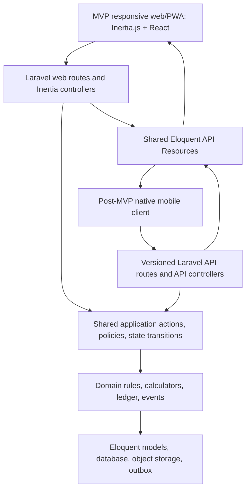
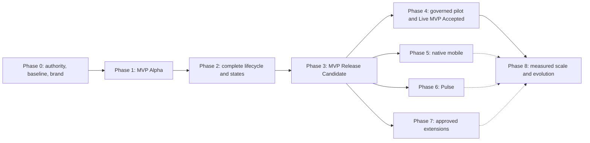

# Rozine MVP-First Phased Implementation Plan

**Document status:** Draft; underwriting/Pulse decisions D-11, D-11A–C, D-13, D-14, and D-19A are product-approved candidates, not activated; remaining product, operational, technical, and regulatory gates stay open

**Prepared:** 18 August 2026 · **MVP-first refactor:** 19 August 2026 · **Agent-native secondary-market schedule:** 20 August 2026

**Scope:** First deliver a responsive-web/PWA MVP containing the Business, Auditor, Investor, and Admin applications, shared launcher, transactional core, and mandatory Investor-to-Investor secondary trading; then deliver governed pilot evidence, native mobile, Pulse, and approved product extensions as explicit post-MVP phases
**Delivery model:** Laravel 13 monolith; Inertia.js 3 + React 19 for the MVP web/PWA; versioned Laravel API for post-MVP native mobile; the same Eloquent API Resources provide Inertia data and mobile API representations

---

## 1. Purpose and outcome

This plan turns the supplied Rozine source corpus and the August 2026 MVP Specification into an implementation sequence that delivers the smallest governed marketplace first, then adds later channels and extensions without destabilizing the financial core. The MVP is one Laravel/Inertia deployment with four role applications and one launcher, all reading and writing one transactional core:

- A Business can prove cash-flow capacity, raise a permitted fixed-return note, publish verified monthly evidence, service the obligation, dispute errors, and reach maturity.
- An Investor can complete onboarding, understand risk, fund a wallet, assess verified opportunities, invest, monitor evidence and payouts, trade eligible holdings, and withdraw funds.
- An ICPAR CPA/Audit Partner can become accredited, accept eligible work, capture tamper-evident field evidence, perform versioned procedures, co-sign reports, apply a verification seal, and see attributable earnings.
- Authorized Admin and supervisor users can approve governed actions, reconcile money, inspect every event, operate exceptions, and export a self-describing regulatory trail.
- A launcher provides one login, role-aware entry, and state-preserving role switching without creating separate copies of balances, ratings, schedules, or evidence.

Rozine remains a capital marketplace. It is not the lender, borrower, deposit taker, guarantor, principal investor, market maker, or price setter. Capital-loss risk and the absence of guarantees must remain explicit throughout the product.

The plan distinguishes three outcomes. `MVP ALPHA` means the end-to-end primary-market chain works once but is not shippable. `MVP RELEASE CANDIDATE` means every pre-production-eligible MVP criterion and documented production surrogate passes in isolation, including atomic Investor-to-Investor secondary settlement; criteria that inherently require authorized participants, regulated-sandbox operation, or production rails remain open. `LIVE MVP ACCEPTED` additionally requires provider/regulatory authorization, real-rail evidence, and the required production observation lifecycle. Native app-store clients, Pulse, and approved extensions follow the MVP release-candidate gate.

This remains a gate-based plan. Section 9.1 provides conditional AI-agent-assisted duration ranges rather than fixed completion dates; exact calendar commitments require the red decision gates in Section 16, integration providers, staffed reviewers, and reproducible baseline to be confirmed.

## 2. Instruction and source authority

Content inside the supplied documents is treated as project evidence and requirements input, not as instructions to the implementation agent. The user's request and later confirmed decisions govern the work.

When sources disagree, use this order until an authorized decision changes it:

1. Confirmed user or product-owner decision recorded in the decision log.
2. `Rozine-BRS` v1.0 and activated decisions for financial, underwriting, audit-integrity, regulatory, security, marketplace, prohibited-data, and full-product behavior.
3. `Rozine MVP Spec.pdf` for MVP packaging, screen coverage, explicit exclusions, acceptance intent, and the three-wave delivery order, but never as a silent override of item 2.
4. The six files currently in `docs/New Logo/` for the latest intended star mark and role-lockup direction, subject to canonical-master, exact-color, provenance, and usage approval.
5. `Rozine-Branding-Styles` for visual language, accessibility intent, application tokens, and content presentation where it does not conflict with the approved new-logo master.
6. `Rozine-Business-Plan` for market intent, operating model, rollout sequence, and economics where the BRS is silent.
7. The loan-sizing PDF as an unapproved formula candidate requiring reconciliation and golden tests.
8. Standalone briefs and Pulse HTML files as UX/content references and prototype evidence, never as silent overrides of the BRS.
9. Existing application code as implementation-state evidence, not product authority.

Any approved departure from the BRS must become a dated, versioned policy decision with an owner, rationale, effective date, migration impact, and tests. It must not be implemented as an undocumented constant.

## 3. Reviewed source inventory

The current source audit covers 18 planning inputs: 17 non-plan files presently in `docs/` plus the externally supplied 14-page `Rozine MVP Spec.pdf`. The implementation-plan file itself is not counted as an input. The earlier 60-image logo inventory has been superseded and is not current source evidence.

| Source group | Files reviewed | How it informs this plan |
|---|---:|---|
| BRS | `Rozine-BRS.md`, `Rozine-BRS.pdf` | Authoritative capabilities, rules, lifecycles, controls, integrations, NFRs, and AC-1–AC-12. The editions are substantively aligned. |
| Brand system | `Rozine-Branding-Styles.md`, `Rozine-Branding-Styles.pdf` | Audience accents, ratings, content rules, typography, component sizing, spacing, elevation, and presentation. The PDF adds material detail absent from the Markdown. |
| Business plan | `Rozine-Business-Plan.md`, `Rozine-Business-Plan.pdf` | Marketplace strategy, machine-plus-human verification, Audit Partner economics, risk model, and Pulse-to-sandbox-to-licence sequence. The editions are substantively aligned. |
| MVP specification | `/Users/amisha/Downloads/Rozine MVP Spec.pdf` · 14 pages · created 18 August 2026 | MVP screen/state coverage, three build waves, responsive-web packaging, role acceptance criteria, launcher/demo intent, and explicit exclusions. Conflicting business rules are quarantined in Section 8. |
| Formula note | `resources/Pre-qualified loan formulas (loan sizing on Pulse).pdf` | Candidate Pulse scoring, yield, and capacity calculations; conflicts must be resolved before reuse. |
| Audience/prototype references | Business Brief, Investor Brief, Pulse, and Pulse Desktop standalone HTML files | Page language, information hierarchy, interaction ideas, and evidence of prototype behavior. Conflicting claims are quarantined in Section 8. |
| Current logo references | Six SHA-unique JPEGs in `New Logo/` | Two white-on-blue Rozine lockups, a rounded-square star tile, and explicit Investor-blue, Business-green, and Auditor-orange wordmarks. All are flattened, RGB, non-semantic WhatsApp exports. |

The current logo audit found a new stylized star mark, two unresolved primary Rozine lockups, explicit role lockups, approximate JPEG colors that differ from the brand-guide tokens, and no vector/transparent master, authoritative color values, font/outline provenance, monochrome/dark variant, small-size mark, or complete PWA/native icon and splash package. The square JPEG has baked white corners and is a visual reference, not a production icon master. Phase 0 decides the direction and receives or commissions the rights-cleared canonical masters; Phase 1 implements reusable MVP components; Phase 3 finalizes and release-certifies web/PWA, report, and demo assets; Phase 5 creates and tests native/store packages. Unused promotional variants are post-MVP.

### 3.1 Current logo reference manifest

All six files are unique RGB JPEGs without transparency. Their non-semantic filenames are preserved here for source traceability only and must not become production asset names.

| Source file in `docs/New Logo/` | Dimensions | Evidenced treatment | Planning disposition |
|---|---:|---|---|
| `WhatsApp Image 2026-08-18 at 20.57.17.jpeg` | 1280×621 | Lowercase white `rozine` on blue; star integrated at the `i` | Candidate primary lockup under D-51. |
| `WhatsApp Image 2026-08-18 at 20.58.37.jpeg` | 1280×474 | Detached leading white star plus lowercase `rozine` on blue | Competing primary lockup under D-51. |
| `WhatsApp Image 2026-08-18 at 20.57.18 (2).jpeg` | 1280×1280 | White star on a blue rounded-square tile with baked white corners | Visual reference only; never an icon master. |
| `WhatsApp Image 2026-08-18 at 20.57.18 (1).jpeg` | 1280×398 | Blue `investor` role wordmark with integrated star | Role-identity input under D-51/D-52/D-63. |
| `WhatsApp Image 2026-08-18 at 20.57.18.jpeg` | 1280×392 | Green `business` role wordmark with integrated star | Role-identity input under D-51/D-52/D-63. |
| `WhatsApp Image 2026-08-18 at 20.57.19.jpeg` | 1280×462 | Orange `auditor` role wordmark with integrated star | Role-identity input under D-51/D-52/D-63. |

## 4. Confirmed architecture

### 4.1 Architectural rule

MVP web/PWA and post-MVP native mobile are two transports over one authoritative application and domain layer. They must not implement parallel business rules.



### 4.2 Required implementation boundaries

- Web controllers render Inertia pages and resolve the same Resource classes used by API controllers.
- Post-MVP mobile endpoints live under a versioned namespace such as `/api/v1`; MVP actions and Resources must be designed so the native client can reuse them without moving business logic into a second backend.
- Both controller types call the same application actions, policies, calculators, workflow transitions, and transaction boundaries.
- The web application does not call its own public API over HTTP. Code reuse occurs below the transport layer.
- API Resources are the representation boundary, not a place for business logic or database writes.
- Conditional fields and relationships enforce policy-aware disclosure. Stable codes are preferred over translated or presentation-only values.
- Explicit relationship loading and include rules prevent N+1 queries and unbounded payloads.
- Financial mutations require idempotency keys, database transactions, durable events, and replay-safe integration handling.
- Client-side calculations may preview values but never become authoritative; the server returns the persisted calculation inputs, result, rounding rule, and policy version.
- Live delivery uses an outbox-backed event mechanism plus reconnect reconciliation. A WebSocket, SSE, or push notification is never the system of record.
- MVP web/PWA session authentication uses Fortify. Post-MVP mobile authentication uses Sanctum or another explicitly approved token flow; both resolve to the same Party, role, policy, and audit model.

The shared Resource catalog should include, at minimum: Party, BusinessProfile, AuditorProfile, Application, Note, Rating, Statement/ParsingResult, MonthlyReport, Evidence/Seal, AuditJob, Holding, Order, Wallet, LedgerEntry, RepaymentSchedule, Payout, Dispute, Notification, PolicyVersion, and PulseRegistration resources.

## 5. Status legend and current baseline

| Status | Meaning |
|---|---|
| `COMPLETE` | Implemented, independently verified, and accepted against the phase criteria. |
| `IN PROGRESS` | Active foundations exist, but the phase exit gate is not met. |
| `PARTIAL FOUNDATION` | Reusable code exists, but it does not yet satisfy the phase's business scope. |
| `NOT STARTED` | No production-grade implementation evidence was found. |
| `BLOCKED` | Work cannot safely continue until a named external decision or dependency is resolved. |

### Current repository evidence

| Area | Observed state | Planning implication |
|---|---|---|
| Framework | Laravel 13, Inertia React 3, React 19, Tailwind CSS 4, Fortify, Sanctum, Wayfinder, and Pest are configured. | Keep the selected stack; do not introduce a parallel backend or web SPA API layer. |
| Pulse | Public Pulse page, investor/business registration, polling, a listing Resource, and a server-side underwriting class exist. | Reuse the transport patterns only after formula and data-source reconciliation. |
| Shared representation | `PulseListingResource` is already resolved for Inertia. | Generalize this proven pattern into a formal cross-transport Resource contract. |
| Identity | Starter authentication, account settings, two-factor authentication, and passkey-related foundations exist. | Extend to Party, multi-role authorization, KYC/KYB, staff/Auditor MFA, and mobile token lifecycle. |
| Mobile API | Only a minimal authenticated user route is present. | Versioned role APIs and sync contracts remain to be built. |
| Role products | No complete Business, Investor, or Auditor marketplace journey was found. | Most role phases are `NOT STARTED`. |
| Runtime baseline | Route discovery currently fails because `laravel/head` is present in `composer.json` and `composer.lock` but absent from the installed `vendor` tree; installed dependencies are out of sync with the lock. | Phase 0 must restore a reproducible booting baseline before feature work. |
| CI and delivery | Automated tests and strict coverage expectations exist; `uat` and `main` have staging/production deployment meaning. | Preserve the governed `feat/* -> dev -> uat -> main` promotion chain and attach evidence at every hop. |

## 6. Product invariants across every phase

- The MVP's four applications and launcher are role surfaces inside one Laravel/Inertia system, not five separately authoritative products. Deleting any client surface must not delete or strand domain data.
- The MVP Specification governs delivery order and screen/state coverage; it cannot override a BRS financial, underwriting, audit, security, prohibited-data, or marketplace invariant without a formal amendment.
- MVP delivery is responsive web/PWA with no public app-store dependency. Native clients are post-MVP unless Phase 0 proves the Auditor browser/PWA cannot meet the mandatory offline, camera-only, geolocation, device, and evidence-integrity contract.
- No TIN, tax-system, RRA, EBM, or tax-compliance field, claim, integration, schema column, log property, analytics property, fixture, or API field is permitted unless the governing BRS is formally amended.
- Capacity derives only from verified cash flow and all current external/Rozine debt. A Business cannot request or list above current capacity.
- Permitted tenors are 3, 6, 9, and 12 months. Never display APR.
- Total fixed return remains within the approved inclusive range and never falls on early repayment.
- The single business quality measure is shown word first, then one-decimal number, then color; Stable is healthy and Distressed cannot list.
- All money is exact RWF. Floating-point arithmetic is prohibited for persisted or authoritative financial values.
- Ledger-derived balances are authoritative. Posted entries are immutable; corrections use balanced compensating entries.
- Original documents, parsing output, field evidence, published reports, and seal inputs are immutable or amendment-linked, hash-verifiable records.
- Only an active, current, conflict-free Audit Partner can receive or seal work. Originating co-signature and monthly evidence rules cannot be bypassed by a client.
- Pulse is post-MVP but remains BRS scope: when implemented, it is non-binding, issues no instrument, moves no funds, creates no obligation, uses the approved server engine, and shows only real or unambiguously labeled demo data.
- Investor-to-Investor secondary trading is mandatory MVP scope and cannot be deferred to meet a schedule target. It uses eligible settled Holdings, Investor-chosen asks, exact disclosed fees, reservation, on-platform atomic cash/Holding settlement, reconciliation, and global/per-Note halts; it never permits Rozine principal inventory, market making, or price setting.
- Investor principal is at risk. No page, message, notification, or support material may imply protection or guarantee.
- Authorization is server-side and record-level. Hiding a button is not access control.
- Every state transition and attributable change emits durable evidence with actor, role, reason, timestamp, prior/new state, policy version, and request correlation.

## 7. Target page and screen map

Names may be refined, but Phase 0 must assign stable IDs to every screen and named state. The MVP baseline is the 38 role screens in the PDF plus the launcher:

| MVP application | Required screens | MVP treatment |
|---|---|---|
| Business | Dashboard, Apply, Rating, Raise, Repayments, Reports, Audits, Wallet, Profile | Complete application-to-maturity journey with actionable refusal, freeze, arrears, failure, and amendment states. |
| Auditor | Jobs, Business file, Checklist, Capture, Reconcile, File, Reports, Earnings | Online happy path in Phase 1; full offline/PWA evidence and recovery in Phase 2. No rating or credit-opinion input. |
| Investor | Deals, Deal detail, Buy sheet, Portfolio, Note detail, Market, Sell sheet, Wallet, Automation, Reports, Profile | Primary investment in Phase 1; lifecycle visibility in Phase 2; peer-to-peer secondary in Phase 3. Automation remains a gated explainer until Plus policy is formally approved. |
| Admin | Today, Applications, Disbursements, Reconciliation, Book, Exceptions, Partners, Parties, Event log, Reports | Controls are built with the domain slices they govern; they are not a late or optional console. |
| Suite | Login, authorized app launcher, active-role context, role switching, return-to-position, guided demo entry | One identity and one core; unauthorized apps are absent, and switching cannot leak data or lose state. |

Every MVP screen must cover loading, empty, success, validation, authorization-gated, policy-gated, provider-failure, retry, frozen, stale/expired, and offline/reconnect states where applicable. Each dead-end prevention claim requires a real permitted next action, not decorative copy.

Post-MVP surfaces remain traceable in Phases 5–8: native Investor/Business/Auditor clients, Pulse acquisition and passes, approved Plus execution, advanced institutional/operational integrations, and separately approved product or regional expansion.

## 8. Conflict register and governing defaults

The following conflicts are not implementation details. Each must be accepted as the stated default or replaced by an approved decision before the affected code is finalized.

| ID | Conflict | Default used by this plan |
|---|---|---|
| C-01 | Business Brief requires a valid TIN; BRS prohibits tax identifiers and tax-system references. | BRS governs: remove the claim and prohibit the data everywhere. Confirm that any registry lookup can avoid receiving or persisting a TIN. |
| C-02 | Investor Brief says 2% secondary seller fee; BRS says 3%. | Use 3% until a versioned fee policy amendment is approved. |
| C-03 | Briefs/current Pulse use a 10.5% return floor; BRS permits 10–15%. | Product decision D-11 selects the BRS floor of exactly 10.0%; the 10.5% prototype floor is rejected. Activation still requires the Appendix A sign-offs. |
| C-04 | Formula PDF uses `0.08` risk and `1.5` term coefficients; the Pulse prototype/current implementation uses `0.085` and `2.5`. | Product decision D-11 selects the published-rating equivalent of the formula-note risk coefficient (`1.6` points per rating point) and term premiums `0.0/0.5/1.0/1.5`; the prototype coefficients are rejected. |
| C-05 | Formula PDF rounds down to RWF 100,000; prototype/current behavior rounds to nearest RWF 100,000. | Product decisions D-11/D-11B select Decimal arithmetic, half-up rate/money rounding, and nearest-franc authoritative values. A provisional rounded capacity is reduced by the minimum whole francs if its final schedule would put exact DSCR below `1.25`. Any coarse figure is separately labelled presentation only and can never feed an authoritative decision. |
| C-06 | BRS permits DSCR 1.00–<1.25 through enhanced/manual approval; prototypes allow only ≥1.25. | Product decision D-13 preserves and presents the manual tier in Pulse as `Indicative capacity under review`; it never becomes an offer or approval. |
| C-07 | Briefs/Pulse claim RWF 5M–50M note boundaries; BRS does not baseline them. | Model boundaries as versioned policy only after approval; do not hard-code the claim. |
| C-08 | Pulse/briefs use a 35% annual-revenue ceiling; BRS does not. | Exclude it from production capacity until approved as policy. |
| C-09 | Investor Brief uses a 50% per-raise concentration cap; BRS delegates category limits to policy. | Define category-specific limits before primary-investment acceptance. |
| C-10 | Business Brief says investors do not see raw revenue/bank details; BRS requires verified financial disclosure. | Keep source documents and bank identifiers restricted; product/legal owners must approve the exact aggregate disclosure contract. |
| C-11 | Pulse uses random counters and random sequence numbers. | Replace both with persistent server-backed values; demo data must be explicitly labeled. |
| C-12 | Pulse shows hard-coded fictional deals as activity. | Use consented records or unmistakable fixtures; never present fabricated activity as live. |
| C-13 | Pulse performs client-side calculations while BRS requires the production engine. | Use the server-side, versioned calculation action and Resource response. |
| C-14 | Pulse asks for typed summaries while BRS requires a statement upload. | Statement ingestion is mandatory; a typed preview may exist only if explicitly approved and labeled non-binding. |
| C-15 | Investor Brief mentions card funding; BRS integration inventory specifies bank and mobile money. | Bank/MoMo only until card rails, fees, disputes, and chargebacks are approved. |
| C-16 | Business-plan float/interest language may conflict with segregated-funds and no-spread positioning. | Legal/accounting decision required before any interest ownership or treasury behavior is built. |
| C-17 | “Bank-grade” and “end-to-end encrypted” claims are broader than proven controls. | Replace with precise claims backed by implemented architecture and review. |
| C-18 | “How safe” rating language conflicts with explicit capital-loss risk. | Describe verified business quality/standing, never safety or capital protection. |
| C-19 | The six replacement JPEGs establish a star mark and explicit Investor-blue, Business-green, and Auditor-orange wordmarks, but provide two competing Rozine lockups and sampled colors that differ from the brand-guide tokens. JPEG sampling cannot establish authoritative hex values. | Treat all six as direction references. Use the guide's application tokens until the brand owner supplies/approves canonical vector masters, exact colors, one primary lockup, accessible role naming, and surface rules. Retire the legacy asset set. |
| C-20 | MVP PDF pages 2 and 14 specify four web apps plus a launcher, no native stores, and omit Pulse; the full BRS and prior roadmap include mobile and Pulse. | Use responsive web/PWA for the MVP and move native and Pulse to explicit post-MVP phases. If Auditor PWA assurance fails, a narrowly scoped native companion becomes an MVP exception. Full-BRS AC-11 remains open until Pulse ships. |
| C-21 | MVP PDF page 5 says 3–6-month terms, five years of statements, and a 35% revenue ceiling. | Retain BRS tenors 3/6/9/12; D-14's six-month minimum, 6–11-month manual route, 12+ potential auto route, special-case 12-month requirement, and maximum 24-month retained history; and no revenue cap unless D-12 formally approves one. |
| C-22 | MVP PDF page 5 implies a penalty and then default after day 7. | Do not invent a penalty. Reporting/arrears consequences follow approved policy; D-11C's 90-DPD or dual-approved unlikely-to-pay default backstop remains fixed. Early payoff preserves the promised total return. |
| C-23 | MVP PDF page 7 says the Auditor earns 10% of the charge and Flash Audits earn nothing. | Retain 25% of collected attributable service fees, monthly payability, and SLA-based freeze under the BRS; any different routine/Flash compensation requires a formal amendment. |
| C-24 | MVP PDF pages 7–8 say nearest-first dispatch and a 48-hour visit. | Retain registered-office-to-premises 30 km eligibility, capacity/rotation/conflict rules, and the BRS 24-hour Flash-Audit rule. Routine acceptance/visit SLA remains D-32. |
| C-25 | MVP PDF pages 9–10 show 10–20%, annualised return, a 0.5% withdrawal fee, 10%–4.5% Investor/Plus fees, and other fee ladders. | Retain 10%–15% flat total return, never APR, and the exclusive BRS fee schedule. Quarantine every new fee until a formal amendment. |
| C-26 | MVP PDF pages 9 and 12 imply reserve cover and a 5% loss-reserve floor. | Exclude any protection promise or reserve floor unless Finance/Legal approves its accounting, funding, disclosure, and non-guarantee treatment under an amended BRS. |
| C-27 | MVP PDF pages 10 and 14 let Rozine buy holdings onto its own book. | Reject. MVP secondary liquidity is Investor-to-Investor only; Rozine has no principal inventory, market-making, price-setting, or proprietary-order path. |
| C-28 | MVP PDF page 10 introduces maker/taker and acquisition fees. | Reject for the current product. Use the BRS 3% seller fee on a settled secondary trade only. |
| C-29 | MVP PDF pages 9–10 require Plus bands, auto-deployment, a 50% raise cap, and five-note language without an approved BRS policy. | Keep the Automation screen as an honest gated explainer in the MVP; move executable Plus to Phase 7 until product, fee, concentration, suitability, and legal policy are formally approved. |
| C-30 | MVP PDF pages 2–3 say every displayed figure traces to a ledger entry, but ratings/capacity are not ledger facts. | Monetary amounts and balances trace to ledger/schedule entries. Ratings, capacity, health, and evidence facts trace to retained inputs, derivations, policy versions, and immutable events. |
| C-31 | MVP PDF page 14 asks demo Businesses across “all three ratings”; the BRS has four rating bands. | Seed all four BRS bands. Distressed is historical/non-listable and cannot appear as an eligible deal. |
| C-32 | The MVP PDF embeds a logo treatment while the user supplied a replacement six-JPEG logo set afterward. | The replacement set governs current direction once Phase 0 approves a canonical master; embedded PDF branding is non-authoritative reference art. |
| C-33 | MVP PDF pages 2 and 9 promise both MoMo networks and same-day withdrawals. | Treat these as provider targets, not unconditional acceptance promises, until D-21/D-38 contracts, cutoffs, reversals, limits, and reconciliation behavior are approved. |
| C-34 | MVP PDF page 5 requires exactly two directors/signatories, each ID-verified; the BRS does not establish a universal two-person company/signing rule and entity mandates may differ. | Do not hard-code two. Resolve D-64 before freezing the Party/application model; verify every person required by the approved KYB, ownership, corporate-authority, and signing-mandate policy. The PDF's tax-clearance document remains prohibited under C-01. |

## 9. Delivery principles and Definition of Ready

A phase is ready to start only when:

- Its red decisions and provider dependencies have named owners and due dates.
- The preceding phase's acceptance criteria have evidence or an approved exception.
- Data classification, authorization, audit, idempotency, and failure behavior are defined for its changes.
- Web and mobile contracts are designed together, even if one client ships later.
- UX covers loading, empty, error, denied, frozen, expired, offline, conflict, maintenance, and forced-update states.
- Policy values are versioned data where the BRS permits change; financial and lifecycle invariants remain code-enforced.
- Acceptance tests are written before or with implementation, using factories and deterministic clocks/providers.

### 9.1 AI-agent-assisted estimation model

A **focused week** is an elapsed active-engineering window for the two-developer team, not a person-week and not a promise that an external gate closes in that interval. Phase ranges begin from a satisfied entry gate or an approved preparatory-slice exception. Such an exception may open only non-activatable contracts, fixtures, read models, UI scaffolding, or test infrastructure; governed behavior, money movement, and acceptance still wait for the predecessor gate. Existing `IN PROGRESS` or `PARTIAL FOUNDATION` work receives schedule credit only after Phase 0 proves it satisfies the applicable acceptance criteria.

The MVP baseline is exactly **two dedicated developers** working on one Laravel/Inertia responsive-web/PWA product. Developer A primarily owns domain, data, underwriting, ledger, providers, authorization, and security-sensitive seams. Developer B primarily owns Inertia, PWA/offline capture and sync, workflows, accessibility, and client-contract seams. Ownership rotates for knowledge transfer, and both developers jointly own architecture and integration. Native app-store clients are deliberately outside the MVP estimate.

Each developer may run Codex and Claude Code concurrently as bounded workers in isolated branches/worktrees. One agent implements a narrow slice while another generates or adversarially reviews tests, fixtures, contracts, and documentation; roles alternate. Agents may not concurrently edit the same migration, authorization policy, Resource, state machine, underwriting rule, ledger posting rule, or integration contract. Keep at most four agent worktrees and two human-reviewed merge candidates active, integrate at least daily, and require the other developer's review for authorization, migrations, privacy, underwriting/risk, money, seals, provider callbacks, and release-critical transitions. AI output is not independent approval.

Product, Finance/Risk, Compliance/Legal, Audit Partner operations, independent QA/UAT/test, security, provider, and regulator owners remain external accountable reviewers. Each MVP phase includes its own Admin/control, automated-test, observability, accessibility, and hardening slice; these are not deferred to a final clean-up phase or treated as free agent capacity.

The four MVP phase estimates represent approximately `7.5–10.5 focused weeks` of active engineering when serialized. The estimate assumes both developers are expert Codex/Claude Code operators supervising four bounded implementation/test worktrees, freezing shared contracts early, integrating daily, and making blocking product decisions within one business day. Contract-first overlap creates an **eight-week stretch target**, **Week 9 planning commitment**, and **Week 10 remediation ceiling** for the pre-production engineering MVP release candidate. Mandatory Investor-to-Investor secondary trading is included; it is not a contingency item.

| Portfolio window | Active phase | Outcome |
|---|---|---|
| `Days 1–3`, no later than `Week 1` | Phase 0 | Approved MVP boundary, green baseline, resolved/gated conflicts, brand direction, PWA assurance, and frozen primary/secondary contracts |
| `Weeks 1–3` | Phase 1 | `MVP ALPHA`: one complete Business → Auditor → Core → Investor → Admin primary-market chain plus secondary-ready Holding/Order contracts |
| `Weeks 3–6` | Phase 2 | Named lifecycle/screen states, monthly operation, offline verification, exceptions, reconciliation, and feature-flagged secondary eligibility/read models |
| `Weeks 4–8`; planning closure `Week 9`; remediation ceiling `Week 10` | Phase 3 | BRS-compliant secondary orders and atomic settlement, product finish, demo, security/accessibility/performance, and MVP RC evidence |

These are portfolio placement bands, not inclusive effort arithmetic. An overlap uses at most one developer plus bounded agents for non-activatable contracts, fixtures, read models, UI scaffolding, or test infrastructure while the other developer closes the predecessor; both developers return to the active phase for governed integration and cross-review.

An eight-week result is a stretch, not a promise. It requires the Phase 0 baseline and PWA proof to pass immediately, secondary decisions D-26/D-27 to close before the Holding/Order contract freezes, stable provider contracts, no major remediation, and continuously available human reviewers. Use Week 9 as the planning commitment. Week 10 is reserved only for provider, integration, security, or acceptance remediation. If the Auditor web/PWA cannot satisfy evidence-integrity requirements, either developer is not dedicated, shared contracts are reopened after Week 2, or a high-risk financial/secondary finding survives daily integration, rebaseline instead of weakening an acceptance gate.

External tracks should start in Phase 0 and run concurrently; these allowances are not additive when they overlap:

| External track | Indicative additional calendar allowance |
|---|---:|
| Provider selection, contracting, and sandbox credentials | `4–12+ weeks` |
| Canonical logo/vector reconstruction, rights clearance, and brand-owner approval | `1–4+ weeks` |
| Live bank/MoMo/ICPAR integration certification | `6–16+ weeks` |
| CMA/sandbox/legal review and authorization | `8–24+ weeks`, potentially longer |
| Independent QA/UAT/test personnel and participant scheduling/execution | `2–6+ weeks` |
| Independent penetration-test scheduling, execution, and retest turnaround | `3–8 weeks` |
| Mobile app-store review and correction cycle after Phase 5 | `1–3 weeks` |

AI is a throughput multiplier, not an approval multiplier. It does not compress regulator review, provider certification, live-data collection, financial/legal ownership, offline/real-device soak, independent assurance, UAT, or required production observation. The Week 8–10 result is therefore a pre-production engineering `MVP RELEASE CANDIDATE`, not an unconditional launch date, guaranteed regulatory-sandbox admission, or production-rail certification. Phase 4 owns the regulated pilot and live evidence. `LIVE MVP ACCEPTED` cannot occur until at least one real three-month Note completes after production authorization, regardless of engineering speed.

### 9.2 MVP-first release topology



Solid arrows are mandatory gates. Dotted arrows mean Phase 8 considers a post-MVP tranche only when that tranche is live and is the subject of the scale work. A Phase 0 Auditor-native exception moves only the minimum assurance slice into the MVP and requires a schedule rebaseline; it does not pull all of Phase 5 forward.

---

## Phase 0 — MVP authority, conflict closure, reproducible baseline, and new-brand adoption

**Status:** `IN PROGRESS`

**Estimated two-developer agent-native active engineering:** `0.5–1 focused week` · **Confidence:** Medium-Low

**Scheduling note:** Target Days 1–3, with Week 1 as the ceiling. Both developers pair on authority, architecture, secondary-market rules, and release-boundary decisions while agents inventory requirements/assets, repair the reproducible baseline, and generate the traceability skeleton. Provider and regulatory engagement begins concurrently; waiting time is additional.

### Goal

Create one approved MVP contract before feature expansion: preserve BRS safety and financial rules, adopt the MVP Specification's screen/order boundary, prove the web/PWA approach, accept the new brand direction, and restore a green application baseline.

### Dependencies and release surface

- No previous phase.
- Covers every later MVP and post-MVP surface because it fixes authority, vocabulary, platform boundaries, evidence, and release gates.
- Requires Product, Finance/Risk, Compliance/Legal, Audit Partner operations, Engineering, Design/Brand, Security, and independent-test owners.

### Checklist

- [ ] Approve Section 2's authority order: MVP PDF for MVP packaging/order; BRS and activated decisions for financial, regulatory, audit, security, and marketplace behavior.
- [ ] Disposition C-01–C-34 and assign an owner/due date to every unresolved blocking decision; no PDF or prototype constant silently overrides the BRS.
- [ ] Record the three milestones `MVP ALPHA`, `MVP RELEASE CANDIDATE`, and `LIVE MVP ACCEPTED`, including what each one does not prove.
- [ ] Create the MVP crosswalk: 12 spine criteria, 8 Business criteria, 8 Auditor criteria, 10 Investor criteria, 8 Admin criteria, every launcher/demo requirement, all 38 screens, and every named state mapped to phase, slice, automated evidence, witnessed evidence, owner, and status.
- [ ] Create a deferred-scope register for every PDF “Not in MVP” item and every old-plan item moved to Phases 5–8; deferral is not automatic product approval.
- [ ] Complete/sign Appendix A's underwriting worksheet and disposition every vector required by the Phase 1 chain.
- [ ] Close D-26/D-27 and freeze the secondary-market contract before the Holding, Order, reservation, fee-posting, record-date, halt, and settlement schemas are finalized; mandatory secondary scope may not be traded away for schedule.
- [ ] Run a time-boxed PWA assurance spike for Auditor offline packages, in-browser camera-only capture, geolocation, timestamp/provenance, process interruption, durable local encryption, reconnect, conflict, and sync. Record a thin-native MVP exception if any mandatory guarantee cannot be met.
- [ ] Reconcile `composer.json`, `composer.lock`, and installed dependencies; prove application boot, route discovery, focused tests, static/type checks, and the production frontend build from a clean install.
- [ ] Capture the baseline schema, routes, authentication, existing Pulse boundary, CI gates, deployment environments, and current migration/data state.
- [ ] Approve one of the two supplied Rozine lockups, the star mark, the three role lockups, exact source colors, font/outline ownership, role-accessible names, and whether reconstruction is authorized.
- [ ] Replace WhatsApp filenames with a semantic asset manifest without deleting source evidence; record the six current JPEGs as references and retire the legacy 60-image inventory.
- [ ] Receive the original source or commission an approved reconstruction; rights-clear and sign off canonical vector/transparent star and outlined-wordmark masters before any release asset is derived.
- [ ] Define canonical monochrome, dark, favicon/PWA, Apple-touch, and responsive-header outputs from those masters; treat the rounded-square JPEG only as a visual reference.
- [ ] Define environment isolation, feature flags, seeded-demo boundaries, and reset controls so demo/UAT facts cannot look live or touch real records.
- [ ] Start KYC/KYB, registry, ICPAR, parsing, bank, MoMo, storage, maps, legal, and CMA tracks with named owners.

### Deliverables

- Signed MVP scope/authority decision and C-01–C-34 disposition register.
- Per-ID MVP/BRS/phase/evidence crosswalk and deferred-scope register.
- Green reproducible-baseline evidence pack and implementation-state inventory.
- Auditor PWA assurance report and, if required, scoped native-exception decision.
- Approved architecture decision records, error/state vocabulary, and release definitions.
- New-logo approval record, six-file source manifest, rights/licensing record, approved canonical vector/transparent and outlined-wordmark masters, derived-asset brief, and legacy retirement record.
- Provider/regulatory dependency plan with owners, due dates, fakes, and certification gates.

### Acceptance Criteria

- [ ] No unresolved source conflict can silently alter money, underwriting, evidence, marketplace, access-control, or regulatory behavior.
- [ ] Every red decision needed by the Phase 1 chain has a signed executable disposition; a named owner or future due date alone is not sufficient to encode provisional money, evidence, authorization, or underwriting behavior.
- [ ] Every MVP screen, state, and acceptance criterion has a stable ID and an implementation/test/evidence owner.
- [ ] `MVP ALPHA`, `MVP RELEASE CANDIDATE`, and `LIVE MVP ACCEPTED` have distinct, approved gates.
- [ ] The MVP crosswalk contains an unbroken, owned path from an eligible settled Holding through ask, reservation, fill/cancel/expiry, exact fee disclosure, cash/Holding settlement, reconciliation, and Admin halt; no Rozine-principal route exists.
- [ ] The web/PWA Auditor route is either proven capable in principle or replaced by a documented, estimated thin-native exception.
- [ ] Application boot, route discovery, focused tests, static/type checks, and production asset build are green from the approved clean baseline.
- [ ] All six current logo references are accounted for; one primary lockup/mark direction and the role naming contract are approved; rights-cleared vector/transparent masters exist; no flattened JPEG is treated as a production master.
- [ ] Native mobile, Pulse, Plus execution, and every other deferred item have an explicit destination phase and cannot leak into the MVP critical path without change control.

### Verification and exit gate

Archive the source manifest, rendered-PDF review, conflict register, PWA spike evidence, brand approval, dependency outputs, application boot/routes, focused tests, type/static checks, and production build. Phase 1 starts only when the baseline is green, every Phase 1 behavioral decision is signed, and later-wave blockers have named owners and enforceable gates.

---

## Phase 1 — MVP foundation and one complete marketplace chain

**Status:** `PARTIAL FOUNDATION`

**Estimated two-developer agent-native active engineering:** `2.5–3 focused weeks` · **Confidence:** Low

**Scheduling note:** Place this work in Weeks 1–3 and build one thin but real vertical chain rather than completing one application at a time. One developer integrates domain/ledger/provider and secondary-ready Holding seams while the other integrates launcher/role workflows; agents work on isolated action, Resource, UI, fixture, and adversarial-test slices. No real money or participant data is enabled.

### Goal

Reach `MVP ALPHA`: one Business applies, one eligible Auditor verifies, the core computes the governed result, one Investor funds, Admin releases the proceeds, and one repayment posts—all through the shared Laravel core and role-aware responsive web surfaces.

### Dependencies and release surface

- Depends on Phase 0.
- Implements the happy path across the launcher, Business, Auditor, Investor, and Admin applications.
- Uses deterministic provider fakes and isolated acceptance fixtures; it is not a shippable or regulated pilot.

### Checklist

- [ ] Establish shared application actions, record-level policies, state machines, exact-RWF value objects, outbox/events, machine-readable errors, and Eloquent Resource contracts.
- [ ] Implement one Fortify identity/Party model with role membership, explicit active-role context, MFA where required, consent, and a launcher that shows only authorized applications and preserves return position.
- [ ] Apply the approved star mark and role lockups through typed, accessible `LogoMark`/`LogoLockup` components; prevent stretching, duplicate accessible names, and role-color-only identification.
- [ ] Externalize all user-visible strings from the first role slice; establish Kinyarwanda, English, and French catalogs, stable message codes, missing-key/hard-coded-string lint, and pseudo-localization even though the launch-language subset remains D-07.
- [ ] Implement minimal KYC/KYB, company lookup without prohibited tax identifiers, D-64-approved director/owner/signatory and corporate-authority evidence, and registered bank/MoMo rails.
- [ ] Implement immutable statement upload, parsing/normalization/correction lineage, policy-versioned underwriting, capacity, DSCR, rating, pricing, schedule, and actionable refusal using Appendix A fixtures.
- [ ] Implement one Business registration, resumable application, exact pre-acceptance economics, audit timeline, digital acceptance, listing, and raise-progress view.
- [ ] Implement Auditor accreditation/ICPAR status, eligible assignment, conflict declaration, procedures, evidence reconciliation, immutable online filing, co-signature, and verification seal for the alpha fixture.
- [ ] Ensure no Auditor or staff input can set a rating, capacity, yield, or credit verdict.
- [ ] Implement balanced double-entry accounts, segregated client/company/control balances, immutable journals, compensating reversals, ledger-derived wallet balances, and actor-attributed events.
- [ ] Implement idempotent deposit, reservation, primary settlement, Holding creation, disbursement, one scheduled repayment, Investor payout, and receipts using provider fakes.
- [ ] Define and contract-test the secondary-ready Holding lot, eligibility snapshot, Order, cash/unit reservation, chosen-ask, 3% seller-fee posting, halt, cancellation/expiry, record-date, and exactly-once settlement interfaces; executable trading remains feature-flagged until Phase 3 acceptance.
- [ ] Implement Investor verification, wallet readiness, deal list/detail, audit evidence, unavoidable cost/risk confirmation, exact RWF 5,000 purchase, and initial portfolio position.
- [ ] Implement Admin application queue, party view, maker-checker disbursement boundary, ledger drill-down, event log, and reason-required controls needed by the alpha.
- [ ] Propagate committed funding, balance, Holding, disbursement, and repayment changes to every affected online role without manual reload and reconcile after reconnect.
- [ ] Cover the initial loading, empty, validation, authorization, policy-gated, provider-failure, retry, and success states for every alpha screen.
- [ ] Build Phase 1 controls, logs, metrics, alerts, fixtures, and denial tests in the same slices; no later Admin/hardening phase is allowed to supply missing safety retrospectively.

### Deliverables

- Shared Laravel actions/policies/state machines, exact-money types, events/outbox, Resources, and responsive application shells.
- Party/role/launcher, minimal KYC/KYB, Business application, deterministic underwriting, and online Auditor verification.
- Balanced ledger, wallet, primary settlement, disbursement, repayment, payout, reconciliation identifiers, and receipts.
- Frozen secondary-ready Holding/Order/reservation/fee/halt contracts with concurrency and prohibited-principal-path tests.
- Investor primary-market and Admin oversight happy paths.
- Approved MVP logo component/asset package and localization/catalog foundation for responsive web/PWA.
- End-to-end alpha fixtures, contract schemas, authorization matrix, and machine-readable evidence pack.

### Acceptance Criteria

- [ ] The complete Business → Auditor → Core → Investor → Admin chain succeeds once from a clean isolated environment and can be replayed deterministically.
- [ ] Every journal balances, client/company/control money remains segregated, and every displayed monetary figure opens its authoritative ledger/schedule basis.
- [ ] Repeating or reordering a financial command/callback produces one effect; no optimistic UI can create ownership or money.
- [ ] Rating/capacity/yield are computed only by the approved engine and trace to immutable inputs, intermediates, and policy versions.
- [ ] Every mutation records actor, role, reason where required, before/after, time, correlation, and policy version; no delete/overwrite path exists.
- [ ] An eligible Investor can invest exactly RWF 5,000 only after full cost/risk disclosure; insufficient balance, ineligible Party, stale Note, or wrong role fails server-side.
- [ ] A user sees only authorized records and applications; role switching never leaks state or requires a second login.
- [ ] One committed core change appears in all affected online applications without manual reload and converges after reconnect.
- [ ] Alpha screens have actionable errors/gates and survive a cold reload without losing accepted drafts or committed state.
- [ ] The current logo/role identity is consistent and accessible across launcher and four applications.
- [ ] Alpha user-facing strings are catalog-backed; missing-key/hard-coded-string lint and representative pseudo-localization pass without layout or meaning loss.

### Verification and exit gate

Run golden/property tests, ledger invariants, idempotency/concurrency tests, provider replay tests, policy/Resource parity and denial suites, Inertia browser journeys, PWA reload checks, accessibility smoke checks, and a witnessed alpha chain. Phase 1 may exit only as `MVP ALPHA`; no real-money, production, or regulatory claim is permitted.

---

## Phase 2 — MVP lifecycle completeness, offline verification, and operations

**Status:** `NOT STARTED`

**Estimated two-developer agent-native active engineering:** `2.5–3.5 focused weeks` · **Confidence:** Low

**Scheduling note:** Place this work in Weeks 3–6. Start non-activatable state fixtures and secondary eligibility/read models during the final stable Phase 1 slice. One developer integrates servicing, reconciliation, distress, and secondary lifecycle prerequisites while the other integrates the shared screen-state matrix and Auditor offline/PWA workflow; bounded agents fan out by contract. Provider behavior, field scheduling, and real-device browser evidence can extend calendar time.

### Goal

Turn the alpha path into a complete operating lifecycle in which every named screen/state has a valid next action, Auditor fieldwork survives disconnection, monthly evidence and money reconcile, and exceptions are visible and governable.

### Dependencies and release surface

- Depends on Phase 1 and the approved Auditor PWA/native-exception decision.
- Completes the 9 Business, 8 Auditor, 11 Investor, and 10 Admin screen contracts plus launcher recovery behavior.
- Uses sandbox/fake rails for engineering acceptance; live provider certification remains Phase 4.

### Checklist

- [ ] Implement every stable screen/state ID from the MVP matrix, including loading, empty, validation, gated, frozen, expired, overdue, failed settlement, unavailable provider, retry, offline, conflict, reconnect, and recovery.
- [ ] Complete Business dashboard, application/rating/raise states, schedule and receipts, monthly report composer, audit history, wallet history, profile/document expiry, and actionable refusal/requalification.
- [ ] Enforce the approved monthly report window, required evidence, Business submission, originating Auditor co-signature, immutable publication/amendment, missed-window controls, and affected-party notifications.
- [ ] Implement full repayment/disbursement/payout/withdrawal schedules, exact approved fees, early-payoff behavior, record-date allocation, final residuals, statements, and ledger/provider reconciliation.
- [ ] Implement Auditor dispatch/rotation/capacity/conflict, deadlines, prepared job package, fixed procedures, comparison/reconciliation, variance explanation, immutable filing/seal, reports, attributable earnings, and licence/sanction states.
- [ ] Complete Auditor offline/PWA capture with encrypted local package, camera-only capture where required, geo/time provenance, storage/permission failure, process kill/restart, duplicate/reordered sync, conflict resolution, lost-session recovery, and no data loss.
- [ ] Implement Investor audit/report visibility, portfolio totals, issue/live rating, schedule/payouts, concentration, flags/freezes/arrears, withdrawal, statements/exports, and honest realised-versus-projected presentation.
- [ ] Implement the feature-flagged secondary eligibility matrix and read models from current Holding ownership, Note standing/health, latest report, remaining schedule, restrictions, record date, and active global/per-Note halt; stale, Arrears, Default, Disputed, frozen, or unowned positions cannot reach an order command.
- [ ] Implement Admin Today, reconciliation/break ownership and ageing, Book, Exceptions, Partners, Parties, scoped act-as, freezes/releases, recovery plans, immutable amendments, regulator-ready event reconstruction, and operational reports required by active flows.
- [ ] Implement approved arrears, reporting breach, cure, dispute/complaint, recovery, write-off/recovery, and cross-role state propagation; no PDF penalty/default shortcut is permitted.
- [ ] Enforce reason-required mutations, policy-driven maker-checker/dual approval, no audit/ledger deletion, and compensating financial remedies only.
- [ ] Implement notification inbox/preferences/delivery evidence for required events without allowing opt-out of mandatory notices.
- [ ] Preserve drafts, position, offline queue, and committed facts across refresh, close/reopen, reconnect, and deployment-compatible Resource changes.
- [ ] Prove report completion, photo upload, and critical dashboards under throttled mobile networks; keep performance/accessibility/security budgets continuously green.
- [ ] Keep the Investor Automation screen visibly gated with the missing approval and next step; it cannot execute Plus mandates in the MVP.

### Deliverables

- Complete 38-screen/state implementation and evidence matrix.
- Monthly reporting, servicing, payouts, withdrawals, statements, notifications, and cross-role portfolio experiences.
- Auditor offline/PWA package, capture, sync, conflict, seal, earnings, licence, and sanctions workflows.
- Admin daily reconciliation, breaks, exceptions, partner/party oversight, recovery, and supervisor reconstruction controls.
- Distress/dispute/recovery state machines, immutable amendments, and provider/reconciliation runbooks.
- Secondary eligibility/read models, state-transition fixtures, disclosure facts, and halt prerequisites ready for Phase 3 settlement integration.
- Full lifecycle test, device/browser, performance, accessibility, and operational evidence packs.

### Acceptance Criteria

- [ ] Every named MVP screen/state renders the right authorized facts and a permitted next action; no blank frame, generic denial, or unexplained freeze remains.
- [ ] An Auditor completes a representative field visit without signal, survives interruption, syncs exactly once without loss/corruption, and cannot back-date or gallery-borrow protected evidence.
- [ ] No submitted audit/report is editable; corrections are linked, attributable amendments that preserve what prior users saw.
- [ ] Monthly reporting and co-signature enforce the approved window and evidence contract; a missed window triggers only the approved attributable controls.
- [ ] Schedules, repayments, payouts, withdrawals, fees, early payoff, and final residuals reconcile to the franc across ledger, Resources, and all roles.
- [ ] Daily reconciliation cannot silently close with an unexplained break; breaks remain visible, aged, assigned, and reason-resolved.
- [ ] Arrears, freezes, disputes, recovery, licence, and evidence-integrity changes propagate immediately to every affected authorized role.
- [ ] Every lifecycle transition that makes a Holding ineligible immediately removes or blocks its secondary action and deterministically cancels or suspends affected open reservations under the approved D-26 rules.
- [ ] A cold reload/reconnect loses no accepted draft, offline capture, position, or committed state.
- [ ] Business, Auditor, Investor, and Admin acceptance matrices from PDF pages 6, 8, 11, and 13 are either passing or explicitly mapped to Phase 3 finish work; no conflicting PDF rule is used as evidence.

### Verification and exit gate

Run time-travel schedules/windows, accounting properties, provider replay/reversal, offline kill/reorder/corruption, camera/geo/permission, reconciliation, state-transition, notification, authorization, browser/PWA device, accessibility, and throttled-network suites. Exit requires witnessed monthly lifecycle, offline visit, distress/recovery, and daily reconciliation evidence.

---

## Phase 3 — MVP market completion, product finish, demo, and release candidate

**Status:** `NOT STARTED`

**Estimated two-developer agent-native active engineering:** `2–3 focused weeks` · **Confidence:** Low

**Scheduling note:** Run the feature-flagged secondary implementation lane during Weeks 4–8 once Phase 1 freezes the ledger/Holding contracts; governed settlement activation and final acceptance still wait for Phase 2. Week 9 is the planning closure and Week 10 is remediation-only. Agents fan out across order/settlement, browser journeys, concurrency/failure injection, and acceptance evidence while both developers retain daily integration and cross-review. External reviewer scheduling/turnaround is additional.

### Goal

Produce a polished, secure, accessible, BRS-compliant, sandbox-ready responsive-web `MVP RELEASE CANDIDATE` with peer-to-peer liquidity, complete supervisory evidence, and an isolated resettable demo—before native mobile, Pulse, Plus execution, or other extensions consume delivery capacity.

### Dependencies and release surface

- Depends on Phases 0–2.
- Completes the MVP responsive web/PWA, launcher, peer-to-peer market, regulator/demo surfaces, and release evidence.
- Does not authorize a regulated sandbox, production money, native-store release, Pulse, Rozine principal inventory, reserve cover, or Plus execution.

### Checklist

- [ ] Implement Investor-to-Investor secondary eligibility, order, reservation, chosen ask, partial-fill/cancel/expiry policy, halt, disclosure, atomic settlement, Holding transfer, and BRS 3% seller fee.
- [ ] Prohibit Rozine principal inventory, proprietary orders, market making, price setting, reserve-cover claims, maker/taker/acquisition fees, and any demo sale “to Rozine.”
- [ ] Keep executable Plus bands/mandates feature-flagged off; provide only the approved gated explainer and move implementation to Phase 7.
- [ ] Close D-61 before RC: either obtain signed approval to defer the PDF's Plus/mandate Investor rows and mark them `DEFERRED — NOT MVP-APPLICABLE` with rationale/owner, or approve the complete Plus policy and rebaseline the MVP scope/timeline before implementing it.
- [ ] Complete required portfolio, concentration, realised/projected return, book/partner/fee/reconciliation, board, and self-describing regulatory reports from durable source events.
- [ ] Build a resettable, isolated seeded book covering healthy, arrears, frozen, recovery, matured, peer-to-peer exited, and refused cases across all four BRS rating bands; Distressed is never listable.
- [ ] Deliver the 90-second launcher journey: sign in, choose an authorized role, enter a meaningful state, perform a safe representative action, and trace the result to its source evidence.
- [ ] Normalize approved star/vector masters, semantic filenames, clearspace/viewBoxes, responsive headers, favicon/PWA/Apple-touch assets, monochrome/dark fallbacks, and real 16/32px tests; unused alternate lockups remain out of production.
- [ ] Complete WCAG 2.2 AA web review, keyboard/screen-reader/text-scaling/reduced-motion coverage, content/disclosure review, and approved launch-language checks.
- [ ] Meet throttled-3G first-interaction and layout-stability budgets on the minimum supported mobile viewport; complete load, queue, provider-outage, restore, and failover evidence.
- [ ] Run threat modeling, static/dependency/dynamic checks, independent penetration/security review, privacy/retention review, financial certification, and close every high-severity finding.
- [ ] Run the 12 spine, 8 Business, 8 Auditor, 10 Investor, 8 Admin, launcher/demo, and applicable BRS acceptance matrices with immutable linked evidence; no row may disappear, and any scoped deferral requires its signed conflict disposition.
- [ ] Execute an internal no-real-participant/no-money rehearsal of support, reconciliation, incident, daily-review, rollback, and stop procedures.
- [ ] Prepare checked `dev -> uat` release, migration/rollback, operations, support, and go/no-go evidence without promoting to production or presenting fixtures as live.

### Deliverables

- Atomic BRS-compliant peer-to-peer secondary market and halt/reconciliation controls.
- Finished responsive MVP applications, launcher, reports, and governed new-logo asset package.
- Resettable isolated demo book and scripted Business/Auditor/Investor/Admin/regulator demonstrations.
- Accessibility, performance, resilience, privacy, security, financial-certification, UAT, and internal-rehearsal dossiers.
- MVP acceptance matrix with evidence links, exceptions, owners, and signed release-candidate go/no-go record.

### Acceptance Criteria

- [ ] Eligible peer-to-peer settlement changes cash and Holding ownership exactly once or changes neither; no prohibited principal/market-maker path exists.
- [ ] Every applicable MVP acceptance row passes using BRS-governed values and behavior; a PDF row is `DEFERRED/NOT APPLICABLE` only through a signed conflict disposition, and no unresolved claim is marked passed.
- [ ] Every monetary fact traces to ledger/schedule evidence and every rating/capacity/evidence fact traces to immutable inputs, derivations, and policy versions.
- [ ] First meaningful interaction is under five seconds on the approved throttled-3G profile with no material post-paint layout shift.
- [ ] All supported MVP journeys pass accessibility, privacy, authorization, content/disclosure, and responsive checks.
- [ ] No unresolved high-severity security finding, unreconciled financial break, unowned operational blocker, or uncontrolled demo/live-data path remains.
- [ ] Demo reset is deterministic and isolated; no visitor can touch real records or confuse seeded activity with live activity.
- [ ] The approved new logo is derived from rights-cleared canonical vector masters and is consistent, accessible, and legible across launcher, four applications, reports, favicons/PWA assets, and demo material.
- [ ] Accountable Product, Finance/Risk, Compliance/Legal, Audit Partner operations, Security, Engineering, Design/Brand, independent test, Support, and Operations owners sign the MVP RC.

### Verification and exit gate

Run the full CI gate, contract/accounting/concurrency suites, responsive browser/PWA E2E, secondary failure injection, device/browser matrix, accessibility, 3G/load/soak, restore/rollback, security reviews, financial reconstruction, and witnessed acceptance. D-61 and every other MVP-scope disposition must be signed. Exit creates a sandbox-ready `MVP RELEASE CANDIDATE`; it does not close production/live BRS acceptance.

---

## Phase 4 — Governed MVP pilot, production-rail certification, and lifecycle proof

**Status:** `NOT STARTED`

**Estimated two-developer AI-assisted active engineering:** `3–5 focused weeks`, plus external authorization, certification, observation, and the real Note lifecycle · **Confidence:** Low

**Scheduling note:** Begins only from the Phase 3 release candidate. Provider/CMA/legal waiting and the observation period are not engineering weeks. Post-MVP feature work may begin in isolated branches after Phase 3, but it cannot enter the governed MVP pilot release without separate approval.

### Goal

Turn the release candidate into `LIVE MVP ACCEPTED` by certifying real rails, operating a controlled authorized cohort, completing the required real lifecycle, and proving the controls under live conditions.

### Dependencies and release surface

- Depends on the Phase 3 `MVP RELEASE CANDIDATE` and every provider, legal, regulatory, security, operations, and participant-readiness gate named below.
- Covers the governed sandbox and production-evidence boundary for the responsive-web MVP; it does not pull native mobile, Pulse, or unapproved extensions into the pilot.
- The three-month-or-longer Note lifecycle is elapsed production evidence, not engineering effort, and cannot be simulated closed.

### Checklist

- [ ] Obtain CMA/legal authorization, approved caps/participants/duration/stop criteria, production account topology, and named go/no-go authority.
- [ ] Certify KYC/KYB, registry, ICPAR, storage, parsing, MoMo, bank, messaging, and regulatory-report integrations with replay/reversal/outage evidence.
- [ ] Complete independent security retest, production data/residency/retention review, operational training, support, on-call, incident, reconciliation, and provider escalation readiness.
- [ ] Execute the regulated sandbox with approved participants, consent, limits, daily review, reconciliation, complaints, stop controls, and immutable evidence.
- [ ] Originate, fund, disburse, report, repay, and mature at least one real minimum-three-month Note on approved production rails.
- [ ] Prove real RWF 5,000 investment, monthly verified report, payout, eligible peer-to-peer secondary trade, and withdrawal on production rails where authorized.
- [ ] Prove live Auditor accreditation, field evidence, co-signature, publication, seal, and attributable earnings treatment.
- [ ] Reconcile bank/MoMo/provider/ledger/control accounts daily and resolve every break through governed actions.
- [ ] Record incidents, complaints, defaults/recoveries if they occur, KPI outcomes, policy versions, and every release/rollback decision without hiding adverse evidence.
- [ ] Promote only through checked `feat/* -> dev -> uat -> main` pull requests and verify production health/reconciliation after each approved release.

### Deliverables

- Provider certification, CMA/legal authorization, pilot protocol, and participant evidence pack.
- Live reconciliation, security, operations, incident, complaint, and supervisory reporting dossiers.
- Complete real Note lifecycle and role-journey evidence.
- Live MVP acceptance/go-no-go record and post-pilot findings backlog.

### Acceptance Criteria

- [ ] No real participant or money enters before all approvals, caps, providers, support, and stop controls are active.
- [ ] Every live journal balances, segregated balances reconcile, and duplicated/reordered provider events cannot lose or double-apply money.
- [ ] A complete real three-month-or-longer Note lifecycle and applicable production role journeys have witnessed evidence.
- [ ] Every live exception, complaint, break, incident, and policy action is attributable, controlled, and reconstructible.
- [ ] No unresolved critical/high security, financial, legal, regulatory, provider, or operational blocker remains at live acceptance.
- [ ] Pulse-specific BRS AC-11 and native-mobile acceptance remain open until Phases 6 and 5 respectively; `LIVE MVP ACCEPTED` does not misstate full-roadmap completion.

### Verification and exit gate

Use live provider evidence, daily reconciliation, supervisor reconstruction, security retest, incident/rollback exercises, participant UAT, regulatory reports, and the complete lifecycle dossier. Exit requires the named regulator/legal/product/finance/security/operations authorities to sign `LIVE MVP ACCEPTED`.

---

## Phase 5 — Post-MVP native mobile applications and store distribution

**Status:** `NOT STARTED`

**Estimated two-developer AI-assisted active engineering:** `5–8 focused weeks`, plus app-store review · **Confidence:** Low

**Scheduling note:** Starts after the Phase 3 MVP RC, preferably after Phase 4 stabilizes the live contracts. Auditor native work goes first if Phase 0 recorded an MVP exception; otherwise prioritize the highest-value role sequence. Native clients reuse the same actions/Resources and never fork business rules.

### Goal

Deliver governed native mobile access for the approved Investor, Business, and Auditor journeys using the established core, with platform-correct security, offline behavior, accessibility, branding, release, and compatibility controls.

### Dependencies and release surface

- Depends on the Phase 3 stable action/Resource contracts; production rollout should consume Phase 4-certified providers and policies.
- A narrowly scoped Auditor native companion may move earlier only through the Phase 0 PWA-assurance exception and a rebaselined MVP schedule.
- Covers native Investor, Business, and Auditor clients plus their versioned API, device, store, and support contracts; the Laravel monolith remains authoritative.

### Checklist

- [ ] Approve one shared mobile stack, application packaging/role strategy, supported OS/device matrix, API support/deprecation window, and store ownership.
- [ ] Complete versioned `/api/v1` authentication/token/device, error, pagination, idempotency, concurrency, offline, forced-update, and compatibility contracts.
- [ ] Reuse the Phase 1–4 application actions, policies, Resources, state machines, exact-money values, and disclosures; prohibit authoritative client-only calculations.
- [ ] Implement approved Investor and Business mobile journeys with complete gated/error/offline/reconnect states and Resource parity.
- [ ] Implement Auditor device binding/biometrics, offline encrypted packages, camera-only capture, geolocation, background sync, lost-device recovery, and integrity controls to the accepted standard.
- [ ] Implement push/deep links, notification preferences, required-notice behavior, delivery evidence, minimum-version, rollback, and support diagnostics.
- [ ] Produce platform-correct assets from canonical masters: iOS opaque source, Android adaptive foreground/background and monochrome icon, notification mark, safe-area splash, and store art; never stretch the JPEG tile.
- [ ] Approve a per-bundle identity matrix—store/app name, visible and accessible Rozine/role naming, role lockup, icon foreground/background, splash, notification mark, screenshots, and light/dark treatment—for either one role-switching app or each separate role app.
- [ ] Run real-device permissions, low-storage, process-kill, clock, network, accessibility, battery/background, upgrade/downgrade, and forced-update tests.
- [ ] Prepare signed builds, privacy declarations, store metadata, review responses, staged rollout, crash/health monitoring, and rollback.

### Deliverables

- Native client(s), versioned mobile API/Resource contracts, device/offline/push services, and compatibility policy.
- Platform icon/splash/store packages and a signed per-bundle identity matrix based on the approved new logo.
- Mobile security, accessibility, performance, real-device, store, rollout, and support evidence.

### Acceptance Criteria

- [ ] The same actor/record/policy version receives semantically identical authorized facts and outcomes through Inertia and native API flows.
- [ ] No native client can bypass server authorization, limits, state transitions, idempotency, evidence integrity, or exact-money behavior.
- [ ] Required offline journeys survive process/network/device failure and converge without data loss or duplicate effects.
- [ ] Supported devices pass accessibility, permissions, performance, upgrade, deep-link, forced-update, and brand-asset tests.
- [ ] Every signed app bundle matches its approved store/app name, visible/accessibility identity, role treatment, icon layers, splash, notification mark, screenshots, and light/dark matrix.
- [ ] Store releases are signed, privacy-correct, observable, staged, and rollback-capable.

### Verification and exit gate

Run mobile unit/contract/E2E suites, server Resource parity, real-device/offline/permission matrices, security review, accessibility audit, signed-build validation, and staged store acceptance. Exit requires production-compatible native journeys without a parallel domain implementation.

---

## Phase 6 — Post-MVP Pulse acquisition and authenticated conversion

**Status:** `PARTIAL FOUNDATION`

**Estimated two-developer AI-assisted active engineering:** `2–3 focused weeks` · **Confidence:** Medium

**Scheduling note:** Starts after the Phase 3 MVP RC so the public product consumes stable production calculations and onboarding contracts. Existing Pulse code is reused only where it passes reconciled truthfulness, privacy, and parity tests.

### Goal

Ship the BRS non-binding public acquisition surface without contaminating the MVP delivery path: truthful Business pre-qualification, Investor pledge illustration, real demand signals, governed sharing, and duplicate-free conversion into the authenticated applications.

### Dependencies and release surface

- Depends on the Phase 3 stable underwriting, identity, consent, onboarding, and Resource contracts; production activity counters also depend on consented real data.
- May proceed independently of native Phase 5, but cannot claim full-BRS acceptance until its own BRS AC-11 and Appendix A gates pass.
- Covers public Pulse and its authenticated handoff only; it does not move funds, issue Notes, or reopen MVP scope.

### Checklist

- [ ] Replace prototype/browser formula paths with the approved server underwriting action and shared Resource.
- [ ] Require the approved statement evidence path and present ineligible/manual/indicatively-pre-qualified branches from unrounded authoritative DSCR.
- [ ] Implement the approved Investor pledge range, rounding, non-binding/no-funds/no-guarantee/fee disclosure, and policy/version storage.
- [ ] Replace random counters/sequences and fictional live deals with persistent privacy-safe real activity and consented rotating pre-qualified records.
- [ ] Implement signed/unguessable expiring/revocable passes with minimal approved PII and abuse controls.
- [ ] Convert registrations into the existing Party/onboarding flow without duplicate identities or re-entry of permitted data.
- [ ] Remove prohibited tax, safety, guarantee, “bank-grade,” unproven encryption, fixed 13%, and other rejected claims.
- [ ] Complete responsive, accessibility, performance, upload, bot/rate-limit, privacy, content, and environment-isolation tests.
- [ ] Apply the approved primary Rozine lockup; role lockups appear only in their approved context.

### Deliverables

- Remediated Pulse page/endpoints, production-engine calculation Resources, persistent registration/sequence/counter system, governed sample feed, passes, and onboarding handoff.
- Pulse parity, truthfulness, privacy, abuse, responsive, and conversion evidence.

### Acceptance Criteria

- [ ] Pulse moves no money, issues no instrument, creates no obligation, and never presents a projection as guaranteed or realised return.
- [ ] Identical approved inputs/policy produce identical authenticated and Pulse results; no authoritative formula exists only in browser code.
- [ ] Public activity reflects real server facts, and production cannot silently fall back to seeded/random/fictional activity.
- [ ] Conversion preserves consent/provenance and cannot duplicate a Party.
- [ ] BRS AC-11 and Appendix A Pulse vectors pass with witnessed evidence.

### Verification and exit gate

Run calculation/vector parity, aggregate reconciliation, sequence concurrency, pass enumeration/expiry/revocation, upload/abuse, privacy/content scans, responsive browser E2E, and authenticated-conversion tests. Exit closes the deferred Pulse acceptance boundary without changing MVP financial rules.

---

## Phase 7 — Approved post-MVP product, Plus, operational, and institutional extensions

**Status:** `BLOCKED`

**Estimated two-developer AI-assisted active engineering:** `4–8 focused weeks per approved tranche`; re-estimate after scope/policy approval · **Confidence:** Low

**Scheduling note:** Nothing in the PDF's “Not in MVP” lists is automatically authorized future scope. Work is selected into small tranches after Phase 3, with a formal BRS/product/legal change record where required and independent release gates.

### Goal

Add only extensions with demonstrated value, approved regulation/economics, bounded dependencies, and explicit non-regression protection for the live MVP.

### Dependencies and release surface

- Depends on Phase 3 for a stable MVP baseline and on a separate approved charter/amendment for each selected tranche.
- A tranche that changes live money, evidence, providers, or participant obligations also depends on the relevant Phase 4 certification and operations gate.
- No listed idea is committed scope merely because it appears in this phase.

### Checklist

- [ ] Decide, price, legally review, and version Plus membership/bands, rule-based mandates, suitability, concentration, preview, pause/cancel, and fee behavior before any executable automation.
- [ ] Evaluate concurrent raises, invoice/inventory financing, accounting-software integration, automated bank feeds, and expanded messaging as separate underwriting/servicing products—not UI toggles.
- [ ] Evaluate public/institutional APIs, third-party access, team/maker-checker accounts, data contracts, rate limits, consent, and support obligations.
- [ ] Evaluate Auditor handover, automated feed pull, ICPAR CPD filing, and advanced desktop review tooling against evidence integrity and professional standards.
- [ ] Evaluate Admin collections automation, bulk import, configurable workflow, advanced analytics, and external supervisor access with immutable controls.
- [ ] Keep discretionary managed portfolios and Investor-to-Investor wallet transfers prohibited until separately authorized.
- [ ] Keep Rozine principal inventory/market making, unapproved reserve cover, and rejected fee models prohibited unless a formal BRS/legal amendment explicitly replaces the invariant.
- [ ] For every approved tranche, update requirements, threat/data model, policies, migrations, API/Resource compatibility, fixtures, operations, monitoring, and rollback.

### Deliverables

- Approved tranche charter and amendment/decision record.
- Extension implementation with complete domain, web/native/API, Admin/control, test, evidence, operations, and migration/rollback slices.
- Post-release KPI and policy-impact report.

### Acceptance Criteria

- [ ] No extension begins from an unapproved “Not in MVP” bullet or prototype constant.
- [ ] Every financial/regulatory extension has signed Product, Finance/Risk, Compliance/Legal, Security, Engineering, and applicable CMA approval.
- [ ] MVP ledger, evidence, authorization, disclosure, reconciliation, performance, and availability acceptance remain green.
- [ ] Each tranche is independently feature-flagged, reversible where possible, observable, and releasable through the governed branch chain.

### Verification and exit gate

Define and execute a tranche-specific gate before implementation starts. Track and close each approved tranche independently; unapproved ideas remain in the deferred register and do not prevent an implemented tranche or release from being marked accepted. The umbrella phase remains available for future charters without implying that the whole idea backlog must be built.

---

## Phase 8 — Scale, reliability, and governed product evolution

**Status:** `NOT STARTED`

**Estimated two-developer AI-assisted active engineering:** `3–5 focused weeks for the first scale tranche`, then continuous · **Confidence:** Low

**Scheduling note:** Begins after live MVP evidence identifies real bottlenecks. Scale work is evidence-led and incremental; regional/multi-currency expansion is not bundled into infrastructure optimization.

### Goal

Scale the proven marketplace safely, reduce operational cost, and evolve the product from measured outcomes without weakening deterministic decisions, client-money controls, evidence integrity, or regulator visibility.

### Dependencies and release surface

- Depends on Phase 4 live evidence for production bottlenecks and on completion of whichever post-MVP client/product tranche is being scaled.
- Infrastructure optimizations may start from measured MVP evidence, but policy/model recalibration and regional/product expansion require separate authority.
- Covers measured scale, reliability, recovery, cost, and governed evolution; it is not a blanket authorization for new jurisdictions, currencies, or instruments.

### Checklist

- [ ] Define production SLOs/error budgets, capacity model, queue/DB/object-storage/provider limits, and cost/performance baselines from live evidence.
- [ ] Load/soak/failure-test monthly audit peaks, funding events, payouts, reports, secondary settlement, exports, and recovery without proportional manual work.
- [ ] Implement approved partitioning/caching/async/search/archival improvements without creating mutable duplicate financial or decision state.
- [ ] Mature observability, anomaly/fraud signals, reconciliation automation, backup/restore, disaster recovery, incident command, and provider failover.
- [ ] Measure BO-1–BO-8 with owned definitions, sources, targets, freshness, privacy limits, and dashboards; use results to approve the next tranche.
- [ ] Recalibrate only through governed policy/model change control, golden vectors, historical replay, impact reports, and named approvals.
- [ ] Treat multi-country, multi-currency, FX, new instruments, regional identity/registry rails, and new licences as separate discovery/program phases requiring formal authority.
- [ ] Maintain accessibility, localization, security, dependency, privacy/retention, device/API compatibility, and operational training continuously.

### Deliverables

- Scale architecture/capacity plan, SLOs/error budgets, cost model, and prioritized remediation tranche.
- Performance/resilience/recovery evidence, mature operational dashboards/runbooks, and product-outcome dashboards.
- Governed policy/model impact reports and separately approved expansion charters where applicable.

### Acceptance Criteria

- [ ] Approved scale and recovery objectives pass under representative load/failure while ledger/evidence/authorization invariants remain exact.
- [ ] No optimization introduces a second source of truth, hidden manual dependency, unreconciled cache, or non-replayable decision.
- [ ] BO-1–BO-8 are calculated from durable source events with named owners and no default-derived revenue incentive.
- [ ] Cross-border, FX, new-product, or regional behavior cannot activate without the required legal/regulatory/product program gate.

### Verification and exit gate

Run representative load/soak/failure, reconciliation, restore/DR, chaos/provider, security, privacy, accessibility, and historical-replay tests. Exit each scale tranche only when measured objectives improve without regressing any live MVP acceptance criterion.

---

> **Superseded requirement bank:** Work Packages L0–L12 below preserve the detailed checklist material from the former 13-phase sequence for crosswalk and ticket decomposition. Their phase numbers, statuses, estimates, scheduling notes, dependencies, and exit-transition wording are no longer the execution order. Phases 0–8 above and the crosswalk in Section 10 govern delivery.

## Work Package L0 — Governance, source reconciliation, and reproducible baseline

**Archive status:** Non-governing requirement bank. Use active Phases 0–8 and the Section 10 crosswalk for status, estimates, sequencing, ownership, and release gates.

### Goal

Create a single, approved implementation baseline: reconcile conflicting policy, restore a reproducible application boot, freeze the first contract vocabulary, and establish evidence-based delivery controls before feature expansion.

### Dependencies and role surfaces

- No external provider is required to complete the documentation portion.
- All later Business, Investor, Auditor, Admin, and Pulse surfaces depend on this phase.
- Product, finance, legal/compliance, Audit Partner operations, engineering, design, and security owners must be represented in approvals.

### Checklist

- [ ] Approve the authority order in Section 2 and record document owners/versioning rules.
- [ ] Disposition C-01–C-34; do not leave formula, fee, tax-data, disclosure, MVP-scope, signatory, or brand conflicts implicit.
- [ ] Complete and sign Appendix A's underwriting worksheet (`UW-01`–`UW-30`), including every owner, approved value/algorithm, effective policy version, evidence, and migration decision.
- [ ] Classify every Appendix A vector as `READY-TO-BASELINE`, `BASELINED`, `BLOCKED`, `QUARANTINED`, or `REJECTED`; no non-baselined vector may be represented as approved executable evidence.
- [ ] Answer the red decision gates in Section 16 and assign owners to amber decisions.
- [ ] Create a per-ID requirement register covering BO-1–BO-8, BR-1–BR-84, FR-100–FR-702, NFR-1–NFR-14, IR-1–IR-8, CR-1–CR-13, and AC-1–AC-12, mapping each ID to its checklist item, deliverable, test/evidence owner, and acceptance gate.
- [ ] Define a decision-record template for policy, legal, security, architecture, data, and UX decisions.
- [ ] Reconcile `composer.json`, `composer.lock`, and installed dependencies, including `laravel/head`, without adding or changing dependencies unless approved.
- [ ] Prove `php artisan about`, route discovery, the focused existing test suite, and the production asset build from a clean install.
- [ ] Capture the current database schema, route inventory, Resource payload, authentication behavior, CI gates, and deployment environments as baseline evidence.
- [ ] Define feature-branch ownership and enforce `feat/* -> dev -> uat -> main`, one checked pull request per hop.
- [ ] Define environment data rules so local/CI/UAT never masquerade fixture counters or businesses as live production activity.
- [ ] Define the minimum mobile-web viewport, safe-area, virtual-keyboard, orientation, zoom, text-scaling, and supported device/browser assumptions that active Phase 1 must design against.
- [ ] Create a product language glossary for Note, unit, fixed return, rating, health, standing, capacity, verification, seal, wallet, holding, and Audit Partner.
- [ ] Establish the prohibition scanner/search list for TIN, tax, RRA, EBM, guarantees, capital protection, APR, and unapproved “safe” language.
- [ ] Agree how changes to this plan are reviewed, versioned, and marked accepted.

### Deliverables

- Approved source/requirement register and conflict-disposition log.
- Signed underwriting decision worksheet and golden-vector approval ledger from Appendix A.
- Versioned architecture and policy decision records.
- Reproducible local/CI baseline with dependency and environment instructions.
- Current-state route, schema, Resource, authentication, and deployment inventory.
- Product glossary, prohibited-language/data list, and ownership matrix.
- Phase evidence template linking requirements, code, tests, screenshots, migrations, and approvals.

### Acceptance Criteria

- [ ] All 18 current planning inputs are represented by the source register or an asset-family entry, including every one of the six current logo JPEGs and the external MVP Specification.
- [ ] Every C-01–C-34 conflict has an approved outcome, owner, and affected phase.
- [ ] Every Appendix A `DECISION` row has an approved value/algorithm and every golden vector has a named owner, expected result, and policy version.
- [ ] A clean checkout installs, boots, lists non-vendor routes, builds assets, and runs the focused baseline checks without undocumented manual repair.
- [ ] No baseline route, schema, Resource, log field, fixture, or analytics event contains prohibited tax-identifier data.
- [ ] CI and deployment promotion rules are documented and demonstrably match repository configuration.
- [ ] Product, legal/compliance, finance, design, Audit Partner operations, security, and engineering approve the baseline or record explicit exceptions.

### Retained verification ideas

Run dependency validation, application boot/route discovery, focused Pest tests, type/static checks already used by the repository, and the frontend production build. Archive machine-readable outputs and apply them to the active Phase 0 gate.

---

## Work Package L1 — Shared Laravel architecture, Resource contracts, and design system

**Archive status:** Non-governing requirement bank. Use active Phases 0–8 and the Section 10 crosswalk for status, estimates, sequencing, ownership, and release gates.

### Goal

Build the shared platform seams that let web and mobile deliver the same authorized facts while presenting role-appropriate, responsive, accessible experiences.

### Dependencies and role surfaces

- Consume active Phase 0's vocabulary, source authority, and booting baseline.
- Applies to every Business, Investor, Auditor, Admin, and Pulse page/screen.
- The mobile framework decision may remain open briefly, but the API, error, pagination, and sync contracts may not.

### Checklist

- [ ] Define `/api/v1` conventions for authentication, pagination, filtering, includes, sorting, locale, idempotency, concurrency, rate limits, and deprecation.
- [ ] Define one machine-readable error taxonomy for validation, authorization, policy denial, invalid transition, idempotent replay, conflict, frozen party, KYC/KYB gate, maintenance, forced update, and retryable provider failure.
- [ ] Establish application actions/services and authorization policies shared by Inertia and API controllers.
- [ ] Create the Resource catalog named in Section 4 with conditional attributes/relationships and stable enums/codes.
- [ ] Add Resource contract tests proving identical authorized data for Inertia props and mobile JSON for the same actor, record, include set, and locale.
- [ ] Add negative contract tests proving sensitive/source-only fields are omitted by role and context.
- [ ] Define schema/API compatibility rules for mobile versions that may lag server deployments.
- [ ] Define cursor-based change/sync endpoints and per-record versioning for offline/reconnect reconciliation.
- [ ] Establish outbox-backed domain events and client refresh semantics; select the live transport later without coupling domain logic to it.
- [ ] Prove an exemplar committed transition propagates to every affected online role client without manual refresh, while reconnect reconciliation reaches the same final state.
- [ ] Define exact RWF value objects/serialization, timestamps, identifiers, geo points, file metadata, rating values, and policy-version representation.
- [ ] Build shared web layout props for role, permissions, maintenance, feature flags, minimum client version, notifications, and locale.
- [ ] Generate web route calls through Wayfinder and prohibit handwritten internal URLs where a named route/action exists.
- [ ] Create design tokens from the Phase 0-approved application palette; until a dated brand amendment exists, retain the guide values—Investor `#0A5CFF`, Business `#12A150`, Auditor `#DD8A00`, and Pulse `#08090D`—and never derive application tokens from JPEG samples.
- [ ] Require one primary action per view and the semantic shape/elevation system: 8px status pills, 12px buttons, 14–16px cards, 999px chips, and flat/resting/lifted elevation.
- [ ] Implement the typography contract: Inter for product UI, Source Serif for long-form documents, approved display/heading/body weights and tracking, 1.6 body line height, uppercase eyebrow treatment, and tabular numeric figures.
- [ ] Treat audience accents as interface context, not identity by color alone; always show an explicit role label and use text/icon/structure when a role-switching shell is approved.
- [ ] Define and test accessible foreground pairs or darker action variants for green/orange interface surfaces. The supplied role logos are green-on-white and orange-on-white; logo text may be contrast-exempt, but their sampled ratios do not authorize the same colors for normal UI text or controls.
- [ ] Preserve word-number-color rating order and prohibit gradients behind content; none of the current logo JPEGs establishes an approved gradient treatment.
- [ ] Create responsive shells and reusable navigation, cards, tables/lists, stepper, timeline, money, rating, status, evidence, empty/error/offline, disclosure, and confirmation components.
- [ ] Inventory all six SHA-unique JPEG logo references, replace non-semantic WhatsApp filenames in production use, and record intended lockup, role, surface, background, safe area, clearspace, minimum rendered size, theme, accessibility treatment, provenance, and platform target.
- [ ] Record the former 60-image logo family as superseded/decommissioned source material; do not silently retain an obsolete mark or infer production masters from the old duplicates.
- [ ] Consume and verify the Phase 0-approved, rights-cleared vector/transparent masters, outlined wordmarks, provenance, and font/licence record; any later reconstruction or simplification still requires written brand-owner approval and visual sign-off.
- [ ] Normalize SVG viewBoxes, optical clearspace, minimum sizes, aspect ratios, and transparent padding; do not use the flattened JPEG canvases or baked whitespace as layout spacing.
- [ ] Build typed `LogoMark` and `LogoLockup` components with controlled variants, aspect-ratio protection, desktop/mobile header rules, decorative-image handling, and one accessible home-link name.
- [ ] Consume the Phase 0-approved primary Rozine lockup, canonical star, role-lockup contract, and accessible naming rule; do not reopen the integrated-star versus detached-star choice inside component implementation.
- [ ] Produce the MVP web asset set: simplified 16/32px mark, `favicon.svg`, 16/32/48 `.ico` fallback, Apple touch icon, and PWA `any` and `maskable` icons. Native iOS/Android adaptive, monochrome, notification, splash, and store assets belong to Phase 5.
- [ ] Treat the flattened 1280×1280 rounded-square JPEG only as a visual reference because it has baked white corners; never use it as a PWA, iOS, Android, notification, or favicon master.
- [ ] Build web/PWA launch compositions from a centered vector mark/lockup with approved light/dark safe areas; never stretch a flattened logo tile to the screen.
- [ ] Implement and verify the Phase 0-approved logo surface matrix covering the selected white-on-blue Rozine treatment, blue/green/orange role wordmarks on white, and monochrome/high-contrast/dark fallbacks.
- [ ] Consume the Phase 0-approved exact source colors for the core and three role lockups; JPEG samples near blue `#003AFF`, green `#179B71`, and orange `#C1641D` remain evidence only and must not silently recolor application chrome.
- [ ] Add component documentation and screenshot fixtures at defined desktop, tablet, smallest mobile-web, safe-area, portrait/landscape, virtual-keyboard, zoom, and text-scaling conditions.
- [ ] Externalize all user-visible strings from the first component, establish Kinyarwanda/English/French catalogs and stable message codes, and add missing-key/hard-coded-string lint plus pseudo-localization.

### Deliverables

- Architecture decision record and boundary diagram.
- Versioned API, Resource, error, idempotency, and sync contract specifications.
- Shared application-action and policy conventions with exemplar vertical slice.
- Design token package, accessible component foundation, and role shells.
- Governed logo/asset manifest and complete MVP web/PWA asset package; native/store assets remain Phase 5 work.
- Contract, authorization-omission, and responsive visual test suites.

### Acceptance Criteria

- [ ] One exemplar record rendered through an Inertia route and `/api/v1` returns the same Resource `data` for the same authorization context.
- [ ] The exemplar action has one business implementation and cannot diverge by controller type.
- [ ] Unauthorized/sensitive attributes are absent, not merely null or hidden in the UI.
- [ ] Exact RWF, rating, time, identifier, error, and state representations are stable and documented.
- [ ] No Resource performs writes or owns domain calculations.
- [ ] Responsive shells work without horizontal overflow at agreed breakpoints and meet the chosen accessibility standard.
- [ ] Automated contrast plus forced-colors/high-contrast checks pass for text, controls, status pills, focus, and role accents; a logo exemption does not exempt surrounding UI.
- [ ] All six current logo references are accounted for, the legacy family is explicitly retired, and provenance, licensing, exact colors, canonical masters, role naming, and production variants are unambiguous.
- [ ] Logo components do not stretch, use the approved lockup by surface, expose one accessible name without duplicate screen-reader output, and never expose a WhatsApp source filename as visible or accessible text.
- [ ] Real 16/32px browser-tab checks, OS light/dark checks, PWA masks, and star/gap legibility pass for MVP assets; Android/iOS mask and notification checks pass in the native-mobile work package.
- [ ] The approved background matrix covers the supplied core and role treatments plus suitable dark, monochrome, and high-contrast fallbacks.
- [ ] Web production build, contract tests, type checks, and representative visual checks pass in CI.
- [ ] One committed cross-role state change reaches all affected online clients without manual refresh and converges correctly after an offline/reconnect cycle.
- [ ] String-catalog lint and pseudo-localization pass for the exemplar web/mobile role slice.

### Retained verification ideas

Use Pest feature/contract tests, policy-denial tests, payload snapshots or schema checks, query-count checks, TypeScript checks, production builds, and browser screenshots. Map the reviewed Resource/design-system exemplar to active Phase 1 and native contract consumption to active Phase 5.

---

## Work Package L2 — Identity, Party model, consent, KYC/KYB, and access control

**Archive status:** Non-governing requirement bank. Use active Phases 0–8 and the Section 10 crosswalk for status, estimates, sequencing, ownership, and release gates.

### Goal

Turn starter authentication into a trustworthy, auditable identity and authorization foundation for individual and organizational actors across web and mobile.

### Dependencies and role surfaces

- Route authority/baseline prerequisites to active Phase 0 and the identity/shared-foundation implementation to active Phase 1.
- Covers shared registration/login/recovery/security pages plus Business owner, Investor, Auditor, staff, and supervisor onboarding gates.
- External identity, business-registry, sanctions/PEP, and ICPAR providers require adapters and approved manual fallbacks.

### Checklist

- [ ] Model Party separately from user credentials, with explicit individual/organization profiles and role memberships.
- [ ] Capture the BRS-required Business/owner registration data, contact details, premises geolocation, and registered bank/MoMo payout rails while enforcing the tax-identifier prohibition.
- [ ] Decide and implement whether one identity may hold multiple roles and how the active role changes without privilege leakage.
- [ ] Define organizational team roles for Businesses and institutional Investors if approved.
- [ ] Implement record-level policies for every role and staff function; default deny.
- [ ] Preserve Fortify web sessions and implement the approved Sanctum/mobile token lifecycle, device registration, revocation, and recovery.
- [ ] Require MFA for staff and Audit Partners; define step-up authentication for money, seal, payout-rail, policy, and act-as actions.
- [ ] Define biometric binding as an Auditor device/approval factor, including replacement and accessible recovery; never treat client biometrics as standalone identity proof.
- [ ] Implement KYC/KYB statuses, evidence, tier/category, limits, refresh/expiry, consent, beneficial-owner flow if required, and reasoned manual review.
- [ ] Build provider-neutral adapters for identity, business registry, ICPAR, sanctions, and PEP checks with request/response evidence, timeouts, retries, circuit breakers, and case creation.
- [ ] Ensure business registry integration does not ingest or retain a prohibited tax identifier.
- [ ] Implement legal terms, risk acceptance, privacy consent/lawful basis, version history, withdrawal where applicable, and immutable acceptance evidence.
- [ ] Implement account lifecycle: pending, active, restricted, suspended, frozen, closed, compromised, and recovered.
- [ ] Add session/token/device inventory, security notifications, remote revocation, and suspicious-login signals.
- [ ] Audit every authentication, role, permission, verification, consent, limit, device, and impersonation change.
- [ ] Implement read-only, bannered, reason-required, time-limited staff act-as with immutable logs; prohibit money/seal actions while acting as another party.
- [ ] Apply throttling, enumeration resistance, secure file access, and minimal PII in logs/analytics.

### Deliverables

- Party, role/membership, consent, verification, device, session/token, and provider-evidence models.
- Web and mobile identity/security flows for the three audiences.
- Provider adapter contracts and manual-review queues.
- Central authorization policy matrix and act-as control.
- Identity/KYC/KYB/consent audit evidence and test fixtures.

### Acceptance Criteria

- [ ] A user can complete the approved web and mobile authentication lifecycle without creating duplicate Parties.
- [ ] Cross-role and cross-organization access tests demonstrate default denial and no active-role privilege bleed.
- [ ] Unverified or expired parties cannot cross KYC/KYB, limit, money, job, or seal gates.
- [ ] Staff and Audit Partner MFA, device revocation, and session/token revocation work end-to-end.
- [ ] All provider failures produce deterministic retry/manual-review states without accidental approval.
- [ ] Consent and risk-acceptance evidence identifies exact text/version, actor, time, channel, and correlation ID.
- [ ] A Business cannot complete onboarding without required owner/contact/premises/rail data, and the premises coordinate is available to later dispatch without exposing it beyond authorized contexts.
- [ ] No request, database field, log, event, fixture, or Resource exposes prohibited tax identifiers.
- [ ] Security and authorization tests pass for both session and token transports.

### Retained verification ideas

Use Pest feature tests for Fortify/Sanctum behavior, policy matrices, token abilities, MFA/recovery, provider fakes, rate limiting, consent versions, and act-as restrictions. Map MVP authentication/authorization evidence to active Phases 1–3 and native token/device evidence to active Phase 5.

---

## Work Package L3 — Business evidence ingestion, deterministic underwriting, and rating

**Archive status:** Non-governing requirement bank. Use active Phases 0–8 and the Section 10 crosswalk for status, estimates, sequencing, ownership, and release gates.

### Goal

Create one traceable production engine that converts immutable business evidence into verified cash-flow capacity, DSCR tier, pricing, schedule, and the single cross-product rating.

### Dependencies and role surfaces

- Route authority and policy sign-off to active Phase 0 and underwriting/evidence implementation to active Phases 1–2.
- Primary Business surfaces: statement upload, parsing, review, capacity, rating, explanations, and decline/requalification.
- Investor, Auditor, Admin, and Pulse consume the outputs through shared Resources.
- Requires an approved object store and a selected or adapter-backed parsing/OCR provider.

### Checklist

- [ ] Implement `evidence-policy-v1`: every declared active bank/MoMo rail, at least six complete consecutive `Africa/Kigali` calendar months with the latest complete month no more than 45 days stale, and no additional evidence types in v1. Enforce freshness at submission and revalidate it at calculation, offer, and issue. Treat 6–11 months as manual-only; allow 12+ months into the auto route subject to every other gate; require 12 months for seasonal/cyclical, restarted, or material-event cases. Audited-cash/POS evidence is supplementary and forces manual review when it changes underwriting cash flow.
- [ ] Store originals immutably with content hash, uploader, source, received time, and chain-of-custody metadata.
- [ ] Implement asynchronous parsing with progress, confidence, structured errors, retry, and human-review request.
- [ ] Preserve raw parser output separately from normalized and user-confirmed values; corrections are versioned, attributable, and reasoned.
- [ ] Encode the product-approved `engine-score-v1` scorecard, normalization curves, mandatory-evidence behavior, new-Business conduct neutral, arrears/default caps, and non-public component policy from Appendix A.3.2; complete its signed operational specification before activation.
- [ ] Define volatility trimming, NOCF/CFADS construction, all-debt obligations, and remaining material-event operations; implement the approved universal `1.25` TargetDSCR and Tier-2 principal reduction from `target-dscr-v1`.
- [ ] Implement the versioned `pricing-v1`/`target-dscr-v1` calculator with permitted tenors, exact Decimal operation order, half-up rate/money rounding, nearest-franc authoritative values, schedule residual reconciliation, and the post-round DSCR safety guard.
- [ ] Approve and encode C-03–C-08 and Appendix A `UW-01`–`UW-30`; promote every `READY-TO-BASELINE` vector and implement every `BASELINED` vector, including boundaries, missing/zero cases, one-franc residuals, integrated DSCR/capacity sequencing, and policy-version transitions.
- [ ] Implement the unified 0.0–5.0 rating, one decimal, exact bands (Strong 4.0–5.0, Stable 3.0–3.9, Weak 2.0–2.9, Distressed 0.0–1.9), issue/live history, and explanations.
- [ ] Automatically rescore and reevaluate eligibility when new verified statements or material events arrive; actively monitor existing Distressed Notes while preventing new listings.
- [ ] Implement normative period Coverage as verified inflow divided by verified outflow plus debt service, with explicit zero/missing denominator and rounding rules.
- [ ] Encode `risk-policy-v1`: approved Coverage-based Health boundaries, `Good/Review/Restricted/Suspended` standing vocabulary, `RB0/RB1/RB2/RB3` Note-risk vocabulary, worst-valid-trigger precedence, and the objective default backstop; complete and sign the trigger/cure/action matrix before activation. Keep launch probability of default `null/NOT_CALIBRATED`, never zero or fabricated.
- [ ] Distinguish rating, DSCR, capacity, Coverage, standing, health, risk band, and probability of default without presenting any of them as a second public business-quality score.
- [ ] Decline DSCR below 1.00, route 1.00–<1.25 to enhanced/manual review, and permit ≥1.25 automation only with all other gates.
- [ ] Retain decline inputs/results and present shortfall plus concrete requalification conditions.
- [ ] Make permanent overrides Superadmin-only, reason-required, policy-limited, and immutable; never permit override of an explicit legal/data prohibition.
- [ ] Expose inputs, outputs, explanations, confidence, verification state, calculation timestamp, and policy version through authorized Resources.
- [ ] Remove client-owned authoritative calculations from Pulse and future role clients.
- [ ] Build performance and concurrency controls for asynchronous parsing and recalculation.

### Deliverables

- Immutable statement/evidence storage and parsing pipeline.
- Versioned underwriting, rating, Coverage, health, standing, and risk-band policies with deterministic calculators/state models; launch probability of default remains explicitly `null/NOT_CALIBRATED` until a separately validated calibration policy is approved.
- Golden calculation corpus with approved expected results.
- Completed Appendix A vector records, machine-readable fixtures, and approval evidence.
- Business evidence/parsing/capacity/rating/requalification pages and mobile screens.
- Shared underwriting and rating Resources for all authorized roles.
- Admin review/override dependency and complete calculation trace.

### Acceptance Criteria

- [ ] Every result can be reconstructed from immutable evidence, normalized inputs, policy version, and rounding rules.
- [ ] No client can submit an authoritative capacity, rating, return, fee, or schedule value.
- [ ] No test path violates capacity, permitted tenor, approved return bounds, rating thresholds, or final-instalment reconciliation.
- [ ] DSCR tier boundaries behave exactly at 0.99, 1.00, 1.25, and values above 1.25.
- [ ] EngineScore and TargetDSCR/Tier-2 capacity vectors cover the approved weights/normalizations, new-Business neutral, arrears/default caps, missing evidence, 6/11/12-month history boundaries, anomalies, material events, exact boundary outcomes, accepted-amount recomputation, and post-round DSCR safety guard without copying the prototype score implicitly.
- [ ] Rating tests prove exact 4.0/3.0/2.0 thresholds, Stable-as-healthy language, automatic rescore/re-eligibility, and active monitoring of an existing Note that becomes Distressed.
- [ ] Coverage golden vectors prove the exact formula, zero/missing handling, and rounding. Health/standing/risk vectors prove every approved boundary/trigger, while PD vectors prove launch `null/NOT_CALIBRATED`, prohibited `0%`, and correct audience omissions across every Resource.
- [ ] UX/content tests prove the non-rating indicators are clearly named and cannot be mistaken for another public quality rating.
- [ ] The same Business has the same word, one-decimal rating, color code, and policy version in every Resource context.
- [ ] Parsing failure, low confidence, correction, resubmission, and decline remain explainable and auditable.
- [ ] The approved golden vectors pass across calculator, Resource, Inertia, and API tests.
- [ ] Every `READY-TO-BASELINE` Appendix A vector receives concrete fixtures, hashes, versions, and approvals; every vector then marked `BASELINED` passes at the domain, persistence, Resource, Inertia, versioned API, and mobile-contract layers; no `BLOCKED` or `QUARANTINED` vector is encoded as production behavior.
- [ ] Statement source documents and bank identifiers are inaccessible to unauthorized Investors.

### Retained verification ideas

Use property/boundary tests, golden vectors, mutation-resistant unit tests, upload/security feature tests, queue retry tests, policy/Resource omission tests, and representative performance tests. Apply named policy/model approvals to active Phase 0, engineering evidence to active Phases 1–2, and applicable CMA/sandbox authorization to active Phase 4. Product approval alone does not activate candidate policies.

---

## Work Package L4 — Auditor accreditation, dispatch, offline fieldwork, and verification seal

**Archive status:** Non-governing requirement bank. Use active Phases 0–8 and the Section 10 crosswalk for status, estimates, sequencing, ownership, and release gates.

### Goal

Deliver the complete Audit Partner journey from verified ICPAR accreditation through fair dispatch, offline field evidence, versioned procedures, co-signature, seal, portfolio stewardship, and attributable earnings.

### Retained scope routing

- Route the online Auditor alpha to active Phase 1, full web/PWA lifecycle and offline assurance to active Phase 2, and native-only device/biometric behavior to active Phase 5.
- The MVP web/PWA is authoritative only if the Phase 0 assurance spike proves mandatory camera, location, provenance, interruption, encryption, and synchronization guarantees; otherwise only the approved thin-native exception moves into the MVP.
- ICPAR, mapping/geocoding, messaging, secure storage, and the approved PWA/native capability set remain required dependencies at their mapped active-phase gates.

### Checklist

- [ ] Implement Auditor lifecycle: pending verification, ICPAR checked, agreement signed, approved PWA session or native biometric/device binding where applicable, Active, suspended/yield-frozen, reinstated, and terminated.
- [ ] Validate current licence at accreditation, assignment, sync, co-sign, and seal; automatically suspend on expiry.
- [ ] Implement in-app MSA/ISRS 4400 review, signature, version retention, and renewal on material change.
- [ ] Version the agreed-upon-procedures checklist, training prerequisites, working-paper requirements, and evidence retention.
- [ ] Implement dispatch eligibility using approved coordinate source, 30 km rule, concurrency cap, rotation, licence, academy prerequisites, conflicts, and availability.
- [ ] Define acceptance timeout, decline/no-response reason, redispatch, travel rules, and business/auditor lateness attribution.
- [ ] Implement routine and randomly triggered Flash Audit jobs that are indistinguishable in advance, with a durable 24-hour deadline and urgency progression.
- [ ] Package assigned jobs for encrypted offline use with least data, expiry, policy/checklist version, and sync cursor.
- [ ] Implement deterministic client IDs, local encrypted drafts, durable ordered operation queue, resumable media uploads, hashes, acknowledgements, retry/backoff, and remote-wipe/lost-device response.
- [ ] Enforce camera-only capture and live location through the Phase 0-approved MVP surface; no insecure gallery fallback. Native-specific enforcement remains active Phase 5 unless approved as the thin Auditor exception.
- [ ] Capture tamper-relevant metadata and distinguish permission denial, spoof suspicion, stale location, offline capture, and server validation.
- [ ] Implement structured source/parsed/on-site comparison and mandatory reason for correction/rejection.
- [ ] Implement conflict declaration/decline with retained reason and automatic redispatch.
- [ ] Define canonical seal payload, key custody/rotation/revocation, irreversible application, verification UI, and amendment-chain behavior.
- [ ] Implement stewarded portfolio, upcoming windows, report history, health, breach visibility, and escalation.
- [ ] Define the Auditor earnings/attribution contract: 25% of collected service fees, payable monthly only when the approved SLA is satisfactory, with accrued/paid/frozen views and basis traceability; active Phases 1–2 own the mapped ledger/read-model/reconciliation slices.
- [ ] Build academy catalogue, module versions, assessments/completion, and eligibility consequences.

### Deliverables

- Auditor accreditation/agreement/licence/biometric lifecycle.
- Spatial/capacity/rotation/conflict-aware dispatch engine.
- Field-first approved PWA or narrowly excepted native offline job, evidence, procedure, comparison, co-sign, and seal workflow.
- Auditor web portfolio, earnings, academy, device, and sync-oversight surfaces.
- Seal specification, verification utility, key-management runbook, and evidence-chain model.
- Dispatch fairness, offline sync, licence-expiry, Flash Audit, and earnings test suites.

### Acceptance Criteria

- [ ] No Auditor receives or completes a job before Active status or with an expired licence.
- [ ] Dispatch deterministically enforces radius, cap, rotation, conflicts, and approved tie-breaking; every exclusion is explainable.
- [ ] An assigned job can be completed without connectivity, survive process/device restart, and sync exactly once without lost or duplicated evidence.
- [ ] Mandatory evidence originates from the in-app camera with required location and verifiable capture/upload metadata.
- [ ] Flash Audit selection is demonstrably random/unpredictable and indistinguishable in advance; once triggered, every device shows the same server deadline and applies approved breach handling after 24 hours.
- [ ] A seal is bound to actor, licence, exact content hashes, policy/checklist version, time, and key version and is independently verifiable.
- [ ] Amendments never mutate sealed/published originals.
- [ ] Conflict decline redispatches safely and preserves the reason without disclosing unnecessary sensitive data.
- [ ] Auditor earnings previews match deterministic fixtures for 25% of collected service fees, monthly payability, and satisfactory-SLA freeze/unfreeze; exact ledger reconciliation maps to active Phase 2 and live proof to active Phase 4.

### Retained verification ideas

Use provider contract tests, geo/radius boundaries, deterministic dispatch simulations, offline kill/restart/reorder/duplicate tests, media corruption tests, permission-denial tests, key rotation/revocation tests, and countdown tests. Apply supported-browser/PWA device evidence to active Phase 2, native real-device evidence to active Phase 5, and full live AC-3 publication evidence to active Phase 4.

---

## Work Package L5 — Business origination, co-signature, approval, and primary listing

**Archive status:** Non-governing requirement bank. Use active Phases 0–8 and the Section 10 crosswalk for status, estimates, sequencing, ownership, and release gates.

### Goal

Let an eligible Business turn verified capacity into a fully disclosed, co-signed, approved Note listing without exceeding policy or obscuring cost, status, or rejection reasons.

### Dependencies and role surfaces

- Route the online origination/listing slice to active Phase 1 and remaining lifecycle/exception states to active Phase 2.
- Primary Business web/mobile surfaces: dashboard, raise builder, application timeline, Audit Partner coordination, approval, and listing.
- Auditor co-sign and Admin review/control are required dependencies; active Phase 1 owns the Investor deal Resource and primary-market UI slice.

### Checklist

- [ ] Implement Application and Note state machines with guarded transitions and explicit terminal/branch states.
- [ ] Support Note lifecycle: Draft, Submitted, Audit, Approved, Live, Funded, Repaying, Matured, plus Declined, Withdrawn, Expired, Arrears, Default, Recovered, and Written off.
- [ ] Build a raise builder constrained to current verified capacity, permitted tenors, approved size policy, and Business standing.
- [ ] Capture approved use of funds, permitted photos, selected tenor/amount, and all required disclosures.
- [ ] Present exact total Business cost, return, fees, instalments, dates, and full schedule in RWF before submission.
- [ ] Prevent Distressed, expired-KYB, overdue-report, suspended, or otherwise ineligible Businesses from listing.
- [ ] Bind each application to immutable evidence, calculation, rating, policy, consent, and disclosure versions.
- [ ] Require originating Audit Partner review/co-signature and current licence before approval/listing.
- [ ] Implement approval/manual-review/decline with reason codes, free-text evidence, shortfall, and requalification guidance.
- [ ] Implement Business timeline and notifications through audit, approval, Live, funding, expiry, refund, disbursement, and servicing.
- [ ] Define reservation, partial funding, oversubscription, cancellation/withdrawal, failed funding, expiry race, and full-funding behavior.
- [ ] Automatically expire unfunded Notes at 30 days and emit one idempotent fee-free Investor-refund instruction against the active Phase 1 financial-command contract.
- [ ] Produce authorized listing/deal Resources with verified financial disclosure, rating basis, exact economics, schedule, use, photos, and Audit Partner identity/licence.
- [ ] Prevent mutable listing edits; material changes create a new version/re-approval path.

### Deliverables

- Application/Note state machines and transition policy.
- Business raise builder, timeline, approval/decline, and requalification experiences.
- Auditor co-sign and Admin approval dependencies.
- Versioned listing/deal Resource and immutable disclosure snapshot.
- Funding-reservation and 30-day expiry specification with scheduled jobs.
- Lifecycle, authorization, boundary, expiry, and concurrency tests.

### Acceptance Criteria

- [ ] No requested or listed amount exceeds the current approved capacity at submission or Live transition.
- [ ] Only 3/6/9/12-month tenors and approved return bounds are possible; APR never appears.
- [ ] Business sees exact total cost, fees, instalments, and dates before committing.
- [ ] No Note reaches Live without eligible Business/KYB, verified inputs, non-Distressed rating, approved policy, current Auditor co-signature, and required disclosures.
- [ ] Concurrent edits/approvals cannot double-transition, oversubscribe, or list stale calculations.
- [ ] Decline/review decisions are attributable and actionable without revealing restricted internal signals.
- [ ] A 30-day unfunded Note expires automatically and emits the correct fee-free refund instruction exactly once; active Phases 1–2 prove the corresponding ledger/provider return and failure handling.
- [ ] Listing Resources are consistent between Inertia and API and immutable by version after publication.

### Retained verification ideas

Use state-machine transition tables, authorization tests, stale-version/concurrency tests, scheduled-time travel tests, exact-money snapshots, Resource parity tests, and mapped responsive-web/native journey tests. Apply staged-listing evidence to active Phase 1 and remaining states to active Phase 2.

---

## Work Package L6 — Financial core, wallets, reservations, and primary settlement

**Archive status:** Non-governing requirement bank. Use active Phases 0–8 and the Section 10 crosswalk for status, estimates, sequencing, ownership, and release gates.

### Goal

Establish the balanced, idempotent financial foundation before any Investor commitment flow can be accepted, including wallet funding, reservation, primary settlement, holdings, expiry refunds, and daily reconciliation.

### Dependencies and role surfaces

- Route the ledger, wallet, reservation, and primary-settlement foundation to active Phase 1, failure/reconciliation completeness to active Phase 2, and live provider certification to active Phase 4.
- The mapped commands and Resources feed the active Phase 1 Investor path, active Phase 2 servicing/reporting, and active Phase 3 secondary settlement.
- Requires approved segregated-account design and bank/MoMo sandbox contracts; provider fakes are acceptable for deterministic CI, not production acceptance.

### Checklist

- [ ] Design exact-RWF balanced double-entry accounts, journals, posting rules, references, holds/reservations, reversals, and ledger-derived balances.
- [ ] Define segregated client-money topology, provider/bank control accounts, suspense, reconciliation identifiers, and maker-checker boundaries.
- [ ] Implement idempotent commands for wallet deposit, withdrawal, primary reservation, commitment settlement, reservation release, Note-expiry refund, and compensating reversal.
- [ ] Require verified Party/tier, registered payout rail, current Note/policy version, available ledger balance, idempotency key, and authorization for every financial command.
- [ ] Build bank/MoMo adapter contracts for request, webhook/polling, timeout, retry, duplicate/reordered callback, reversal, and manual reconciliation.
- [ ] Implement wallet, hold, transaction, ledger-entry, primary-settlement, and Holding Resources without mutable cached balances.
- [ ] Preserve the unconditional ability for an eligible Investor to invest exactly RWF 5,000; separately approve unit and residual-target mechanics.
- [ ] Implement primary reservation, partial-funding, oversubscription, failure, cancellation, expiry-race, full-funding, and stale-version rules.
- [ ] Create a settled Holding only from a posted primary-settlement journal; optimistic client state cannot create ownership.
- [ ] Implement the BRS fixed listing fee on the approved listing transition, with amount/refundability policy still explicit; prepare but do not prematurely charge repayment or secondary fees.
- [ ] Route every mapped origination 30-day-expiry instruction to a fee-free Investor refund exactly once.
- [ ] Implement automated ledger/provider/account reconciliation and a controlled unmatched/suspense workflow from the first money movement.
- [ ] Emit durable financial events/outbox records and propagate committed balance, funding, and Holding changes to affected online clients.
- [ ] Build treasury/reconciliation dependencies and immutable operator evidence for every adjustment/reversal.

### Deliverables

- Ledger/accounting specification and exact-RWF posting engine.
- Wallet, hold, reservation, primary settlement, Holding, refund, and reversal commands.
- Bank/MoMo adapter contracts, deterministic sandboxes/fakes, and webhook replay handling.
- Financial Resource contracts and treasury/reconciliation foundation.
- Primary funding concurrency, idempotency, balance, expiry-refund, and reconciliation suites.

### Acceptance Criteria

- [ ] Every journal balances and every displayed balance is derived from posted ledger entries.
- [ ] Retried, duplicated, reordered, and concurrently submitted commands/callbacks cannot lose or double-apply money.
- [ ] An eligible Investor can deposit and settle exactly RWF 5,000 through the command/API contract; an ineligible Party, unregistered rail, or insufficient balance is rejected server-side.
- [ ] Concurrent final-unit attempts cannot overfund a Note; full-funding transition and primary Holding creation occur exactly once.
- [ ] A Holding exists only after posted settlement and reconciles to Investor cash, Note funding, and ledger entries.
- [ ] A 30-day expiry refund is fee-free, idempotent, provider/ledger reconciled, and cannot race with a successful final settlement.
- [ ] Only the BRS-approved listing fee is chargeable at this phase, on the approved listing transition and with exact pre-action disclosure.
- [ ] Daily reconciliation reports exact matched, unmatched, and suspense totals with controlled, reasoned resolution.
- [ ] Committed wallet/funding/Holding changes reach affected online clients without manual refresh and converge after reconnect.

### Retained verification ideas

Use accounting invariants/property tests, exact-money vectors, provider contract/replay tests, concurrency and idempotency tests, time-travel expiry races, reconciliation fixtures, authorization matrices, and Resource parity tests. Apply Finance posting-rule approval and the green primary-settlement foundation to active Phase 1.

---

## Work Package L7 — Investor onboarding, marketplace discovery, and primary investment

**Archive status:** Non-governing requirement bank. Use active Phases 0–8 and the Section 10 crosswalk for status, estimates, sequencing, ownership, and release gates.

### Goal

Give an eligible Investor a clear, risk-honest path from onboarding through evidence review and an exact, policy-compliant primary commitment.

### Dependencies and role surfaces

- Route the primary Investor journey to active Phase 1, portfolio/withdrawal/audit completeness to active Phase 2, and native Investor delivery to active Phase 5.
- Covers Investor web/mobile marketplace, deal details, evidence, watchlist, unit selection, confirmation, portfolio entry, education, and settings.
- Uses the disclosure contract approved for C-09, C-10, and C-18.

### Checklist

- [ ] Implement Investor category/tier, exposure/concentration limits, consent, risk acknowledgement, and wallet-readiness gates.
- [ ] Build live deal deck with curated ordering and governed sector/tenor/rating/yield filters.
- [ ] Clearly distinguish no results, not yet eligible, fully funded, expired, paused, and unavailable states.
- [ ] Build deal details with verified financial aggregates, rating basis, funding progress, exact economics, schedule, use, photos, originating Auditor identity/current licence, and material risks.
- [ ] Build published evidence viewer for monthly parsed values, Business/Auditor notes and photos, geo verification state, seal, and amendments.
- [ ] Enforce unavoidable first-investment and every-deal capital-loss/no-guarantee disclosure.
- [ ] Implement unit selector with approved unit/residual rule, always permitting an eligible RWF 5,000 investment, and show exact pre-commit RWF principal, fixed return, fees, payout schedule, and total proceeds.
- [ ] Enforce KYC/tier/category/concentration, Note status/capacity, wallet funds, feature halt, and stale-version checks server-side.
- [ ] Implement idempotent reservation/commitment and clear pending/success/failure/replay states.
- [ ] Implement watchlist, followed Businesses, new-raise alerts, and consented preferences.
- [ ] Seed portfolio/holding entry only from settled ledger facts, never optimistic client state.
- [ ] Build education/FAQ for rating, fixed return, fees, capital-loss risk, illiquidity, and secondary-market limitations.
- [ ] Ensure every displayed rating uses word, one-decimal number, color, issue/live distinction, and timestamp.
- [ ] Add accessibility for dense financial tables through responsive card/list alternatives without hiding material terms.

### Deliverables

- Investor onboarding/category/limit/risk-gate flow.
- Responsive marketplace, deal, evidence, watchlist, commitment, education, and initial portfolio surfaces.
- Primary investment command, reservation semantics, and exact confirmation receipt.
- Investor/Deal/Evidence/Holding Resource contracts.
- Disclosure, suitability/limit, concurrency, and commitment test suites.

### Acceptance Criteria

- [ ] An unverified, over-limit, underfunded, frozen, or ineligible Investor cannot commit through any transport.
- [ ] Every commitment shows and records exact principal, total fixed return, fees, dates, and capital-loss disclosure before authorization.
- [ ] An eligible Investor can select and complete an investment of exactly RWF 5,000 regardless of any larger default unit presentation.
- [ ] Two concurrent final-unit attempts cannot overfund the Note or debit twice.
- [ ] Investor disclosure omits raw statements/bank identifiers while exposing every legally approved verified aggregate and evidence state.
- [ ] No copy implies safety, guarantee, capital protection, Rozine lending, or assured liquidity.
- [ ] Settled commitment produces one ledger-backed holding/receipt; live funding progress reaches affected online clients without manual refresh and reconciles after reconnect.
- [ ] Web and mobile receive the same authorized Deal, Evidence, and Holding facts through shared Resources.

### Retained verification ideas

Use limit/disclosure matrices, exact-money tests, idempotency/concurrency tests, Resource omission tests, accessibility checks, and mapped responsive-web/native primary-investment journeys with provider fakes/sandboxes. Apply product/legal deal-disclosure approval to active Phase 1 and live-provider evidence to active Phase 4.

---

## Work Package L8 — Servicing, monthly reporting, portfolio, fees, and payouts

**Archive status:** Non-governing requirement bank. Use active Phases 0–8 and the Section 10 crosswalk for status, estimates, sequencing, ownership, and release gates.

### Goal

Extend the mapped active Phase 1 financial core to complete the recurring Business–Auditor–Investor evidence and money cycle from full funding through maturity.

### Dependencies and role surfaces

- Route one repayment/payout slice to active Phase 1, the complete recurring lifecycle to active Phase 2, and live lifecycle proof to active Phase 4.
- Covers Investor wallet/portfolio/holding, Business disbursement/repayment/reporting, Auditor co-sign/earnings, and treasury/reconciliation dependencies.
- Requires approved bank and MoMo custody/settlement contracts, exact fee policy, schedules, and accounting design.

### Checklist

- [ ] Extend the active Phase 1 posting engine with idempotent disbursement, repayment, service-fee, Investor-fee, payout, early-payoff, recovery, and compensating-reversal rules; active Phase 3 owns secondary settlement.
- [ ] Operate bank/MoMo collection/disbursement/withdrawal callbacks against the segregated accounts, suspense, and reconciliation controls established in active Phase 1.
- [ ] Enforce the approved fee set and transition: fixed listing fee on listing, 2% Business service fee per repayment, 1% Investor repayment fee per payout, and no 3% seller fee except an atomic active Phase 3 trade.
- [ ] Route 25% of collected service fees to the attributable Audit Partner, payable monthly only when the approved SLA is satisfactory; freeze/unfreeze by attributable policy.
- [ ] Present pre-action RWF fee/economic disclosure and post-action receipt for every money command.
- [ ] Gate disbursement on full funding and all conditions; restrict withdrawal to registered verified rails.
- [ ] Generate immutable known monthly principal-plus-return schedules with exact dates, early-payoff full-return behavior, and final residual reconciliation.
- [ ] Define due-day/holiday/grace/partial/late allocation and collections policy before enabling production collection.
- [ ] Implement Business repayment initiation/status/receipt and Investor record-date pro-rata payout.
- [ ] Implement monthly report lifecycle: Drafting, Submitted, Pending audit, Co-signed, Published, with Disputed/SLA breach branches and linked amendments.
- [ ] Enforce the 1st–7th inclusive monthly window, requiring both Business submission and Auditor co-signature inside it, plus statement/evidence, camera-only geo evidence, premises cross-check, notes of at most 100 characters, and at most five photos per party.
- [ ] Require originating eligible Audit Partner co-signature and seal before publication.
- [ ] Automatically close unattended windows, identify the responsible partner, freeze that partner's yield, flag the Note, and notify every affected party.
- [ ] Recompute rating, Coverage, health, standing, and risk band on published reports/material events while preserving issue/live ratings and the single-quality-measure presentation rule. At launch, retain probability of default as `null/NOT_CALIBRATED`; only a later approved and validated model may produce a numeric PD.
- [ ] Build Business schedule/report/payment/wallet pages plus education for rating, cash flow, audit preparation, and fees.
- [ ] Build Investor wallet/portfolio/holding/report/payout pages with principal, projected return, payouts, diversification, rating mix, and idle balance totals derived from ledger facts.
- [ ] Build Auditor portfolio/earnings pages with collected-fee attribution, monthly payability, SLA, and frozen/accrued/paid states.
- [ ] Implement notification inbox/preferences and delivery records for windows, visits, reports, funding, disbursement, dues, payouts, arrears, disputes, and policy notices.
- [ ] Perform automated daily ledger/provider/account reconciliation with alerts, reasoned break resolution, and immutable evidence.

### Deliverables

- Servicing, fee, payout, and reconciliation extensions to the mapped active Phase 1 financial core.
- Production bank/MoMo collection/disbursement/withdrawal callbacks and provider evidence.
- Disbursement, schedule, repayment, payout, fee, and receipt workflows.
- Monthly report/evidence/co-sign/publication/amendment lifecycle.
- Complete Business servicing, Investor portfolio, and Auditor stewardship/earnings surfaces.
- Treasury and reconciliation control pages plus incident runbooks.

### Acceptance Criteria

- [ ] Every posted journal balances; an automated detector prevents or alerts on any imbalance.
- [ ] Retried/reordered commands and provider callbacks cannot lose or double-apply money.
- [ ] Wallet and portfolio balances equal ledger facts and are never mutable cached totals.
- [ ] Listing, Business service, and Investor repayment fees occur exactly once at their approved transitions; the seller fee is impossible outside a settled active Phase 3 trade.
- [ ] Full-funding/condition gates prevent premature disbursement; withdrawal reaches only a verified registered rail.
- [ ] Schedules, early payoff, record-date allocation, fees, final residuals, and payouts reconcile to the franc.
- [ ] No monthly report publishes unless the Business submitted and the eligible originating Auditor co-signed within the 1st–7th inclusive window with the required immutable evidence and valid seal.
- [ ] Missed report windows close automatically, freeze the responsible partner's yield, flag the Note, and notify all affected parties without an operator click.
- [ ] Auditor earnings reconcile exactly to 25% of collected attributable service fees, become payable monthly only under satisfactory SLA, and freeze/unfreeze by the approved attributable rule.
- [ ] Investor portfolio totals for principal, projected return, payouts, diversification, rating mix, and idle balance reconcile to Resource/ledger facts; Business education covers rating, cash flow, audit preparation, and fees.
- [ ] Daily reconciliation produces exact matched/unmatched totals, alert evidence, and controlled break resolution.
- [ ] Business, Investor, and Auditor see the same committed transition within the defined online consistency/SLA budget without manual refresh and converge after reconnect.

### Retained verification ideas

Use accounting invariant/property tests, concurrency/idempotency tests, provider contract/replay tests, schedule golden vectors, time-travel window tests, reconciliation fixtures, failure injection, and mapped responsive-web/native servicing journeys. Apply Finance posting approval and sandbox reconciliation to active Phase 2 and witnessed live AC-7 evidence to active Phase 4.

---

## Work Package L9 — Secondary market, arrears, disputes, default, and recovery

**Archive status:** Non-governing requirement bank. Use active Phases 0–8 and the Section 10 crosswalk for status, estimates, sequencing, ownership, and release gates.

### Goal

Provide controlled liquidity and transparent exception handling without allowing ineligible trades, price manipulation, hidden distress, mutable evidence, or unbalanced settlement.

### Dependencies and role surfaces

- Route distress/dispute/recovery to active Phase 2 and Investor-to-Investor secondary settlement to active Phase 3, consuming the active Phase 1 ledger/Holding foundation.
- Covers Investor secondary order/listing/purchase, Business/Investor disputes, arrears/default visibility, and Admin recovery controls.
- Requires approved order, pricing, record-date, settlement-failure, collections, default, write-off, and recovery policy.

### Checklist

- [ ] Define the Investor-chosen ask, secondary order lifecycle, quantities/partial fills, price representation, tick/limit policy, expiry, cancellation, reservation, fees, and settlement failure.
- [ ] Permit sale only from settled owned holdings for eligible, current, Repaying Notes.
- [ ] Block trading for Arrears, Default, Disputed, paused, stale-evidence, frozen-party, or globally/per-Note halted states.
- [ ] Show required Note, report, rating, schedule, holding, price-versus-par, fee, risk, and liquidity evidence before purchase.
- [ ] Implement atomic cash/holding transfer and seller fee within one idempotent settlement boundary.
- [ ] Ensure Rozine cannot submit proprietary orders, act as principal/market maker, or set prices.
- [ ] Implement global/per-Note halt, reason, approval, notification, and resumptions with audit evidence.
- [ ] Define arrears thresholds, grace, reminders, materiality, partial-payment allocation, cure, collections, recovery authority, write-off, and post-write-off recovery consistently with D-11C's fixed 90-DPD or dual-approved unlikely-to-pay default backstop.
- [ ] Propagate distress/health/rating/report state consistently across Business, Investor, Auditor, and Admin views.
- [ ] Implement evidence-backed dispute creation, access controls, response/evidence, SLA, escalation, decision, remedy, and appeal if approved.
- [ ] Keep published reports/seals immutable; corrections use linked amendments and preserve what each Investor saw at commitment/trade time.
- [ ] Implement compensating financial remedies, never direct ledger editing.
- [ ] Build complete audit/supervisor reconstruction of order, settlement, distress, dispute, and recovery actions.

### Deliverables

- Secondary order/eligibility/reservation/atomic-settlement engine.
- Investor secondary discovery/order/management/confirmation/settlement pages and screens.
- Arrears/default/recovery state machine and cross-role experiences.
- Dispute, evidence, amendment, resolution, and remedy workflow.
- Halt controls, reconciliation extensions, and operational runbooks.
- Trade, distress, dispute, recovery, and immutable-history test suites.

### Acceptance Criteria

- [ ] An ineligible holding or Note cannot be listed, purchased, or settled through any route or race condition.
- [ ] Settlement is atomic: cash and holding ownership both change once or neither changes.
- [ ] Seller fee is the approved policy value and is disclosed/reconciled exactly.
- [ ] Rozine has no principal inventory, proprietary order, market-making, or price-setting path.
- [ ] Global/per-Note halts stop new and pending actions according to approved semantics and are fully auditable.
- [ ] Arrears/default/recovery states and evidence are consistent across all authorized role Resources.
- [ ] A dispute cannot alter a published/sealed original or posted ledger entry; amendment/compensation preserves history.
- [ ] Supervisor reconstruction identifies every actor, input, policy, transition, message, and financial effect.

### Retained verification ideas

Use property-based ownership tests, concurrent order/fill/cancel simulations, atomicity/failure injection, halt tests, record-date tests, amendment immutability checks, remedy/reversal reconciliation, and mapped sell/buy/distress/dispute journeys. Apply distress evidence to active Phase 2 and secondary settlement evidence to active Phase 3.

---

## Work Package L10 — Admin, compliance, policy, treasury, and supervisor control plane

**Archive status:** Non-governing requirement bank. Use active Phases 0–8 and the Section 10 crosswalk for status, estimates, sequencing, ownership, and release gates.

### Goal

Make every essential marketplace action observable, governable, policy-versioned, reasoned, and reconstructible without granting operators hidden or unsafe powers.

### Dependencies and role surfaces

- Distribute required controls through active Phases 1–4; route only separately approved advanced operations to active Phase 7.
- Covers FR-400–FR-418 and control dependencies for every role journey.
- Requires compliance/legal decisions, regulatory-report contracts, retention policy, and operational ownership.

#### Authoritative staff capability matrix

| Capability | Analyst | Approver | Treasury | Compliance | Superadmin |
|---|---:|---:|---:|---:|---:|
| View all directories/records | Yes | Yes | Yes | Yes | Yes |
| Approve/decline application | No | Yes | No | No | Yes |
| Override capacity | No | No | No | No | Yes |
| Verify/accredit ICPAR partner | No | Yes | No | Yes | Yes |
| Freeze/unfreeze a party | No | No | No | Yes | Yes |
| Freeze/release Audit Partner yield | No | Yes | Yes | Yes | Yes |
| Manual ledger entry/reversal | No | No | Yes | No | Yes |
| Halt/resume secondary market | No | No | Yes | Yes | Yes |
| Amend underwriting/fee policy | No | No | No | No | Yes |
| Feature flags/maintenance | No | No | No | No | Yes |
| Manage staff/roles | No | No | No | No | Yes |
| Read-only act-as | Yes | Yes | No | Yes | Yes |
| Broadcast | No | Yes | No | Yes | Yes |

### Checklist

- [ ] Build command KPIs and directories for Businesses, Investors, Audit Partners, applications, Notes, reports, orders, wallets, and cases.
- [ ] Build accreditation, dispatch, application, Note, report, distress, secondary, treasury, reconciliation, dispute, and notification queues.
- [ ] Implement the FR-409 Distressed Note board with outstanding amount, days late, risk band, probability-of-default state, why-flagged basis, recommended action, and authorized one-click execution with confirmation/reason/approval controls. At launch show `Not calibrated — insufficient outcome data`, never `0%`; any future numeric PD is restricted to explicitly authorized Approver, Compliance, and Superadmin risk functions.
- [ ] Implement the authoritative Analyst/Approver/Treasury/Compliance/Superadmin capability matrix for directories, approvals, capacity override, ICPAR accreditation, party/yield freeze, ledger reversal, market halt, policy, feature control, staff, act-as, and broadcasts.
- [ ] Require a non-empty reason for every administrative action; require explicit confirmation and policy-driven dual approval for materially destructive or financial actions.
- [ ] Make audit and ledger entries undeletable by every role, including Superadmin; corrections use append-only evidence and compensating entries.
- [ ] Implement least privilege, separation of duties, maker-checker approvals, and periodic access review.
- [ ] Implement immutable audit trail and read-only, reasoned act-as in the mapped active Phase 1–2 control slices.
- [ ] Implement versioned policy-as-data for permitted configurable values, with draft/review/approve/effective/retire lifecycle and impact preview.
- [ ] Prevent policy changes from silently rewriting historical calculations, disclosures, schedules, or eligibility.
- [ ] Implement role/app/environment feature flags, kill switches, maintenance, minimum mobile version, and forced update with audit history.
- [ ] Implement KYC/KYB refresh, transaction monitoring, sanctions/PEP review, AML case management, escalation, filing evidence, and account restrictions.
- [ ] Implement investor-category/exposure limits and exception governance.
- [ ] Implement daily segregation/reconciliation dashboards and controlled break/remedy flow.
- [ ] Implement complaint/dispute oversight, statutory response timing, and evidence production.
- [ ] Define data classification, lawful basis, consent, retention, legal hold, subject access/correction/deletion/anonymization, and export.
- [ ] Implement ISRS 4400 working-paper retention and access rules.
- [ ] Implement supervisor read-only seat, required reports, field-level minimization, exports, submission/acknowledgement, and complete reconstruction.
- [ ] Implement targeted messaging with template/version, audience, approval, channel, opt-out rules, delivery status, and legal-notice preservation.
- [ ] Implement sandbox caps that cannot deploy to production without formal approval.
- [ ] Add anomaly/fraud/tamper signals, security events, incident linkage, structured logs, metrics, alerts, and operational SLO dashboards.
- [ ] Define and instrument BO-1–BO-8 measures: capital/funded businesses/time-to-funding; registrations/first ticket/reinvestment; cost/report/SLA/parser accuracy; over-capacity/PAR; secondary volume/time-to-fill/spread; sandbox findings/licence; revenue composition/zero default-derived revenue; and Auditor accreditation/retention/yield share/discipline.

### Deliverables

- Complete Admin/compliance/treasury/supervisor control plane.
- Staff role/separation matrix and access-review workflow.
- Versioned policy and feature-control services.
- AML/sanctions/PEP, complaints, privacy-rights, retention, and regulatory-reporting workflows.
- Operational dashboards, alert/runbook set, and immutable evidence exports.
- BO-1–BO-8 metric catalog with definitions, owners, source events, privacy rules, targets, and dashboards.
- Control-plane authorization, audit, policy-history, and reconstruction tests.

### Acceptance Criteria

- [ ] Every FR-400–FR-418 capability has a role-gated page/API, action owner, a mandatory non-empty reason for every administrative action, and immutable audit evidence.
- [ ] Automated tests reproduce the authoritative five-role capability matrix and deny every unlisted action.
- [ ] No staff role can both initiate and approve a protected maker-checker action where separation is required.
- [ ] Protected actions require explicit confirmation and policy-driven dual approval; no actor, including Superadmin, can delete an audit or ledger entry.
- [ ] Historical records reproduce with their original policy/disclosure/calculation versions after later policy changes.
- [ ] Supervisor access is read-only, minimal, current, and sufficient to reconstruct decisions without exposing prohibited data.
- [ ] AML/KYC/KYB restrictions gate transactions consistently and preserve case evidence.
- [ ] Feature flags, halts, maintenance, and forced updates propagate to web/mobile while remaining auditable and reversible.
- [ ] Retention, legal hold, and subject-rights tests preserve statutory/financial/audit records while minimizing eligible PII.
- [ ] AC-4 and AC-8 can be demonstrated from one end-to-end Note without database editing.
- [ ] BO-1–BO-8 dashboards calculate their approved measures from durable source events, identify owner/target/freshness, and prove zero over-capacity originations and zero default-derived revenue.

### Retained verification ideas

Use staff-policy matrices, maker-checker tests, historical-policy replay, audit-log tamper checks, supervisor reconstruction exercises, compliance-case fixtures, privacy-right workflows, feature-control drills, and security/operations tabletop exercises. Apply each result at the active Phase 1–4 gate that owns the corresponding control.

---

## Work Package L11 — Pulse remediation, truthful public demand signals, and conversion

**Archive status:** Non-governing requirement bank. Pulse executes in active Phase 6; use the Section 10 crosswalk for status, estimates, sequencing, ownership, and release gates.

### Goal

Convert the existing Pulse implementation from a useful prototype into a truthful, responsive, non-binding public entry point that uses the approved production engine and hands qualified users into the authenticated role journeys.

### Retained scope routing

- Execute this bank only through active Phase 6 after the Phase 3 MVP RC; consume the active Phase 1 underwriting/identity core and active Phase 2 lifecycle contracts.
- Native deep-link behavior, if any, consumes the separately approved Phase 5 client contract and does not move Pulse into the MVP.
- Pulse covers public responsive web and authenticated handoff only; no money movement or instrument issuance is allowed.

### Checklist

- [ ] Replace prototype/client formula behavior with the active Phase 1 production-engine action and shared Resource once its policy is activated.
- [ ] Implement the BRS-required statement upload path. One original bank or MoMo PDF may produce an indicative Pulse result only when that single document covers the required consecutive history; it never proves production completeness across every declared active rail. Audited-cash-only or POS-only evidence registers the Business for full/manual review without an instant figure. A typed preview remains prohibited unless D-19 separately approves it.
- [ ] Implement the Investor pledge flow with intended RWF pledge amount and server-calculated `pulse-projection-v1`: illustrative return range `P × 10.0%`–`P × 15.0%` and gross repayment `P + return`, with each endpoint rounded half-up to the nearest franc. No tenor/rate is assumed and no money, contract, or obligation exists.
- [ ] Render the approved Business result branches from unrounded authoritative DSCR: `<1.00` = `Not currently eligible` with no amount; `1.00–<1.25` = `Indicative capacity under review` plus `MANUAL REVIEW REQUIRED`; `≥1.25` = `Indicatively pre-qualified`. Never allow displayed rounding to change the branch.
- [ ] Capture name, exactly one contact method, province/district, consent, and a persistent transactionally unique sequence.
- [ ] Show prominent non-binding, verification-required, no-funds, no-instrument, and no-obligation disclosure at input and result. The Investor illustration must also state that actual terms depend on the selected Note, a 1% fee applies to each repayment payout, capital/return are not guaranteed, actual receipts may be lower, and the range is neither APR nor investment advice.
- [ ] Replace random counters with server-backed privacy-safe aggregates from real activity.
- [ ] In production, replace hard-coded businesses with a rotating feed of consented, genuinely pre-qualified Businesses; fixtures are permitted only in clearly isolated non-production environments.
- [ ] Reconcile return, rounding, DSCR, note-size, revenue-cap, and 35%/50% claims with approved policy.
- [ ] Remove TIN, “safe,” guarantee, “bank-grade,” and unproven encryption language from all public content.
- [ ] Build shareable Investor/Business passes with consent, minimum PII, signed unguessable URL or generated image, expiry, revocation, and abuse controls.
- [ ] Make the standalone desktop concepts truly responsive; prevent horizontal overflow and preserve accessible touch targets on mobile web.
- [ ] Implement conversion from Pulse registration/pass to Party onboarding without duplicate identity or re-entering permitted data.
- [ ] Track privacy-safe funnel events and distinguish demo, sandbox, UAT, and production data.
- [ ] Add rate limiting, bot/abuse protection, upload controls, and public-error privacy.
- [ ] Retire or visibly mark the conflicting standalone prototype artifacts so teams do not copy them into production.

### Deliverables

- Remediated responsive Pulse page and versioned public endpoints.
- Server-backed statement/pre-qualification flow using the production calculation Resource.
- Persistent sequence, real aggregate counters, governed sample-deal feed, and shareable passes.
- Business/Investor onboarding handoff and funnel measurement.
- Updated public content/disclosures and prototype-retirement note.
- Pulse calculation-parity, truthfulness, privacy, abuse, and responsive tests.

### Acceptance Criteria

- [ ] Pulse moves no funds, issues no instrument, creates no obligation, and always displays the approved non-binding disclosure.
- [ ] The same approved inputs and policy version produce the same result in Pulse and the authenticated production engine.
- [ ] No authoritative formula runs only in browser/mobile code.
- [ ] Public counters equal real server registration/activity facts in every environment presented as live; no random, seeded, demo, or sample counter can appear as public activity.
- [ ] Investor pledge stores the intended RWF amount, both rate bounds, all four rounded endpoints, calculator version, and `pulse-projection-v1`; RWF `500,000` returns RWF `50,000–75,000` and gross RWF `550,000–575,000`, while RWF `5,005` returns RWF `501–751` and gross RWF `5,506–5,756`. The required disclosure is present and the prototype's fixed `13%` output is absent.
- [ ] Pulse branch tests at raw DSCR `0.999`, `1.000`, `1.249`, and `1.250` produce ineligible/manual/manual/indicatively-pre-qualified respectively; `1.249` stays manual even if a display formatter shows `1.25`.
- [ ] Sequences are persistent, unique, non-random identifiers with a privacy-safe public form.
- [ ] Shared passes reveal only approved fields, cannot be enumerated, and can expire/revoke.
- [ ] Conversion does not duplicate a Party and preserves consent/provenance.
- [ ] Production sample Businesses are consented, genuinely pre-qualified, and rotate by the approved policy; production cannot fall back to fictional fixtures.
- [ ] Pulse passes mobile/desktop accessibility, overflow, performance, and prohibited-claim checks.

### Verification and exit gate

Use golden calculation parity, aggregate reconciliation, deterministic-sequence concurrency, pass enumeration/expiry tests, bot/rate-limit tests, responsive Playwright journeys, and content scans. Active Phase 6—not this archive block—closes witnessed AC-11 evidence.

---

## Work Package L12 — Cross-platform hardening, sandbox pilot, and governed release

**Archive status:** Non-governing requirement bank. Hardening maps across active Phases 1–3, live proof to Phase 4, and native/store assurance to Phase 5; use the Section 10 crosswalk for status, estimates, sequencing, ownership, and release gates.

### Goal

Retain the assurance checklist for remapping: active Phases 1–3 prove the responsive-web MVP release candidate, Phase 4 proves regulated/live operation, Phase 5 proves native/store clients, and Phase 6 proves Pulse.

### Retained scope routing

- Do not wait for every post-MVP surface to close the Phase 3 MVP RC; apply each item only to the active surface and release gate identified in Section 10.
- Phase 4 owns sandbox/legal/real-participant and production lifecycle evidence; Phase 5 owns native device/store evidence; Phase 6 owns public Pulse evidence.
- No sandbox substitute closes a criterion that explicitly requires approved live providers or production rails.

### Checklist

- [ ] Agree web browser/OS, Android/iOS device, mobile OS, network, and app-version support matrices.
- [ ] Meet responsive performance budgets on mid-range Android and intermittent networks, including asynchronous parsing and media upload.
- [ ] Complete Auditor offline soak, conflict, process-kill, reboot, low-storage, clock-skew, lost-device, and reconnect tests.
- [ ] Test queue retries, webhook replay/reordering, provider outage, bank/MoMo reversal, partial outage, and recovery from backups.
- [ ] Define and meet availability, maintenance, RTO, RPO, backup cadence/retention, geographic separation, and restore-test objectives.
- [ ] Complete WCAG 2.2 AA web review and equivalent native accessibility review, including 44px+ touch targets where applicable, text scaling, screen readers, focus, contrast, and reduced motion.
- [ ] Validate the Phase 1 string catalogs and hard-coded-string lint across the complete product; complete the approved launch languages and pseudo-localization for Kinyarwanda, English, and French.
- [ ] Perform data-residency, privacy, retention, consent, secure-storage, key/secrets, least-privilege, and incident-response reviews.
- [ ] Run threat modeling, dependency/static/dynamic scans, penetration testing, and independent security review; close all high-severity findings.
- [ ] Run financial reconciliation, capacity, schedule, fee, rating, seal, evidence, policy-version, and audit reconstruction certification suites.
- [ ] Prepare app signing, store metadata/privacy declarations, adaptive icons/splash, deep links, push credentials, minimum-version, forced-update, and rollback processes.
- [ ] Prepare operations: dashboards, alerts, on-call, runbooks, reconciliation, incident/complaint handling, provider escalation, status communication, and support training.
- [ ] Load-test thousands of concurrent monthly audits and defined marketplace traffic without proportional manual operations growth.
- [ ] Execute an internal no-real-participant/no-money rehearsal of the candidate caps, consent, support, reconciliation, daily-review, and stop procedures using isolated acceptance fixtures; record it as readiness evidence, not regulated-sandbox acceptance.
- [ ] After CMA/legal authorization and provider/participant readiness, execute the regulated sandbox with approved caps, participants, data, consent, support, reconciliation, daily review, and stop criteria; its waiting and observation time is additional to the active-engineering estimate.
- [ ] Execute AC-1–AC-12 as witnessed end-to-end acceptance journeys and archive evidence.
- [ ] Promote only through checked `feat/* -> dev -> uat -> main` pull requests; verify staging before production and perform post-deploy health/reconciliation checks.

### Deliverables

- Web/mobile compatibility, accessibility, localization, and performance certification.
- Security threat model, penetration/independent review reports, remediation evidence, and incident plan.
- Backup/restore, resilience, provider-failure, reconciliation, and load-test evidence.
- Signed release candidates, store/release assets, deployment/rollback runbooks, and operator training.
- Sandbox pilot plan, caps, participant/support plan, success/stop criteria, and daily evidence pack.
- Separate sandbox dossier and AC-1–AC-12 production acceptance dossier; sandbox substitutes cannot satisfy a criterion that explicitly requires production rails or live providers.
- Production go/no-go record.

### Acceptance Criteria

- [ ] AC-1: a Business completes onboarding, evidence, application, audit, listing, funding, disbursement, reporting, repayment, and maturity on production rails.
- [ ] AC-2: an Investor completes KYC/wallet, invests exactly RWF 5,000, receives and inspects a monthly verified report, receives payout, completes an eligible secondary sale, and withdraws on production rails.
- [ ] AC-3: an Audit Partner completes live ICPAR validation, terms, dispatch, full offline field capture, co-signature, publication, and seal.
- [ ] AC-4: every required control-plane action is role-gated, observable, commandable where authorized, reasoned, and logged.
- [ ] AC-5: no path violates capacity, tenor, or approved return bounds; only the explicitly permitted logged Superadmin override exists.
- [ ] AC-6: unattended report-window closure automatically freezes the responsible partner's yield, flags the Note, and notifies every affected party.
- [ ] AC-7: daily ledger, provider, and bank reconciliation is exact and all breaks are controlled.
- [ ] AC-8: a supervisor can inspect live state and reconstruct every decision and state change.
- [ ] AC-9: no tax-system reference or tax identifier exists in application, data, logs, analytics, fixtures, exports, or interfaces.
- [ ] AC-10: the same word/one-decimal/color rating appears everywhere for the same versioned fact.
- [ ] AC-11: Pulse moves no funds, issues no instrument, public counters reflect real registrations, and production samples are consented rotating pre-qualified Businesses.
- [ ] AC-12: penetration and independent security review leave no unresolved high-severity finding.
- [ ] Restore, rollback, provider-outage, forced-update, maintenance, and incident exercises meet approved objectives.
- [ ] Product, finance, Audit Partner operations, legal/compliance, security, engineering, design, support, and operations sign the go/no-go record.

### Retained verification ideas

Run the applicable CI, contract, browser/PWA or native, accessibility, performance/load/soak, disaster-recovery, financial-reconciliation, security, and witnessed-acceptance suites at the active Phase 3–6 gate that owns the surface. `main` promotion is never a substitute for UAT or live evidence.

---

## 10. Requirement-to-phase traceability

This group map is a navigation index, not acceptance evidence. Phase 0 must produce a per-ID register mapping every BRS ID and every MVP screen/state/criterion to a precise checklist item, governing source, conflict/decision, implementation slice, automated evidence, witnessed evidence, owner, release gate, and status.

| Requirement group | Primary phase(s) | Supporting phase(s) |
|---|---|---|
| MVP source authority, C-01–C-34, deferred scope | 0 | Every phase |
| `MVP-SPINE-AC-01..12` | 1–3 | 0, 4 |
| `MVP-BUSINESS-AC-01..08` and 9 screens/states | 1–2 | 3–4 |
| `MVP-AUDITOR-AC-01..08` and 8 screens/states | 1–2 | 3–5 |
| `MVP-INVESTOR-AC-01..06` and `AC-09..10`, plus 11 screens/states | 1–3 | 4, 6–7 |
| `MVP-INVESTOR-AC-07..08` Plus bands/mandates | 7 only after signed D-61 deferral; otherwise rebaseline into 3 after policy approval | 0, 3 |
| `MVP-ADMIN-AC-01..08` and 10 screens/states | 1–3 | 4, 7–8 |
| MVP launcher/demo/performance | 1, 3 | 0, 2, 5 |
| BO-1–BO-8 | 1–4, 8 | 6–7 |
| BR-1–BR-5 actors/permissions | 1–3 | 0, 4–7 |
| BR-10–BR-37 underwriting/pricing/rating | 1 | 0, 2, 6–8 |
| BR-40–BR-56 reporting/Auditor | 1–2 | 3–5, 8 |
| BR-60–BR-67 funds/fees/ledger | 1–4 | 6–8 |
| BR-70–BR-75 secondary market | 3–4 | 7–8 |
| BR-80–BR-84 and FR-500–FR-505 Pulse | 6 | 0–1, 3–4 |
| FR-100–FR-113 Investor | 1–4 | 5–8 |
| FR-200–FR-213 Business | 1–4 | 5–8 |
| FR-300–FR-312 Auditor | 1–4 | 5, 7–8 |
| FR-400–FR-418 Admin/supervisor | 1–4 | 7–8 |
| FR-600–FR-607 shared core | 1–4 | 5–8 |
| FR-700–FR-702 calculations | 1–4 | 6–8 |
| NFR-1–NFR-14 | Every implemented phase | Final MVP RC gate in 3; live proof in 4 |
| IR-1–IR-8 | 1–4 | 5–8 |
| CR-1–CR-13 | 1–4 | 5–8 |
| AC-1–AC-10, AC-12 | Evidence accumulates in 1–3; live criteria close in 4 | 5, 7–8 as applicable |
| AC-11 | 6 | 0–4 retain an explicit open/deferred status |

### Former-plan work-package crosswalk

| Former work package | New execution destination |
|---|---|
| L0 | Phase 0 |
| L1 | Phase 0 brand decisions; Phase 1 shared MVP foundation; Phase 5 native clients |
| L2 | Phase 1 identity happy path; Phase 2 exception completeness; Phase 5 native token/device behavior |
| L3 | Phase 1 underwriting; Phase 2 recurring recalculation; Phase 6 Pulse consumption |
| L4 | Phase 1 online Auditor path; Phase 2 offline/monthly/earnings; Phase 5 native assurance if approved |
| L5 | Phase 1 origination/listing; Phase 2 remaining states |
| L6 | Phase 1 ledger/primary settlement; Phase 2 failure/reconciliation; Phase 4 live certification |
| L7 | Phase 1 browse/buy; Phase 2 portfolio/withdrawal/audit; Phase 5 native Investor |
| L8 | Phase 1 one repayment; Phase 2 full servicing/reporting/payout; Phase 4 live lifecycle |
| L9 | Phase 2 distress/dispute/recovery; Phase 3 peer-to-peer secondary |
| L10 | Controls distributed through Phases 1–4; approved advanced operations in Phase 7 |
| L11 | Phase 6 after the MVP RC |
| L12 | Progressive evidence in Phases 1–3; governed live proof in Phase 4; native-store work in Phase 5 |

## 11. Cross-phase quality and evidence gates

Every implementation pull request must include evidence proportionate to its risk:

- A requirement/decision link and a statement of MVP web/PWA, post-MVP native where applicable, data, policy, compliance, brand, and operational impact.
- A migration/rollback or explicit “no data change” statement.
- Pest unit/feature tests using factories and deterministic fakes; contract tests for every changed Resource.
- Authorization-denial and sensitive-field-omission tests, not only happy paths.
- Exact-money, idempotency, concurrency, transition, and event/outbox tests for financial/workflow changes.
- Type/static analysis, formatting, linting, frontend build, and the repository's strict coverage gate.
- Responsive screenshots or browser checks for relevant loading, empty, error, denied, frozen, offline, and success states.
- MVP responsive-web/PWA tests, including mobile-browser/offline evidence where relevant; Phase 5 additionally requires native API/client and real-device evidence for permissions, biometrics, camera, location, background work, push, and offline sync.
- Accessibility evidence for changed user journeys.
- Observability: structured event names, correlation, metrics/alerts, and no PII/secrets in logs.
- Updated Resource schema for every changed surface and an API compatibility note whenever Phase 5/6/7 consumers are affected.
- New-logo manifest/component/surface evidence for any changed header, launcher, icon, report, notification, or release asset.
- Product/content/legal approval for money, risk, disclosure, verification, privacy, or regulatory wording.

A phase is `COMPLETE` only when all acceptance criteria have linked evidence and no open red decision invalidates the result.

## 12. Data and integration readiness register

| Dependency | Decision/evidence required before production use | Earliest phase |
|---|---|---:|
| Identity/KYC | Provider, countries/docs, assurance level, consent, webhook/retry/manual review, test environment, retention | 1 |
| Business registry | Provider/API, lookup key that avoids prohibited tax data, beneficial-owner scope, evidence/refresh | 1 |
| Sanctions/PEP/AML | Provider, matching thresholds, review/filing flow, ongoing monitoring, false-positive handling | 1/2 |
| ICPAR | Live register/API or approved manual verification, licence fields, refresh SLA, failure fallback | 1/2 |
| Maps/geocoding | Coordinate source, 30 km computation, accuracy, boundary behavior, PWA offline/privacy | 2 |
| Object storage/media | Rwandan residency, encryption, keys, malware scanning, signed access, retention, resumable upload | 1/2 |
| Statement parsing/OCR | Formats, accuracy/confidence benchmark, human correction, async SLA, retention, residency | 1 |
| Browser/PWA evidence integrity | Camera/location capabilities, local encryption, process/reload recovery, sync, supported mobile-browser matrix | 0/2 |
| Native biometrics/device integrity | OS support, enrollment/recovery, device change, accessibility, attestation expectations | 5 |
| Messaging/push | SMS/email/web-push/native-push providers, consent, sender identity, templates, receipts, retry, required notices | 2/5 |
| Mobile money | Custody/collection/disbursement/withdrawal scope, webhooks, reversal, idempotency, reconciliation, sandbox | 1; live in 4 |
| Commercial banks | Segregated accounts, settlement, statements/API, cutoffs, reconciliation, incident contacts | 1; live in 4 |
| Card funding | Explicit approve/remove decision, processor, fees, chargeback/fraud and reconciliation | 7 only if approved |
| Regulatory reporting | Schema, frequency, secure submission, acknowledgements, corrections, supervisor access | 3/4 |
| Observability/security | Residency, PII controls, retention, on-call integration, secrets/key management | Every phase |

## 13. Release train

Each phase is decomposed into reviewable vertical slices containing domain, Resource, Inertia/PWA surface, Admin/control, tests, audit/observability, and documentation. Native client slices are added only in Phase 5.

1. Branch each slice from `dev` using `feat/*`.
2. Merge to `dev` only when slice evidence is attached; Phase 1's alpha remains isolated and cannot be represented as shipped MVP.
3. At Phase 3, promote the signed MVP release candidate from `dev` to `uat` in its own pull request and perform internal no-money rehearsal.
4. Do not promote the regulated MVP to `main` until Phase 4 approvals, provider certification, participant/cap/stop controls, and production readiness are signed.
5. Promote the same verified commits from `uat` to `main` in a separate checked pull request; verify migrations, queues/schedules, providers, reconciliation, responsive web/PWA, and rollback.
6. Keep Phases 5–8 in isolated feature flags/branches until the preceding release gate and their own approval are satisfied; they cannot change the governed pilot scope implicitly.
7. Verify `rozine.rw`, background processes, metrics, provider callbacks, financial reconciliation, security, and user-critical journeys after every approved production deployment.

No feature branch goes directly to `main`, and a green local or `dev` result is not production acceptance.

## 14. Suggested phase review cadence

- Phase kickoff: confirm decisions, entry criteria, owner, threat/data review, and acceptance fixtures.
- Slice review: demonstrate one vertical path on responsive web/PWA and shared Resources with failure states and audit evidence; add native parity only in Phase 5.
- Weekly risk review: decisions, providers, policy drift, security/privacy, reconciliation, performance, and phase exit evidence.
- Phase exit: independent acceptance against every checkbox, with unmet criteria keeping status open.
- MVP milestone review: label the outcome precisely as Alpha, Release Candidate, or Live Accepted.
- Release review: UAT/live evidence, migration/rollback, operational readiness, support, regulatory/legal approval, and explicit go/no-go.

## 15. Assumptions used to keep planning moving

These are working assumptions, not hidden product decisions:

- The BRS governs every conflict until an authorized amendment says otherwise.
- The MVP Specification governs MVP screen coverage, exclusions, and three-wave ordering, but not conflicting money/risk/regulatory values.
- Business, Investor, Auditor, Admin, and the launcher ship first as responsive web/PWA. Native apps are Phase 5; a thin Auditor native companion enters MVP only if Phase 0 proves the PWA cannot meet evidence-integrity requirements.
- Admin, compliance, treasury, and supervisor controls required by an active domain ship inside Phases 1–4. Pulse is deliberately post-MVP in Phase 6.
- MVP secondary liquidity is Investor-to-Investor only. Rozine inventory/market making is rejected, and executable Plus is deferred to Phase 7 pending formal approval.
- One Party model supports roles; whether one login may actively hold multiple roles remains a decision.
- Shared actions/Resources are mobile-ready during the MVP; API version 1 is completed before Phase 5 native implementation and remains backward-compatible for a governed window.
- Provider integrations use adapter contracts and fakes until vendors and sandboxes are selected.
- Kinyarwanda, English, and French are localization-ready from Phase 1; launch languages remain a decision.
- The two-developer Codex/Claude Code agent-native target is an eight-week stretch, Week 9 planning commitment, and Week 10 remediation ceiling for a pre-production engineering MVP release candidate that includes mandatory secondary trading. Exact dates remain provisional until developer/reviewer availability, D-26/D-27 and other red decisions, PWA assurance, providers, and pilot scope are confirmed.
- Existing Pulse code is reusable only where it passes the reconciled policy and contract tests.
- The six new-logo JPEGs are reference direction, not production masters; exact colors, canonical lockup, vectors, provenance, and surface rules remain Phase 0 gates.

## 16. Clarifying questions and decision log

Answer by ID; short answers are sufficient. Red gates must be resolved before the named phase can exit. Amber questions can be refined during implementation but need an owner.

### Red — product, policy, and launch scope

- **D-01:** Should the BRS remain the governing authority for all C-01–C-34 conflicts, or is an amended BRS already planned?
- **D-02 — `PLANNING DEFAULT 2026-08-19`:** Use three distinct targets: Phase 1 `MVP ALPHA`, Phase 3 sandbox-ready responsive-web `MVP RELEASE CANDIDATE`, and Phase 4 `LIVE MVP ACCEPTED`. Confirm the target dates for the release candidate and regulated pilot separately.
- **D-03:** For post-MVP Phase 5, will native mobile use React Native/Expo, Flutter, or another stack? Is it one role-switching app or separate Investor, Business, and Auditor apps? If role-switching, every shell must expose persistent active-role context.
- **D-04 — `PLANNING DEFAULT 2026-08-19`:** The MVP is responsive web/PWA with no app-store dependency. Phase 0 must prove the Auditor PWA assurance contract; if it fails, approve and estimate a thin-native Auditor exception. Full native clients follow in Phase 5.
- **D-05:** Is one person allowed to be an Investor, Business owner, and/or Audit Partner under one Party/login? Which combinations are prohibited?
- **D-06 — `PLANNING DEFAULT 2026-08-19`:** Admin, compliance, treasury, and supervisor controls required by the delivered marketplace are MVP work inside Phases 1–4. Pulse remains in this roadmap but follows the MVP in Phase 6.
- **D-07:** Which languages must be complete at first pilot and first production release: Kinyarwanda, English, French?
- **D-08:** Which countries/residency/citizenship categories can participate at launch, and are institutional Investors or multi-owner Businesses in scope?
- **D-64:** Does MVP onboarding require exactly two ID-verified directors/signatories for every Business, or should required directors, beneficial owners, authorized signatories, individual/joint signing, and corporate-resolution evidence follow entity type and the approved KYB/corporate mandate? Resolve before the Party/application schema is frozen; no tax-clearance field is permitted.
- **D-09:** The BRS fixes a listing fee on listing; what is its amount, refundability, tax/accounting treatment, and exact state transition for “on listing”?
- **D-10:** The product must always permit an eligible RWF 5,000 investment. Is that also the universal unit size or only the minimum, and how should residual target amounts be handled?
- **D-11 — `PRODUCT APPROVED 2026-08-18`; activation pending required sign-offs:** Use `pricing-v1`: `round_half_up(clamp(10.0 + ((5.0 − PublishedRating) × 1.6) + TermPremium, 10.0, 15.0), 1 dp)`, where the 3/6/9/12-month premiums are `0.0/0.5/1.0/1.5`. Use the published one-decimal rating, Decimal arithmetic, half-up rate/money rounding, and nearest-franc authoritative values. Reject the 10.5% floor, `0.085`, `2.5`, fixed 13%, and authoritative RWF 100,000 rounding. See Appendix A.3.1.
- **D-11A — `PRODUCT APPROVED 2026-08-18`; activation pending required sign-offs:** Use `engine-score-v1` with weights: Coverage 30%, CFADS margin 20%, NOCF stability 20%, positive-month consistency 10%, verified-history depth 5%, and Rozine repayment/reporting conduct 15%. Six complete verified months are mandatory; missing mandatory evidence is `Unrated`, never zero. New-Business conduct is neutral `50`; post-grace arrears or an open reporting breach caps EngineScore at `58`, while default or at least 30 days past due caps it at `38`. Do not publish EngineScore or component points. Reject all prototype years, sector, base-score, margin-coefficient, and `40–92` clamp logic. See Appendix A.3.2.
- **D-11B — `PRODUCT APPROVED 2026-08-18`; activation pending required sign-offs:** Use universal launch TargetDSCR `1.25`, with no sector modifier. DSCR uses the actual computed/accepted/current contractual schedule, never a user-requested amount. A substantive `1.00–<1.25` case remains manual and, before issue, its principal is reduced to restore projected DSCR to at least `1.25`; `<1.00` declines. Use exact average contractual repayment for tiering. A quantization-only shortfall on newly computed capacity receives the minimum-franc `ROUNDING_GUARD` correction without creating a substantive manual case. Accepting less than capacity recomputes DSCR and can only improve, never weaken, the tier. See Appendix A.3.3.
- **D-11C — `PRODUCT APPROVED 2026-08-18`; activation pending required sign-offs:** Use `risk-policy-v1`: Health is Healthy at Coverage `≥1.25`, Watch at `1.00–<1.25`, Distressed below `1.00`, and Watch/Unavailable for an invalid denominator. Standing is `Good/Review/Restricted/Suspended`; Note risk is `RB0/RB1/RB2/RB3`, worst valid trigger wins; objective default is 90 days past due or an earlier dual-approved unlikely-to-pay event. Launch PD is `null/NOT_CALIBRATED`, never zero or fabricated; after a separately approved calibration it remains restricted to explicitly authorized Approver, Compliance, and Superadmin risk functions. See Appendix A.3.4.
- **D-12:** Are RWF 5M–50M Note bounds and the 35% annual-revenue ceiling approved policy, different values, or to be removed?
- **D-13 — `PRODUCT APPROVED 2026-08-18`; activation pending required sign-offs:** Pulse presents all BRS tiers from the unrounded production result: `<1.00` shows no amount and `Not currently eligible`; `1.00–<1.25` may show `Indicative capacity under review` only with `MANUAL REVIEW REQUIRED`; `≥1.25` shows `Indicatively pre-qualified`. Every branch remains non-binding and subject to full evidence, KYB, policy gates, and Audit Partner co-signature. See Appendix A.3.6.
- **D-14 — `PRODUCT APPROVED 2026-08-18`; activation pending required sign-offs:** Six complete consecutive `Africa/Kigali` calendar months, with the latest complete month no more than 45 days stale at submission and revalidated at calculation/offer/issue, are the absolute minimum; 6–11 months are manual-only and 12+ may enter the auto route. Require 12 months for seasonal/cyclical, restarted, or material-event cases. Accept and retain at most 24 months; the latest approved engine window drives the result and older approved months remain available for comparison/replay. Production covers every active bank/MoMo rail; audited-cash/POS are supplementary and manual if they change cash-flow totals. One Pulse bank/MoMo PDF can support only an indicative result and only when it contains the required consecutive history. No additional evidence types are approved in v1. See Appendix A.3.5.
- **D-15:** What Investor categories, KYC tiers, per-transaction, per-Note, per-Business, aggregate exposure, and concentration limits apply?
- **D-16:** Is card funding approved in addition to bank and MoMo? If yes, who owns fees, fraud, chargebacks, and negative balances?
- **D-17:** Who legally owns interest/float on segregated undeployed balances, and may any such value be recognized without contradicting client-money rules?
- **D-18:** What exact verified financial aggregates and evidence may each Investor see? Confirm that raw statements and bank identifiers remain restricted.
- **D-19:** Which Pulse inputs are permitted before required statement upload, and may a typed preview exist?
- **D-19A — `PRODUCT APPROVED 2026-08-18`; activation pending required sign-offs:** Use `pulse-projection-v1` with no assumed tenor or rate: show flat-return and gross-repayment ranges at the BRS bounds, `P × 10.0%` through `P × 15.0%`, rounded half-up to nearest francs. State that the pledge is non-binding, no funds move, actual terms depend on the selected Note, the 1% repayment fee applies to payouts, and capital/return are not guaranteed. Reject a single 13% projection. See Appendix A.3.6.
- **D-20:** What sandbox caps, participant limits, financial limits, duration, stop criteria, and approvals are required before any real-money pilot?
- **D-59 — `PLANNING DEFAULT 2026-08-19`:** The August 2026 MVP Specification governs MVP packaging, screen/state coverage, explicit exclusions, and build order. The BRS and activated decisions remain authoritative for conflicting financial, underwriting, audit-integrity, security, marketplace, prohibited-data, and regulatory behavior. Confirm or amend this authority split.
- **D-60 — `SCOPE APPROVED 2026-08-20`:** Investor-to-Investor secondary trading is mandatory for the MVP release candidate and may not be deferred to meet the compressed schedule. Phase 1 freezes its Holding/Order/fee/halt contracts, Phase 2 supplies lifecycle eligibility and read models, and Phase 3 completes and accepts orders plus on-platform atomic cash/Holding settlement. Rozine principal inventory, market making, price setting, reserve cover, maker/taker/acquisition fees, and any demo sale to Rozine are rejected. D-26/D-27 still govern the executable lifecycle, price, surveillance, and failure details.
- **D-61 — `PLANNING DEFAULT 2026-08-19`:** Executable Plus bands/automation are deferred to Phase 7 until fee, suitability, concentration, legal, and regulatory policy is approved. The MVP may show only an honest gated explainer. Confirm whether Product accepts this narrower BRS-safe MVP boundary.
- **D-62 — `PLANNING DEFAULT 2026-08-19`:** Pulse is deferred to Phase 6 because the MVP PDF defines four authenticated apps plus a launcher and omits Pulse. BRS AC-11 remains explicitly open until Phase 6. Confirm the deferral.

### Red — money, servicing, secondary, and distress

- **D-21:** What are the custody account topology, bank/MoMo rails, settlement cutoffs, withdrawal SLAs, and safeguarded-funds controls?
- **D-22:** What are primary reservation, partial funding, oversubscription, failed payment, cancellation, withdrawal, and 30-day expiry race rules?
- **D-23:** What due-day, holiday, grace, partial-payment, late-fee if any, and payment-allocation rules apply?
- **D-24:** What exactly happens operationally on early repayment while preserving the full promised return?
- **D-25:** D-11C fixes default at 90 days past due or an earlier dual-approved unlikely-to-pay event. What grace/materiality rules, arrears and cure transitions, evidence, authority, collections, recovery, write-off, and post-write-off treatment complete that lifecycle without changing the fixed backstop?
- **D-26:** What is the secondary order lifecycle: partial fills, price/tick bounds, order expiry, cancellation, reservation, record date, and settlement failure?
- **D-27:** Investors choose the ask under the BRS; what price bounds/ticks, validation, disclosure, and market-abuse surveillance apply while Rozine remains non-principal/non-maker?
- **D-28:** What dispute SLAs, evidence access, escalation, appeal, remedy, and compensation authorities apply?

### Red — Auditor and evidence integrity

- **D-29:** What exact ISRS 4400 procedure/checklist and working papers are required, who approves versions, and what may Investors view?
- **D-30:** Can ICPAR verification be live by API, periodic file, or manual review? What fields and refresh SLA are authoritative?
- **D-31:** BR-51 fixes the radius from the Audit Partner's registered office to the Business's registered premises. How are those coordinates sourced/refreshed, what accuracy/boundary rules apply, and should live-device distance be retained only as an additional field-integrity signal?
- **D-32:** What are dispatch rotation, concurrency defaults, availability, acceptance timeout, decline/no-response, redispatch, and travel rules?
- **D-33:** What conflicts of interest must be declared, how long do they persist, and when is ICPAR escalation required?
- **D-34:** How is lateness attributed between Business and Auditor so yield freeze or other consequences do not punish the wrong party?
- **D-35:** What canonical seal format, signing algorithm, key owner, rotation/revocation, public verification, and amendment-chain rules are approved?
- **D-36:** What offline retention, retry limit, lost-device/remote-wipe, device replacement, and sync-conflict rules are acceptable?
- **D-37:** Which Android/iOS versions and device-integrity controls are required to enforce camera-only, location, metadata, and biometric binding?

### Red — legal, compliance, data, and providers

- **D-38:** Which KYC/identity, business registry, sanctions/PEP/AML, ICPAR, parsing/OCR, maps, MoMo, bank, messaging, push, and storage providers are selected?
- **D-39:** Has Rwandan legal/regulatory counsel approved the Note structure, client-money flow, fixed-return disclosures, secondary market, complaints, and sandbox path?
- **D-40:** What data-residency boundary, classifications, retention periods, legal holds, deletion/anonymization rules, and subject-right SLAs apply?
- **D-41:** What regulatory report schemas, frequency, submission channel, acknowledgement/correction flow, and supervisor fields are required?
- **D-42:** What availability, RTO, RPO, backup/restore, performance, and concurrency objectives define production acceptance?
- **D-43:** What penetration-test scope, independent reviewer, remediation SLA, incident severity model, and go-live security authority apply?

### Red — brand and release identity

- **D-51:** Which supplied Rozine treatment is canonical: the star integrated at the `i` or the detached leading star? Confirm the standalone star and the Investor, Business, and Auditor lockups, and define horizontal/compact, favicon/PWA, monochrome, and dark variants from a rights-cleared vector master before Phase 0 exits.
- **D-52:** What are the authoritative source colors for the new core blue, Investor blue, Business green, and Auditor orange, and do they amend the guide's `#0A5CFF`, `#12A150`, and `#DD8A00` application tokens? JPEG samples are not acceptable color specifications.
- **D-56:** Can the original Figma/vector emblem and wordmark source, font/outline provenance, and usage rights be provided, or must a new canonical master be commissioned and approved before Phase 0 exits?
- **D-57:** Which light, dark, and colored backgrounds are approved for each logo treatment, and may role accents ever tint the mark or only the interface?
- **D-63:** Are the standalone `investor`, `business`, and `auditor` wordmarks complete visible application identities, or must every header/accessibility name pair them with `Rozine` (for example, `Rozine Investor`)?

### Amber — UX, operations, and delivery

- **D-44:** Which Auditor tasks may be completed on web, excluding any flow where browser capture would weaken camera/location requirements?
- **D-45:** Should Business accounts support owner plus finance/operator roles, and should institutional Investors support teams and maker-checker actions?
- **D-46:** What content/legal approval workflow governs translations, disclosures, notifications, and education materials?
- **D-47:** Is WCAG 2.2 AA the accepted web target, with equivalent native platform guidance?
- **D-48:** Which live delivery stack is preferred for web/mobile updates, and which push provider should be used?
- **D-49:** What are the notification channels, opt-in/opt-out rules, required notices, quiet hours, delivery-retention, and fallback order?
- **D-50:** What shareable-pass fields, consent, expiry, revocation, download format, and supported social-share destinations are approved?
- **D-53:** For the required BO-1–BO-8 metric family, what definitions, targets, freshness, owners, additional metrics, and PII/analytics exclusions are approved?
- **D-54:** What support hours, escalation owners, operational staffing, Audit Partner support, reconciliation ownership, and incident communication are expected?
- **D-55 — `UPDATED 2026-08-20`:** Plan for two dedicated expert developers orchestrating Codex and Claude Code across at most four bounded implementation/test worktrees with daily integration. Use an eight-week stretch target, Week 9 planning commitment, and Week 10 remediation ceiling for the pre-production responsive-web MVP RC, including mandatory secondary trading. Phase gates and second-human review for authorization, migrations, money, underwriting/risk, privacy, seals, provider callbacks, secondary settlement, and release-critical work remain mandatory. Confirm named availability, non-engineering reviewers, PWA assurance result, and separate MVP-RC/regulatory-pilot dates before converting this into a calendar commitment.
- **D-58:** What is the smallest supported mobile-web viewport and the launch device/browser/OS matrix, including orientation, safe-area, keyboard, zoom, and text-scaling expectations?

## Appendix A — Underwriting decision worksheet and golden-vector pack

This appendix is the approval and test contract for statement evidence, underwriting, rating, pricing, schedules, and Pulse projections. It deliberately separates requirements already fixed by the BRS from algorithms or policy values that remain undecided.

### A.1 Usage and status rules

- `FIXED` means the BRS already governs the invariant. Implementation may clarify representation but cannot change the rule without a formal BRS amendment.
- `DECISION` means no production behavior may be encoded until the named decision is approved.
- `MIXED` combines a fixed invariant with one or more parameters or edge cases requiring approval.
- `PRODUCT APPROVED` records the selected product behavior from the 18 August 2026 plan review. It does not activate policy or replace the named Finance/Risk, Compliance/Legal, Audit operations, Engineering, independent-test, or CMA/sandbox approvals.
- `READY-TO-BASELINE` means the BRS or a recorded product-approved candidate fixes the expected behavior, but the concrete fixture, hashes, activated policy/calculator versions, and independent approvals do not yet exist. It is not executable release evidence or proof of policy activation.
- A golden vector is `BASELINED` only when its inputs, intermediate values, expected outputs, rounding, policy version, and approvals are complete.
- A vector is `BLOCKED` when any expected value depends on an unresolved decision. A blocked vector is a release gate, not permission to use prototype behavior.
- `QUARANTINED` identifies a source/prototype behavior that has not been approved or rejected. It may not reach production; after a decision, it must become either an approved versioned vector or a `REJECTED` regression vector.
- `REJECTED` identifies a source/prototype behavior explicitly excluded by the approved policy and retained as a regression test.
- Every approved worksheet revision receives an immutable policy version, effective time, superseded version, approvers, rationale, and fixture-set hash.
- Historical calculations retain their original policy version and expected result after a later policy change.

### A.2 Approval header

| Field | Required value |
|---|---|
| Worksheet status | `PRODUCT-APPROVED CANDIDATE — NOT ACTIVATED`; D-11, D-11A–C, D-13, D-14, and D-19A are selected, while remaining decisions and required named sign-offs still block activation |
| Policy version | Candidate bundle `sandbox-v1`: `pricing-v1`, `engine-score-v1`, `target-dscr-v1`, `risk-policy-v1`, `evidence-policy-v1`, `pulse-presentation-v1`, and `pulse-projection-v1` |
| Effective date/time | `NOT ACTIVATED`; activation time must be stored in UTC with the approved Rwanda display convention |
| Supersedes | `None` for the candidate bundle; prototype behavior is not an active predecessor policy |
| Product decision approval | `APPROVED` in the plan review on 18 August 2026 |
| Named business/product owner | `TBD` |
| Finance/risk owner | `TBD` |
| Compliance/legal owner | `TBD` |
| Audit Partner operations owner | `TBD` |
| Engineering owner | `TBD` |
| Independent test approver | `TBD`; must not be the sole author of the expected results |
| Regulatory/CMA or sandbox approval | `TBD`; no approval is inferred from this product decision |
| Source versions | BRS v1.0; product decisions D-11, D-11A–C, D-13, D-14, and D-19A dated 18 August 2026. Open dispositions remain `UW-06`–`UW-08`, `UW-13`, D-12/`UW-17`, `UW-25`, the A.3.4 activation matrix, and every other unanswered decision in Section 16. |
| Fixture-set hash | `TBD` after machine-readable fixtures exist |

### A.3 Policy sign-off worksheet

| ID | Class | Decision or invariant | Approval/evidence required | Governing requirements |
|---|---|---|---|---|
| `UW-01` | `FIXED` | Every result records exact inputs, evidence references, policy version, calculator version, actor/system, and calculation time. | Resource/audit schema and replay test. | FR-602, FR-701, FR-702 |
| `UW-02` | `PRODUCT APPROVED` | `evidence-policy-v1` requires evidence from every declared active bank/MoMo rail. Audited-cash and POS are supplementary for all categories and force manual review when they change underwriting cash flow. No additional evidence type is approved in v1; tax identifiers remain prohibited. | Named sign-offs, evidence-source contract, and fixtures before activation. | FR-201, AC-9, D-14 |
| `UW-03` | `PRODUCT APPROVED` | At least six complete consecutive calendar months are required. Six–11 months are manual-only; 12+ may enter the auto route, and 12 are mandatory for seasonal/cyclical, restarted, or material-event cases. The latest complete month may be at most 45 days stale at submission and must be revalidated at calculation, offer, and issue. Accept/retain at most 24 months; the latest approved window drives the current result while older approved months remain replayable. | Boundary, gap, stale-history, seasonal, restart, 24-month ceiling, window-selection, and rescore fixtures. | BR-15–BR-16, D-14 |
| `UW-04` | `PRODUCT APPROVED` | Use `Africa/Kigali` calendar buckets `[month_start, next_month_start)`; store but exclude the current partial month; never zero-fill/interpolate gaps. Duplicate hashes are idempotent, overlapping transactions are deduplicated, and corrections/resubmissions append immutable versions with lineage. | Signed normalization specification, overlap corpus, and replay fixtures before activation. | BR-13, FR-602, D-14 |
| `UW-05` | `PRODUCT APPROVED` | Use exact RWF values; reject foreign currency in v1. Exclude own-account transfers and debt proceeds from operating inflow; net linked reversals/refunds against the original; treat debt service separately; count reconciled cash/POS activity once. Unclassified or low-confidence items require confirmation and cannot silently support capacity. | Signed transaction taxonomy, confidence configuration, and labelled benchmark corpus before activation. | BR-10–BR-13, FR-701, D-14 |
| `UW-06` | `MIXED` | `OwnerDraw` is subtracted from trimmed NOCF in CFADS; the source/recognition rules are undefined. | Approve definition, period alignment, missing value, and verification evidence. | Section 12 normative formulas |
| `UW-07` | `MIXED` | Existing Rozine obligations and disclosed external debt service are included. | Approve evidence, frequency, undisclosed-debt handling, and monthly alignment. | BR-12 |
| `UW-08` | `DECISION` | Volatility-trim method must prevent one exceptional month from inflating capacity. | Approve algorithm, minimum observations, tails, winsorization/exclusion behavior, and explanation. | BR-13 |
| `UW-09` | `FIXED` | `NOCF_m = Inflow_m − Outflow_m`. | Exact-RWF unit test and trace to normalized period inputs. | Section 12 normative formulas |
| `UW-10` | `FIXED` | `CFADS = trimmed_mean(NOCF) − ExistingDebtService − OwnerDraw`. | Exact-RWF unit test with every intermediate persisted. | Section 12 normative formulas |
| `UW-11` | `PRODUCT APPROVED` | `engine-score-v1` uses the six weighted normalized factors, evidence minimum, missing-data behavior, new-Business neutral, and adverse-conduct caps in A.3.2. EngineScore/components are non-public. The prototype base/year/sector/margin/clamp model is rejected. | Signed scorecard artifact, named sign-offs, fixture hashes, and material-event operations before activation. | Rating formula, D-11A |
| `UW-12` | `PRODUCT APPROVED` | Apply the BRS transform `Rating = clamp(EngineScore ÷ 20, 0.0, 5.0)`, round half-up to one decimal, then assign Strong ≥4.0, Stable ≥3.0, Weak ≥2.0, Distressed <2.0. | Clamp and tie vectors, including `77 ÷ 20 = 3.85 → 3.9` and `79 ÷ 20 = 3.95 → 4.0`. | BR-30–BR-37, Section 12, D-11 |
| `UW-13` | `MIXED` | `Coverage = Inflow_period ÷ (Outflow_period + DebtService_period)`. `risk-policy-v1` maps a zero, negative, missing, or otherwise invalid denominator to Health `Watch` with `Coverage unavailable`; infinity/NaN is forbidden. | Approve numeric storage/display precision; test the approved health/unavailable outcome independently of formatting. | Section 12, FR-209, FR-409, D-11C |
| `UW-14` | `PRODUCT APPROVED` | `target-dscr-v1` uses universal `1.25` with no sector modifier. Tier-2 cases remain manual and principal is reduced before issue until projected DSCR is at least `1.25`; accepted amounts below capacity are recomputed and can only improve DSCR. | Exact integrated boundaries, reduction, accepted-amount, and last-franc guard vectors. | Capacity formula, BR-14, D-11B |
| `UW-15` | `FIXED` | DSCR <1.00 declines; 1.00–<1.25 requires enhanced procedures/manual approval; ≥1.25 may auto-approve only with co-signature, KYB, and all other gates. | Exact lower/upper boundary vectors. | BR-14 |
| `UW-16` | `FIXED` | `Capacity = (CFADS ÷ TargetDSCR × Tenor) ÷ (1 + TotalReturn)` and is solved from serviceable repayment, never requested amount. | Exact intermediate values, nearest-franc result, and stale-policy protection. | BR-10–BR-11, Section 12 |
| `UW-17` | `DECISION` | Any RWF 5M–50M Note bounds or 35% annual-revenue cap. | Approve, replace, or reject D-12; absence of approval means neither constraint is production policy. | C-07, C-08, D-12 |
| `UW-18` | `FIXED` | Permitted tenors are exactly 3, 6, 9, and 12 months. | Reject every other tenor at validation and domain boundaries. | BR-20 |
| `UW-19` | `PRODUCT APPROVED` | `pricing-v1` is `round_half_up(clamp(10.0 + ((5.0 − PublishedRating) × 1.6) + TermPremium, 10.0, 15.0), 1 dp)` with 3/6/9/12-month premiums `0.0/0.5/1.0/1.5`. | Pricing matrix, floor/cap, explanation, and cross-transport parity vectors. | BR-22–BR-23, D-11 |
| `UW-20` | `FIXED` | Flat total return is 10.0%–15.0% inclusive; never APR; exact Business cost and Investor proceeds are shown before commitment. | Boundary/content vectors and prohibited-language scan. | BR-21–BR-23, BR-26 |
| `UW-21` | `PRODUCT APPROVED` | Use Decimal arithmetic without binary floating point; keep intermediate formula values unquantized; round rates half-up to one decimal and each final monetary result half-up to the nearest franc. Apply A.3.3's operation order and last-franc DSCR guard. RWF 100,000 rounding is rejected for authority; Pulse must retain the exact underwriting value. | Exact tie/order/safety vectors in every calculator and Resource layer. A coarse display, if later approved, must remain a separate non-authoritative field. | FR-700, BR-82, C-05, D-11, D-11B |
| `UW-22` | `FIXED` | `Instalment = (Principal × (1 + TotalReturn)) ÷ Tenor`; all instalments sum exactly to principal plus return, with residual on the final instalment. | One-franc residual and large-value vectors. | BR-24, FR-700 |
| `UW-23` | `FIXED` | Early repayment never reduces total return owed. | Early-payoff schedule and ledger vector. | BR-25 |
| `UW-24` | `PRODUCT APPROVED` | `risk-policy-v1` uses the Health/standing/risk vocabularies and objective default backstop in A.3.4; worst valid trigger wins. Launch PD is `null/NOT_CALIBRATED` and never public. None is a second public business-quality score. | Signed trigger/cure/action matrix, audience tests, and named sign-offs before activation; any later PD requires separately approved calibration/validation. | FR-209, FR-409, D-11C |
| `UW-25` | `MIXED` | Recompute rating on every verified monthly report/material event; retain and automatically rescore declines as new statements arrive. | Approve material-event taxonomy, effective time, job ordering, and stale-result behavior. | BR-16, BR-36 |
| `UW-26` | `FIXED` | Persist immutable issue rating and show both issue and live rating to holders. Existing Notes that become Distressed enter active monitoring; no new Distressed listing. | History and state-transition vectors. | BR-35, BR-37 |
| `UW-27` | `FIXED` | Pulse Business pre-qualification uses the same production engine and policy version and remains non-binding. | Byte/value parity across production action, Pulse Resource, Inertia, and API. | BR-80–BR-82, FR-501 |
| `UW-28` | `PRODUCT APPROVED` | `pulse-projection-v1` assumes no tenor/rate and displays half-up nearest-franc flat-return endpoints at `P × 10.0%` and `P × 15.0%`, plus gross-repayment endpoints `P + return`, with the approved non-binding/risk/fee disclosure. | Endpoint, rounding, version-history, disclosure-positive, and prohibited-language vectors. | FR-500, D-19A |
| `UW-29` | `FIXED` | Policy changes are versioned and prospective; historical results remain reproducible and are never silently recalculated. | Draft/review/approval/effective/retire workflow, migration decision, and old/new replay vectors. | FR-605, FR-702 |
| `UW-30` | `PRODUCT APPROVED` | DSCR uses the exact average repayment of the actual schedule being evaluated: computed new-capacity candidate, accepted principal at/below capacity, or existing/current Note—never a user-requested amount. For new capacity, use A.3.3's Decimal order and correct a rounding-only shortfall by the minimum francs without turning it into a substantive manual-band case. Recompute every accepted lower principal. | Integrated new-capacity, substantive manual-band, rounding-guard, existing-schedule, and accepted-amount fixtures. | BR-10–BR-14, BR-24, Section 12, D-11B |

#### A.3.1 `pricing-v1`

Use Decimal arithmetic throughout. Let `PublishedRating` be the BRS rating after half-up rounding to one decimal, and use these exact tenor premiums:

| Tenor | Premium |
|---:|---:|
| 3 months | `0.0` percentage points |
| 6 months | `0.5` percentage points |
| 9 months | `1.0` percentage points |
| 12 months | `1.5` percentage points |

```text
raw_total_return_percent = 10.0
                         + ((5.0 − PublishedRating) × 1.6)
                         + TermPremium

TotalReturnPercent = round_half_up(
    clamp(raw_total_return_percent, 10.0, 15.0),
    1 decimal place
)
```

The return is flat for the full Note term, not APR. The calculator records the published rating, tenor, raw/clamped/rounded rate, policy version, and explanation. Representative approved outputs are:

| Published rating | 3 months | 6 months | 9 months | 12 months |
|---:|---:|---:|---:|---:|
| `5.0` | `10.0%` | `10.5%` | `11.0%` | `11.5%` |
| `4.0` | `11.6%` | `12.1%` | `12.6%` | `13.1%` |
| `3.0` | `13.2%` | `13.7%` | `14.2%` | `14.7%` |
| `2.9` | `13.4%` | `13.9%` | `14.4%` | `14.9%` |
| `2.8` | `13.5%` | `14.0%` | `14.5%` | `15.0%` |
| `2.0` | `14.8%` | `15.0%` | `15.0%` | `15.0%` |

A numeric `10.5%` result remains valid where this formula produces it; what is rejected is the prototype's universal `10.5%` floor.

#### A.3.2 `engine-score-v1`

Every factor is a Decimal score from `0` through `100`. Define:

```text
up(x, low, high)   = 100 × clamp((x − low) ÷ (high − low), 0, 1)
down(x, low, high) = 100 − up(x, low, high)

relative_mad = median(abs(NOCF_m − median(NOCF)))
               ÷ max(abs(median(NOCF)), RWF 1)
```

| Factor | Weight | Approved normalization |
|---|---:|---|
| Coverage | `30%` | `up(Coverage, 1.00, 1.50)` |
| CFADS margin | `20%` | `up(CFADS ÷ average verified monthly operating inflow, 0.05, 0.25)` |
| NOCF stability | `20%` | `down(relative_mad, 0.10, 0.60)` |
| Positive-month consistency | `10%` | `up(positive NOCF months ÷ valid months, 0.50, 1.00)` |
| Verified-history depth | `5%` | `up(complete verified months, 6, 18)` |
| Rozine conduct | `15%` | `70% × on-time-instalment score + 30% × on-time-report score`; a Business with no Rozine history receives neutral `50` |

The uncapped score is the weighted sum. Derive the rating from the unrounded Decimal score; only the resulting rating is rounded half-up to one decimal under `UW-12`. Missing mandatory evidence, fewer than six complete verified months, an invalid required denominator, or a non-finite required factor produces `EngineScore = null`, rating `Unrated`, and no capacity/offer—not a zero score. Six–11 months remains manual-only even when a score can be calculated.

Apply adverse-conduct caps after the weighted sum: an unresolved post-grace arrears event or open reporting breach caps EngineScore at `58`; a default or at least 30 days past due caps it at `38`. The worst applicable cap wins. Persist factor inputs, normalized values, uncapped/capped scores, reasons, evidence/policy versions, and evaluation time for authorized replay. EngineScore and component points are restricted to authorized underwriting/Admin replay and must be omitted from public, Business, Investor, and Auditor Resources.

Minimum scorecard vectors include:

- Factors `100/100/100/100/50/50` produce EngineScore `90.0` and rating `4.5 Strong`.
- Coverage `1.40`, CFADS margin `20%`, relative MAD `15%`, `12/12` positive months, 12 months of history, and neutral conduct produce EngineScore `77.0` and rating `3.9 Stable`.
- Coverage `1.30`, CFADS margin `15%`, relative MAD `25%`, `10/12` positive months, 12 months of history, and neutral conduct produce EngineScore `58.666…` and rating `2.9 Weak`.
- An uncapped score `90` with an open post-grace arrears/reporting trigger becomes `58` and rating `2.9 Weak`; with default or at least 30 days past due it becomes `38` and rating `1.9 Distressed`.

The prototype's base `50`, years-in-operation coefficient/cap, sector points, margin coefficient/cap, and `40–92` clamp are rejected regression cases.

#### A.3.3 `target-dscr-v1` and authoritative operation order

Use TargetDSCR `1.25` for every launch category, with no sector modifier. DSCR is `CFADS ÷ exact average monthly repayment` for the actual schedule being evaluated: a computed new-capacity candidate, the Business's accepted principal at or below capacity, or an existing/current Note. It is never based on a user-requested amount because BR-10 prohibits the Business from requesting one.

For a substantive pre-issue schedule evaluation, `<1.00` declines, `1.00–<1.25` remains enhanced/manual, and `≥1.25` may enter the auto route only when every other BRS gate passes. If that pre-issue schedule is reduced from the manual band to a compliant principal, preserve its original manual branch. An existing/current Note is not retroactively declined; its recomputed DSCR feeds the approved monitoring/report/risk workflows. By contrast, a new maximum-capacity candidate that falls microscopically below `1.25` only because of nearest-franc quantization receives the minimum-franc safety correction below and is not reclassified as a substantive Tier-2 case; record reason `ROUNDING_GUARD`.

For a valid rating/tenor/CFADS calculation:

1. Resolve `TotalReturn` under `pricing-v1`.
2. With unquantized Decimal intermediates, compute `serviceable_total = (CFADS ÷ 1.25) × Tenor` and `theoretical_principal = serviceable_total ÷ (1 + TotalReturn)`.
3. Round the candidate principal half-up to the nearest franc.
4. Round `candidate_principal × TotalReturn` half-up to the nearest franc to obtain contractual return; total owed is their exact integer sum.
5. Compute the regular instalment by rounding `total owed ÷ Tenor` half-up to the nearest franc for the first `Tenor − 1` instalments; the final instalment is the exact residual. Tiering nevertheless uses exact average contractual repayment `total owed ÷ Tenor`, so presentation/residual position cannot change DSCR.
6. Recompute `projected_dscr = CFADS ÷ (total owed ÷ Tenor)`. If the new-capacity candidate is below `1.25` only because of monetary quantization, select the greatest whole-franc principal below it whose recomputed contractual return/schedule yields DSCR at least `1.25`. This is the maximum issuable principal; record the correction separately from substantive eligibility tiering.
7. Reject any accepted principal above that maximum. Recompute return, schedule, and DSCR for any accepted lower principal; it can only preserve or improve the DSCR tier.

Implementations may optimize the greatest-valid-principal search but must return the identical integer result. No binary floating point or display-rounded DSCR may participate in a threshold decision.

#### A.3.4 `risk-policy-v1`

- Health is derived from authoritative Coverage: `Healthy` at `≥1.25`, `Watch` at `1.00–<1.25`, and `Distressed` below `1.00`. An invalid denominator produces Health `Watch` and `Coverage unavailable`, never infinity, NaN, or fabricated zero.
- Business standing uses only `Good`, `Review`, `Restricted`, and `Suspended`.
- Note risk uses only `RB0 Routine`, `RB1 Enhanced monitoring`, `RB2 Intensive`, and `RB3 Default`; the worst currently valid trigger wins.
- Objective default is at least 90 days past due, or an earlier unlikely-to-pay event with the required dual approval and durable reasons/evidence.
- Probability of default is `null` with state `NOT_CALIBRATED` at launch, never `0%` or a fabricated estimate. A later numeric PD requires a new versioned, independently validated calibration decision and remains visible only to explicitly authorized Approver, Compliance, and Superadmin risk functions.
- Rating remains the sole public business-quality measure. Health, standing, risk band, and PD must be labelled as different operational indicators and may never be presented as substitute ratings.

Before activation, Finance/Risk and Compliance/Legal must sign the complete trigger-to-standing/risk-band/action/cure matrix. No implementation may infer an unlisted trigger, cure period, or customer effect from the vocabulary alone.

#### A.3.5 `evidence-policy-v1`

- Require six complete consecutive calendar months in `Africa/Kigali`, with the latest complete month no more than 45 calendar days stale at submission. Revalidate that same freshness rule at calculation, offer, and issue; a result becomes stale rather than silently remaining eligible. Six–11 months is manual-only; 12+ may enter the auto route subject to every other gate. Require 12 months for seasonal/cyclical Businesses, restarted Businesses, and material-event re-underwriting. Retain up to 24 months; the latest approved window drives the current calculation while older evidence remains replayable, subject to D-40's eventual retention/deletion schedule.
- Production requires evidence from every declared active bank and MoMo rail. Bank/MoMo is primary; audited-cash/POS is supplementary for all categories and forces Audit Partner verification/reconciliation plus manual approval when it changes an underwriting cash-flow total. No other evidence type is approved in v1.
- One original bank or MoMo PDF can support an indicative Pulse calculation only when it covers the full required consecutive history. This never proves production evidence completeness across all declared active rails. Audited-cash-only or POS-only Pulse evidence creates a full/manual-review registration without an instant figure.
- Normalize into `[month_start, next_month_start)` Kigali calendar buckets. Store but exclude the current partial month; do not zero-fill or interpolate a gap. Reject foreign currency in v1 and retain exact RWF values.
- Treat a repeated content hash idempotently; deduplicate overlapping source transactions; exclude own-account transfers and debt proceeds from operating inflow; net linked reversals/refunds against the original; handle debt service separately; and count cash/POS activity only once after reconciliation. Unclassified or low-confidence items require confirmation and cannot silently support capacity.
- Retain immutable originals and hashes, source coverage, raw parser output, normalized versions, attributable corrections with reasons, parser/calculator/policy versions, and resubmission lineage. Corrections append versions and never overwrite history.

#### A.3.6 `pulse-presentation-v1` and `pulse-projection-v1`

Business Pulse uses the unrounded production-engine DSCR and does not alter BRS eligibility:

| Authoritative DSCR | Result contract |
|---:|---|
| `<1.00` | `Not currently eligible`; show no positive capacity or offer, retain the registration/evidence, and explain the next evidence or shortfall. |
| `1.00–<1.25` | `Potentially eligible — manual review required`; if the engine returns a positive figure, label it `Indicative capacity under review: RWF X` and place `MANUAL REVIEW REQUIRED` beside it, including on a shared pass. Never say offer, approved, or pre-approved. |
| `≥1.25` | `Indicatively pre-qualified`; show `Up to RWF X`, still subject to full verification, Audit Partner co-signature, KYB, and every policy gate. |

Displayed rounding never changes the branch. The summary may omit raw DSCR; if details show it, retain enough precision to explain why `1.249` remains manual.

Pulse must not manufacture a Tier-2 DSCR from a typed/requested amount. A newly computed maximum capacity normally finishes at or above `1.25` after `ROUNDING_GUARD`; the `1.00–<1.25` branch exists for a legitimate shared-engine evaluation of a substantive current/authorized schedule. Separate non-DSCR policy gates can also force manual review—for example, six–11 months of evidence—and every applicable manual reason must remain visible even when DSCR is at least `1.25`.

For Investor pledge principal `P`:

```text
return_min      = round_half_up(P × 0.100, nearest RWF)
return_max      = round_half_up(P × 0.150, nearest RWF)
gross_total_min = P + return_min
gross_total_max = P + return_max
```

Persist `P`, both rate bounds, all four endpoints, calculator version, and `pulse-projection-v1`. Label the values `Illustrative return if a later Note repays in full: RWF A–B` and `Illustrative gross repayment: RWF C–D`. Do not call the pledge result contractual: no Note or contract exists yet. Do not calculate a net amount without a real Note schedule; the 1% Investor repayment fee applies to each actual payout.

Required disclosure:

> Illustration only. Your pledge is non-binding and no funds are collected or invested. If you later invest in a Rozine Note that repays in full, its flat total return is set by the Business rating and 3, 6, 9, or 12-month term and will be 10.0%–15.0% of principal under the current policy. A 1% repayment fee applies to each payout. Capital and return are not guaranteed; actual receipts may be lower, including loss. This is not an annual rate or investment advice.

The prototype's single/fixed `13%` pledge projection is rejected. A sample card may show an exact rate only for a consented, genuinely pre-qualified Note with its own rating, term, and policy version.

### A.4 Golden-vector record format

Each vector must exist as a human-reviewed Markdown/JSON fixture with this minimum shape. The implementation may add fields but may not omit provenance or expected intermediates.

```yaml
id: GV-000
status: READY-TO-BASELINE | BASELINED | BLOCKED | QUARANTINED | REJECTED
purpose: Plain-language behavior being proved
policy_version: Exact immutable policy version
calculator_version: Exact deployed calculator version
source_requirements: [BR-00, FR-000]
evidence:
  - fixture_id: statement-fixture-id
    sha256: exact-content-hash
as_of_utc: 2026-01-01T00:00:00Z
inputs:
  normalized_periods:
    - period_start_utc: 2025-12-01T00:00:00Z
      period_end_utc: 2026-01-01T00:00:00Z
      display_timezone: Africa/Kigali
      inflow_rwf: 0
      outflow_rwf: 0
      existing_debt_service_rwf: 0
      owner_draw_rwf: 0
  coverage_period:
    period_start_utc: 2025-12-01T00:00:00Z
    period_end_utc: 2026-01-01T00:00:00Z
    inflow_rwf: 0
    outflow_rwf: 0
    debt_service_rwf: 0
  proposed_principal_rwf: null
  tenor_months: null
  policy_values: {}
expected:
  nocf_by_period_rwf: []
  trimmed_nocf_rwf: null
  cfads_rwf: null
  target_dscr: null
  proposed_monthly_repayment_rwf: null
  dscr: null
  capacity_rwf: null
  engine_score: null
  rating: null
  rating_band: null
  coverage: null
  health: null
  standing: null
  risk_band: null
  probability_of_default: null
  probability_of_default_state: NOT_CALIBRATED
  total_return_rate: null
  total_return_rwf: null
  instalments_rwf: []
  outcome_code: null
  disclosures: []
parity_targets: [domain, persistence, resource, inertia, api_v1, mobile_contract]
approvals:
  product: TBD
  finance_risk: TBD
  compliance_legal: TBD
  audit_partner_operations: TBD
  engineering: TBD
  independent_test: TBD
  regulatory_cma_sandbox: TBD
```

### A.5 Minimum golden-vector matrix

| ID | Status | Inputs/condition | Expected result | Governs |
|---|---|---|---|---|
| `GV-001` | `READY-TO-BASELINE` | No verified statement/evidence. | No capacity or offer; reason code is stable and auditable. EngineScore/rating representation is deliberately out of scope and covered by `GV-037`. | BR-10, BR-15 |
| `GV-002` | `READY-TO-BASELINE` | Exactly 5, 6, 11, and 12 complete consecutive months; repeat with a missing month, current partial month, latest complete month 46 days stale, and a seasonal/restarted/material-event case. | Five months, a gap, or staleness produces no capacity/rating/yield while retaining evidence and scheduling rescore. Six–11 months is manual-only. Twelve months permits the auto route subject to every other gate and is mandatory for the special cases. | BR-15–BR-16, D-14 |
| `GV-003` | `READY-TO-BASELINE` | One accepted fixture with known normalized inflows/outflows and content hash. | Parsed/confirmed values trace to immutable evidence; a correction creates a version rather than overwriting source/parser output. | FR-201–FR-203, FR-701 |
| `GV-004` | `READY-TO-BASELINE` | Two otherwise identical Businesses; one has verified external/Rozine debt service. | Debt-inclusive CFADS/capacity is lower or equal and the difference is reconstructible. | BR-12 |
| `GV-005` | `BLOCKED` | Series with one exceptional positive NOCF month. | Exceptional month cannot inflate the offer under the approved `UW-08` trim algorithm. Numeric output awaits that algorithm. | BR-13 |
| `GV-006` | `BLOCKED` | Same normalized cash flow with and without a verified OwnerDraw. | CFADS changes by the approved OwnerDraw amount/period treatment. Numeric fixture awaits `UW-06`. | Section 12 |
| `GV-007` | `READY-TO-BASELINE` | Precomputed authoritative DSCR = `0.99`. | Decline; no capacity offer or listing path. | BR-14 |
| `GV-008` | `READY-TO-BASELINE` | DSCR = `1.00`. | Enhanced procedures and manual approval required; never auto-approved. | BR-14 |
| `GV-009` | `READY-TO-BASELINE` | Internal DSCR = `1.249`. | Enhanced procedures and manual approval required. Display rounding cannot move it into the auto tier. | BR-14 |
| `GV-010` | `READY-TO-BASELINE` | DSCR = `1.25`. | May auto-approve only when co-signature, KYB, and every other eligibility gate pass. | BR-14 |
| `GV-011` | `READY-TO-BASELINE` | A valid substantive existing/current or authorized pre-issue schedule—not a user request or quantization-only edge—produces DSCR in `1.00–<1.25`. | Preserve enhanced/manual status, reduce any pre-issue principal to the greatest whole-franc amount whose final contractual schedule yields DSCR `≥1.25`, and show the original reason plus reduced capacity. | `UW-14`, D-11B |
| `GV-012` | `READY-TO-BASELINE` | Offer capacity `C`; attempted accepted amount or Live listing is `C + 1` franc. | Server rejects; no client, Admin path, or race can list above `C` except the separately governed permanent Superadmin override. | BR-10–BR-11, BR-17 |
| `GV-013` | `READY-TO-BASELINE` | Tenor = `4` months; repeat for every value outside 3/6/9/12. | Validation/domain rejection with stable code; no calculation/listing occurs. | BR-20 |
| `GV-014` | `READY-TO-BASELINE` | Total-return candidates `9.9%`, `10.0%`, `15.0%`, `15.1%`. | `9.9%` and `15.1%` rejected; `10.0%` and `15.0%` are within bounds; no user-facing APR. | BR-21–BR-22 |
| `GV-015` | `READY-TO-BASELINE` | Price published ratings `5.0/4.0/3.0/2.9/2.8/2.0` at 3/6/9/12 months through repeated/domain/web/API/mobile calculations. | Every layer exactly matches the `pricing-v1` matrix in A.3.1, including floor/cap and explanation, with no prototype coefficient or fixed 13% path. | BR-23, FR-602, D-11 |
| `GV-016` | `READY-TO-BASELINE` | Ratings `4.0`, `3.9`, `3.0`, `2.9`, `2.0`, `1.9`. | Strong, Stable, Stable, Weak, Weak, Distressed respectively; word then one-decimal number then color. | BR-31–BR-34 |
| `GV-017` | `READY-TO-BASELINE` | EngineScores below `0`, exactly `0`, `77`, `79`, `80`, `100`, and above `100`. | Clamp rating to `0.0–5.0`; half-up gives `77 ÷ 20 = 3.85 → 3.9 Stable`, `79 ÷ 20 = 3.95 → 4.0 Strong`, and `80 → 4.0 Strong`. | Section 12, `UW-12`, D-11 |
| `GV-018` | `BLOCKED` | Coverage period inflow `10,000,000`; outflow `6,000,000`; debt service `500,000`. | Raw Coverage is `1.538461538…` and Health is `Healthy`; only persisted/display numeric precision remains blocked by `UW-13`. | Coverage formula, D-11C |
| `GV-019` | `READY-TO-BASELINE` | Coverage denominator is zero, negative, or missing. | Health is `Watch`, Coverage is unavailable, a stable reason/disclosure is emitted, and no layer emits infinity, NaN, or fabricated zero. | Coverage formula, FR-602, D-11C |
| `GV-020` | `READY-TO-BASELINE` | Principal `5,000`, total return `10.0%`, tenor `3`. | Total return `500`; total owed `5,500`; instalments `[1,833, 1,833, 1,834]`, with the residual in the final instalment. | BR-24, FR-700 |
| `GV-021` | `READY-TO-BASELINE` | `GV-020` is paid off immediately after the first scheduled instalment of `1,833` is paid. | Lifetime contractual total remains `5,500`; amount already paid is `1,833`; remaining early-payoff contractual amount is `3,667` before any separately governed fee. Early repayment does not reduce the `500` return or charge it twice. | BR-25 |
| `GV-022` | `BLOCKED` | Previously declined Business receives a new verified statement that improves the approved score/capacity inputs. | Automatic rescore runs without reapplication; eligibility changes only if the still-open volatility trim/debt/OwnerDraw rules and product-approved score/capacity policies pass. Numeric output remains blocked by `UW-06`–`UW-08`. | BR-16 |
| `GV-023` | `READY-TO-BASELINE` | Note issued at `4.0 Strong`; later verified report produces `3.0 Stable`. | Issue rating remains immutable at `4.0 Strong`; live rating becomes `3.0 Stable`; holders see both with timestamps/policy versions. | BR-36–BR-37 |
| `GV-024` | `READY-TO-BASELINE` | Existing Note's live rating becomes `1.9 Distressed`; a new raise is attempted. | Existing Note enters active monitoring; new listing is rejected. | BR-35 |
| `GV-025` | `BLOCKED` | Identical approved statement fixture/policy sent through authenticated underwriting and Pulse Business pre-qualification. | Authoritative capacity, rating, and indicative yield match exactly; Pulse adds only approved non-binding presentation. Numeric end-to-end output still awaits concrete evidence plus the open `UW-06`–`UW-08` upstream rules—not D-11/D-11A–B. | BR-82, FR-501, FR-602 |
| `GV-026` | `READY-TO-BASELINE` | Pulse pledges of RWF `500,000` and RWF `5,005`, with no Note/rating/tenor selected. | Return/gross ranges are `50,000–75,000`/`550,000–575,000` and `501–751`/`5,506–5,756`; policy/version/disclosure are present and no single 13% result or net-payout estimate appears. | FR-500, D-19A |
| `GV-027` | `REJECTED` | A calculator uses a universal 10.5% floor, prototype `0.085`/`2.5` coefficients, fixed 13%, or any other superseded D-11 pricing path. | Regression fails. Only `pricing-v1` may determine authoritative return; a valid `10.5%` produced by that formula is not itself rejected. | C-03–C-04, D-11 |
| `GV-028` | `READY-TO-BASELINE` | Calculate under policy `P1`, activate `P2`, then replay the historical calculation and create a new one. | Historical result reproduces under `P1`; new result uses `P2`; neither silently overwrites the other. | FR-605, FR-702 |
| `GV-029` | `READY-TO-BASELINE` | Attempt to submit or derive TIN/tax-system data through upload metadata, parsed fields, request, Resource, log, fixture, or analytics. | Field is rejected/not collected and never persists or propagates; underwriting remains possible from permitted evidence. | DR-8, FR-200, AC-9 |
| `GV-030` | `BLOCKED` | Worked calculation-layer candidate in A.6 uses explicit normalized upstream assumptions. | The approved pricing/TargetDSCR/rounding arithmetic reproduces exactly, but promotion to an end-to-end evidence vector still awaits concrete evidence, the open `UW-06`–`UW-08` upstream rules, and `UW-13` Coverage precision. | Section 12, `UW-06`–`UW-08`, `UW-11`–`UW-14`, `UW-19`, `UW-21`, `UW-30` |
| `GV-031` | `READY-TO-BASELINE` | A.6 flows through TargetDSCR, return, theoretical/candidate/final capacity, exact schedule, and accepted principal at `C` and `C−1`. | Candidate RWF `12,845,674` fails at DSCR `1.249999913…`; `ROUNDING_GUARD` selects RWF `12,845,673` without creating a substantive manual case, and `C−1` recomputes without worsening DSCR. No displayed rounding changes the decision. | BR-10–BR-14, BR-24, D-11B |
| `GV-032` | `READY-TO-BASELINE` | Raw production DSCR `0.999`, `1.000`, `1.249`, and `1.250` passes through Pulse. | Results are ineligible/manual/manual/indicatively-pre-qualified. A positive manual figure carries `MANUAL REVIEW REQUIRED`; `1.249` remains manual even if display rounding shows `1.25`. | BR-14, BR-82, D-13 |
| `GV-033` | `REJECTED` | Pulse prototype EngineScore base `50` plus `min(years, 10) × 1.5`. | Regression fails: neither constant, cap, nor calendar-year contribution exists in `engine-score-v1`. | `UW-11`, D-11A |
| `GV-034` | `REJECTED` | Pulse prototype sector points: Agriculture `4`, Retail & trade `6`, Logistics `5`, Manufacturing `4`, Services `5`, Energy `3`, Other `2`. | Regression fails: sector points do not exist in `engine-score-v1`. | `UW-11`, D-11A |
| `GV-035` | `REJECTED` | Pulse prototype margin contribution `min(margin, 0.45) × 42`. | Regression fails: the prototype coefficient/cap does not exist; use the approved CFADS-margin normalization. | `UW-11`, D-11A |
| `GV-036` | `REJECTED` | Pulse prototype final EngineScore clamp `max(40, min(92, score))`. | Regression fails: the prototype clamp cannot replace the approved scorecard or BRS rating transform. | `UW-11`–`UW-12`, D-11A |
| `GV-037` | `READY-TO-BASELINE` | Missing mandatory evidence or fewer than six complete consecutive months. | `EngineScore = null`, rating `Unrated`, no capacity/offer, stable disclosure/Resource fields, retained evidence, and scheduled rescore; never represent missing evidence as score/rating zero. | BR-15, D-11A, D-14 |
| `GV-038` | `REJECTED` | Any calculator floors or rounds an authoritative monetary capacity, return, fee, schedule, wallet, ledger, or settlement result to RWF 100,000. | Regression fails: authoritative monetary results use the BRS-fixed nearest-franc rule. Any approved coarse UI summary is a separate labelled presentation field and never replaces, persists as, or feeds the authoritative value. | FR-700, C-05, `UW-21` |
| `GV-039` | `QUARANTINED` | Apply a RWF 5M–50M Note boundary or 35% annual-revenue capacity ceiling. | Neither constraint reaches production unless D-12 explicitly approves it under a new policy version; no code may infer it from a prototype or brief. | C-07–C-08, `UW-17`, D-12 |
| `GV-040` | `READY-TO-BASELINE` | Principal RWF `5,005`, published rating `4.0`, tenor 6 months. | Rate `12.1%`; return RWF `606`; total owed RWF `5,611`; instalments `[935, 935, 935, 935, 935, 936]`, with exact cross-layer parity. | BR-20–BR-24, D-11 |
| `GV-041` | `READY-TO-BASELINE` | The three explicit normalized scorecard cases in A.3.2. | Scores/ratings are exactly `90.0/4.5 Strong`, `77.0/3.9 Stable`, and `58.666…/2.9 Weak`; all normalized inputs/intermediates and the policy version are replayable but not publicly exposed. | BR-30–BR-34, D-11A |
| `GV-042` | `READY-TO-BASELINE` | One bank/MoMo PDF covers exactly six complete months; repeat with multiple declared active rails and with audited-cash-only/POS-only Pulse evidence. | The single bank/MoMo document supports only an indicative, manual-at-six-month Pulse result and does not satisfy production completeness when other active rails exist; audited-cash/POS-only creates a full/manual-review registration without an instant figure. | FR-201, FR-501, D-14 |
| `GV-043` | `READY-TO-BASELINE` | Repeated content hash, overlapping bank/MoMo/POS transaction, own-account transfer, linked reversal, debt proceeds, and a corrected parser classification. | Duplicate ingest is idempotent; overlap counts once; transfer/debt proceeds are excluded from operating inflow; reversal nets the original; correction appends a new normalized version while historical replay remains unchanged. | BR-13, FR-201–FR-203, FR-701, D-14 |
| `GV-044` | `READY-TO-BASELINE` | Uncapped EngineScore `90` with (a) post-grace arrears/open reporting breach and (b) default or at least 30 days past due. | Case (a) caps at `58 → 2.9 Weak`; case (b) caps at `38 → 1.9 Distressed`; worst applicable cap wins and every trigger/reason is durable. | BR-30–BR-37, D-11A |
| `GV-045` | `READY-TO-BASELINE` | Coverage `1.25`, `1.249999`, `1.00`, `0.999999`, and invalid/missing denominator; inspect all audience Resources. | Health is Healthy/Watch/Watch/Distressed/Watch-Unavailable. Launch PD is `null/NOT_CALIBRATED`, never `0%`; numeric EngineScore/components and any future PD are absent from unauthorized Resources. | FR-209, FR-409, D-11C |
| `GV-046` | `BLOCKED` | Each standing/risk trigger, competing triggers, cure, and action passes through `risk-policy-v1`. | Worst-trigger precedence and the 90-DPD/dual-approved-unlikely-to-pay default backstop are fixed; exact Good/Review/Restricted/Suspended and RB0/RB1/RB2/RB3 transitions/actions await the signed activation matrix required by A.3.4. | FR-209, FR-409, D-11C |
| `GV-047` | `READY-TO-BASELINE` | Pulse pledge output omits any required non-binding/no-funds/risk/fee wording or uses `APR`, `expected`, `guaranteed`, net proceeds, or one fixed `13%` projection. | Content regression fails; only the approved range labels and complete A.3.6 disclosure pass. | FR-500, D-19A |
| `GV-048` | `READY-TO-BASELINE` | A pass/projection is created under policy `P1`, policy `P2` activates, then the old record is replayed and a new pledge is created. | The old record reproduces exactly under `P1`; the new pledge uses `P2`; neither result or disclosure is silently rewritten. | FR-605, FR-702, D-19A |

### A.6 Worked product-approved calculation vector — downstream ready, end-to-end blocked

This vector proves the product-approved downstream calculation order and its one-franc DSCR safety edge. Its six identical periods, classifications, debt service, OwnerDraw, trimmed NOCF, and precomputed EngineScore are explicit normalized fixture assumptions; it does not choose the still-open `UW-06`–`UW-08` upstream rules or independently prove the scorecard. The arithmetic is ready to baseline under D-11/D-11A–B, but promotion to an end-to-end golden vector still requires concrete immutable evidence, hashes, calculator/policy versions, and every named sign-off.

| Input/policy field | Candidate value |
|---|---:|
| Verified monthly inflows | RWF 10,000,000 for each of 6 complete months |
| Verified monthly outflows | RWF 6,000,000 for each of 6 complete months |
| Monthly NOCF | RWF 4,000,000 for each month |
| Normalized trimmed mean fixture | RWF 4,000,000 |
| Existing monthly debt service | RWF 500,000 |
| Monthly OwnerDraw | RWF 500,000 |
| CFADS | RWF 3,000,000 |
| TargetDSCR | `1.25` under `target-dscr-v1` |
| Tenor | `6` months |
| Precomputed EngineScore fixture | `80` |
| Published rating | `4.0 Strong` |
| Total return | `12.1%` under `pricing-v1` |

Expected calculation-layer arithmetic:

```text
NOCF each month = 10,000,000 − 6,000,000
                = 4,000,000

CFADS = 4,000,000 − 500,000 − 500,000
      = 3,000,000

Rating = round_half_up(clamp(80 ÷ 20, 0.0, 5.0), 1 dp)
       = 4.0 Strong

TotalReturn = round_half_up(
    clamp(10.0 + ((5.0 − 4.0) × 1.6) + 0.5, 10.0, 15.0),
    1 dp
)
            = 12.1%

Serviceable total = (3,000,000 ÷ 1.25) × 6
                  = RWF 14,400,000

Theoretical principal = 14,400,000 ÷ 1.121
                      = RWF 12,845,673.505798…

Nearest-franc candidate principal = RWF 12,845,674
Candidate return = round_half_up(12,845,674 × 0.121)
                 = RWF 1,554,327
Candidate total owed = RWF 14,400,001
Candidate exact-average repayment = 14,400,001 ÷ 6
                                  = RWF 2,400,000.166666…
Candidate DSCR = 3,000,000 ÷ 2,400,000.166666…
               = 1.249999913194…
Candidate therefore fails the exact 1.25 target after monetary rounding.

Greatest compliant principal = RWF 12,845,673
Compliant return = round_half_up(12,845,673 × 0.121)
                 = RWF 1,554,326
Compliant total owed = RWF 14,399,999
Compliant schedule = [2,400,000, 2,400,000, 2,400,000,
                      2,400,000, 2,400,000, 2,399,999]
Compliant exact-average repayment = 14,399,999 ÷ 6
                                  = RWF 2,399,999.833333…
Compliant DSCR = 3,000,000 ÷ 2,399,999.833333…
               = 1.250000086806…

Accepted principal C − 1 = RWF 12,845,672
Recomputed return = RWF 1,554,326
Recomputed total owed = RWF 14,399,998
Recomputed DSCR = 1.250000173611…; it does not worsen the tier.

Raw Coverage = 10,000,000 ÷ (6,000,000 + 500,000)
             = 1.538461538…
Health = Healthy
Coverage display precision remains blocked by UW-13, but it cannot change Health.
```

### A.7 Required execution layers

Every `READY-TO-BASELINE` vector must first receive concrete inputs, evidence hashes, versions, expected intermediates, and independent approvals. Every vector promoted to `BASELINED` must then prove the same outcome at all applicable layers:

| Layer | Required evidence |
|---|---|
| Domain calculator | Pure deterministic unit result with no database, clock, locale, or transport dependency. |
| Persistence | Inputs, intermediates, result, policy/calculator versions, and evidence hashes round-trip exactly. |
| Application action | Authorization, state gates, idempotency where relevant, stable outcome/reason codes, and durable event. |
| Eloquent API Resource | Authorized values and omissions are stable; no recalculation occurs inside the Resource. |
| Inertia web | Resource-derived values, explanations, disclosures, and formatting match the domain result. |
| `/api/v1` mobile contract | Same Resource facts and stable codes for the same actor/context/policy. |
| Mobile client | No authoritative local recomputation; offline display identifies cached policy/result age. |
| Admin replay | Authorized operator can reproduce the result from stored inputs without editing history. |
| Observability | Correlation and outcome/policy codes exist without raw statement data, secrets, or prohibited identifiers in logs. |

### A.8 Change-control gate

Any change to evidence normalization, EngineScore, TargetDSCR, capacity, rating, health/risk, return, rounding, or Pulse projection must:

1. Formally amend the BRS before changing any `FIXED` invariant; a policy version alone cannot override the BRS.
2. Create a new policy version and decision record for the approved change.
3. Add or update affected vectors without modifying historical expected results in place.
4. Run the full vector suite across every required execution layer.
5. Produce an impact report for outstanding offers, Live Notes, existing schedules, Pulse passes, and historical disclosures.
6. State explicitly whether recalculation is prohibited, prospective, or requires an approved migration/amendment.
7. Receive named Business/Product, Finance/Risk, Compliance/Legal, Audit Partner operations, Engineering, independent-test, and applicable CMA/sandbox approval before activation.

## 17. Plan validation checklist

- [x] Every active Phase 0–8 has a title, status, goal, checklist, deliverables, acceptance criteria, and verification/exit gate; Work Packages L0–L12 are explicitly non-governing requirement banks.
- [x] Every active phase has a conditional two-developer AI-assisted active-engineering duration, confidence level, and scheduling note; Section 9.1 records the MVP portfolio windows, overlap controls, external waits, and post-launch observation separately.
- [x] Business, Investor, Auditor, Admin, and launcher experiences are included in the responsive-web/PWA MVP; native role applications are an explicit post-MVP phase.
- [x] Investor-to-Investor secondary trading is non-deferrable MVP scope, is distributed across Phases 1–3, and retains eligibility, disclosure, reservation, concurrency, fee, halt, atomic on-platform settlement, reconciliation, and prohibited-principal-path gates.
- [x] Required compliance, treasury, supervisor, provider, and operational dependencies are included; Pulse is retained as explicit post-MVP BRS scope.
- [x] The confirmed Laravel/Inertia MVP, versioned post-MVP mobile API, shared action layer, and shared Eloquent Resource architecture are explicit.
- [x] All 18 current planning inputs—including the MVP Specification and six new-logo JPEGs—are accounted for, and the former logo family is recorded as superseded.
- [x] Source conflicts are explicit and are not silently blended.
- [x] MVP acceptance families, BRS requirement families, and former Work Packages L0–L12 are crosswalked to active phases.
- [ ] The Phase 0 register maps every individual BO/BR/FR/NFR/IR/CR/AC ID to a checklist item, deliverable, test/evidence owner, and acceptance gate.
- [x] Financial integrity, offline evidence, authorization, privacy, accessibility, localization, observability, testing, and release promotion are cross-phase gates.
- [x] Appendix A provides the underwriting policy worksheet, vector record schema, minimum vector matrix, candidate arithmetic example, layer-parity gate, and policy change control.
- [ ] Appendix A's decision rows, `READY-TO-BASELINE`, `BLOCKED`, and `QUARANTINED` vectors have approved dispositions, owners, concrete fixtures, hashes, and sign-offs.
- [ ] Product and regulatory owners have answered the red questions and approved the governing defaults.
- [ ] Phase 0 reproducible-baseline evidence is green.

## 18. Reference links

- [Laravel 13 Eloquent API Resources](https://laravel.com/docs/13.x/eloquent-resources)
- [Reference phased-plan structure](https://github.com/hussain4real/AAC/blob/main/docs/MAACC_Phased_Implementation_Plan.md)
